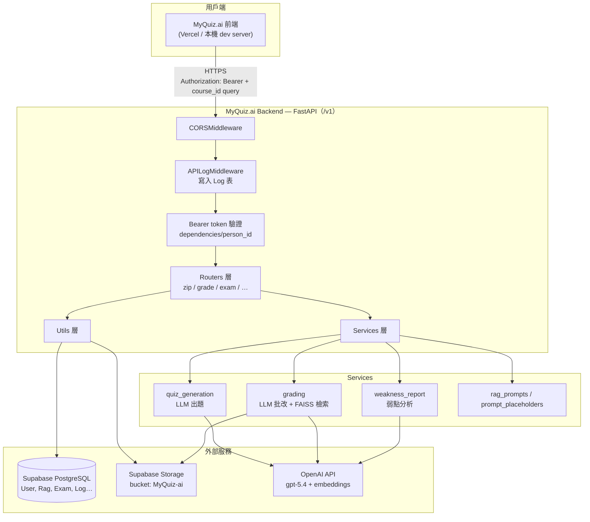
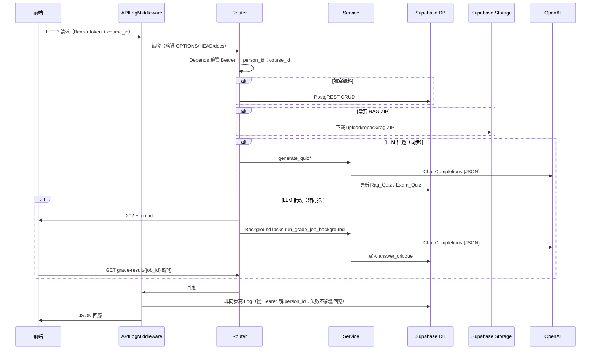
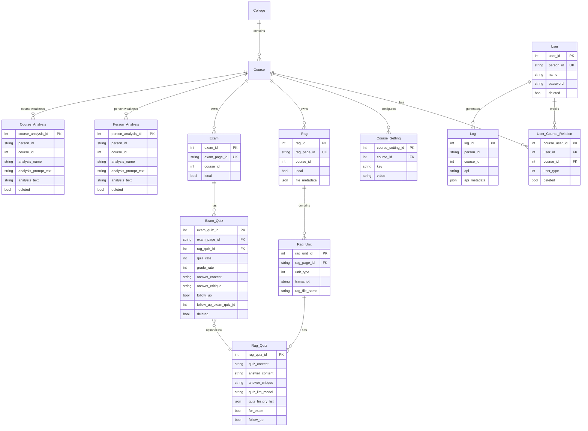
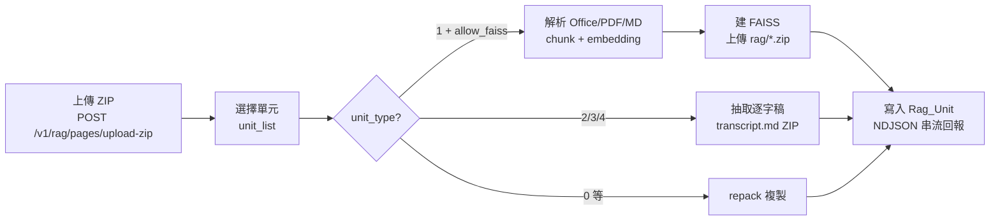
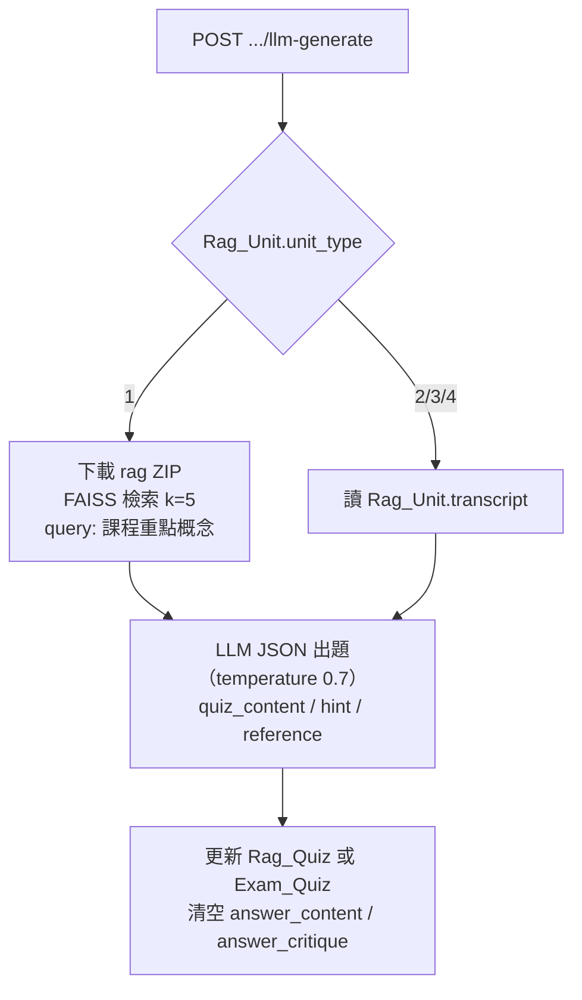
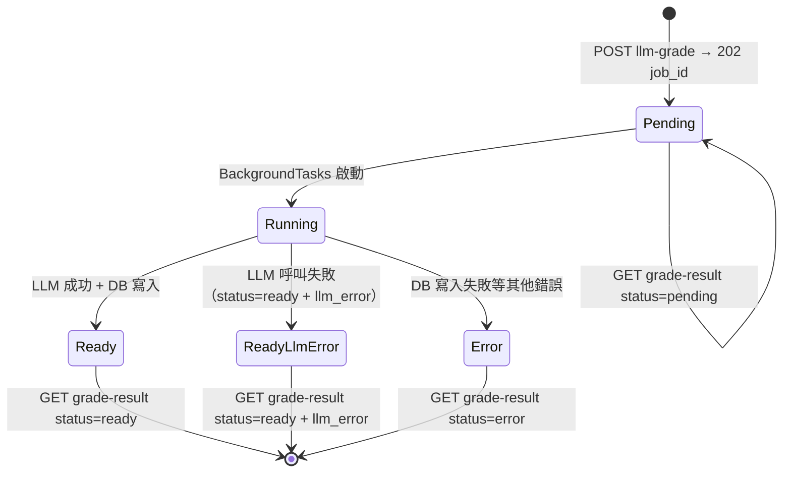

# MyQuiz.ai Backend

[MyQuiz.ai](https://myquiz-ai.vercel.app) 的 **FastAPI 後端**：課程測驗平台之 REST API（**`/v1`**、Bearer token 驗證），負責使用者與課程成員管理、教材 ZIP 上傳與 RAG 向量庫建置、LLM 自動出題／批改、測驗（Exam）管理，以及個人／課程弱點分析報告。

---

## 目錄

- [專案概覽](#專案概覽)
- [系統架構](#系統架構)
- [技術棧](#技術棧)
- [目錄結構](#目錄結構)
- [資料模型](#資料模型)
- [認證與授權](#認證與授權)
- [權限模型](#權限模型)
- [API 設計慣例](#api-設計慣例)
- [核心業務流程](#核心業務流程)
- [LLM 錯誤處理約定](#llm-錯誤處理約定)
- [環境變數](#環境變數)
- [本機開發](#本機開發)
- [部署（Render）](#部署render)
- [API 回傳格式](#api-回傳格式)
- [API 目錄](#api-目錄)
- [API 詳細文件](#api-詳細文件)
- [開發備註](#開發備註)

---

## 專案概覽

MyQuiz.ai 是一套 **AI 輔助測驗與學習分析** 系統。教師上傳課程教材（Office、PDF、Markdown、音訊、YouTube 逐字稿等），後端依單元類型建置 FAISS 向量庫或逐字稿 ZIP，再透過 OpenAI LLM（預設 **gpt-5.4**，可依課程覆寫）自動出題、批改與產生弱點報告；學生則在 Exam 模組完成測驗並取得 AI 評語。

**所有 API 掛在 `/v1` 之下**（`main.py` `API_PREFIX = "/v1"`；未來 breaking change 走 `/v2`），除登入外一律以 `Authorization: Bearer <token>` 驗證身分。

| 模組 | 路由前綴 | 說明 |
|------|---------|------|
| **認證** | `/v1/auth` | 登入簽發 token、token 換發 |
| **使用者** | `/v1/users` | 使用者列表、改自己密碼（新增／編輯／刪除由 course-members 管理） |
| **學院／課程** | `/v1/colleges`、`/v1/courses` | 學院與課程列表 |
| **課程成員** | `/v1/rag/course-members` | 課程成員 CRUD（新增、批次新增、編輯、移出課程） |
| **RAG 教材** | `/v1/rag/pages`、`/v1/rag/units` | 教材 ZIP 上傳、建庫（NDJSON 串流）、單元媒體 |
| **RAG 題目** | `/v1/rag/quizzes` | 練習題 CRUD、LLM 出題／追問、非同步批改 |
| **課程設定** | `/v1/rag/*`、`/v1/exam/llm-api-key` | LLM API Key、LLM 模型、弱點分析指令 |
| **測驗** | `/v1/exam` | 正式測驗卷、從 RAG 匯入出題、追問出題、非同步評分、題目評價 |
| **弱點分析** | `/v1/person-analyses`、`/v1/course-analyses` | 個人／課程弱點報告（列管理 + LLM 產生） |
| **Prompt 模板** | `/v1/prompt-templates` | 內建 LLM prompt 模板全文查詢 |
| **Log** | `/v1/logs` | 每次業務 API 請求寫入 `Log` 表供稽核 |

### 重要資料約定

- **身分**：呼叫者 `person_id` 一律從 Bearer token 解出（`POST /v1/auth/login` 簽發）；query 參數 `person_id` 的過渡 fallback 已於 2026-06-07 移除，未帶或無效一律 **401**。
- **course_id**：RAG／Exam／分析／Log 端點必填 query 參數（缺少回 400 `請傳入 query 參數 course_id`）。
- 少數 request body 仍含 `person_id` 欄位（upload-zip、build-zip、建立 Exam）：**選填**，預設為 token 呼叫者；若有傳則必須與呼叫者一致（不一致回 400）。
- 學生作答欄位：請求 body 使用 **`quiz_answer`**（相容別名 `answer`）；寫入 DB 欄位 **`answer_content`**。
- 批改評語寫入 **`answer_critique`**（純文字 Markdown，非 JSON；無數值評分欄位）。
- LLM API Key 存於 **`Course_Setting`**（依 `course_id`）：
  - `rag-api-key` → RAG 出題／批改、FAISS 建庫、**課程弱點分析**（GET/PUT `/v1/rag/llm-api-key`）
  - `exam-api-key` → Exam 出題／批改、**個人弱點分析**（GET/PUT `/v1/exam/llm-api-key`）
  - 前端可用 `GET /v1/rag/llm-api-key/exists`、`GET /v1/exam/llm-api-key/exists` 查詢是否已設定（不回傳 key 內容、不需管理權限）。
- LLM 模型（出題、批改、弱點分析**共用**）存於 **`Course_Setting`** key=`llm-model`，以 GET/PUT `/v1/rag/llm-model` 管理；未設定時預設 **`gpt-5.4`**（`services/quiz_generation.QUIZ_LLM_MODEL`）。
- LLM 呼叫失敗時，多數端點回 **HTTP 200 + `llm_error` 欄位**（而非 5xx），詳見 [LLM 錯誤處理約定](#llm-錯誤處理約定)。

---

## 系統架構

### 整體架構圖



### 請求處理流程



### 模組分層

| 層級 | 目錄 | 職責 |
|------|------|------|
| **入口** | `main.py` | FastAPI app、CORS、Middleware、`/v1` 路由掛載、OpenAPI 排序 |
| **路由** | `routers/` | HTTP 端點、Pydantic 模型、權限檢查 |
| **服務** | `services/` | LLM 出題／批改／弱點報告、Prompt 模板、Exam 查詢 |
| **工具** | `utils/` | 認證 token、Supabase、Storage、FAISS、ZIP、序列化、LLM 錯誤格式化 |
| **依賴** | `dependencies/` | Bearer → `person_id`、query `course_id` 注入 |
| **中介** | `middleware/` | API 呼叫紀錄、敏感欄位遮罩 |

路由掛載順序（`main.py`，皆掛 `/v1`）：`zip` → `grade` → `exam` → `person_analysis` → `course_analysis` → `profile` → `college` → `course` → `course_settings` → `prompt` → `log`。Swagger（`/docs`）路徑順序由 `utils/openapi_order.py` 統一排序，與掛載順序無關。

### Supabase Storage 路徑

Bucket 名稱由環境變數 `SUPABASE_RAG_BUCKET` 指定（預設 `MyQuiz-ai`）：

```
{person_id}/{rag_page_id}/upload/{rag_page_id}.zip   ← 原始上傳 ZIP
{person_id}/{rag_page_id}/repack/{stem}.zip          ← 單元 repack（stem＝folder_combination）
{person_id}/{rag_page_id}/rag/{stem}_rag.zip         ← FAISS 或 transcript ZIP
```

根目錄 `_metadata.json` 記錄 page_id → 路徑對照，供 `get_zip_path()` 查詢。`Rag_Unit.repack_file_name`／`rag_file_name` 分別記錄 repack／rag 資料夾內的檔名。

---

## 技術棧

| 類別 | 技術 |
|------|------|
| 語言／Runtime | Python 3.10.12 |
| Web 框架 | FastAPI + Uvicorn |
| 認證 | 自簽 HMAC-SHA256 Bearer token（`utils/auth.py`，無外部依賴） |
| 資料庫 | Supabase（PostgreSQL + PostgREST） |
| 檔案儲存 | Supabase Storage |
| 向量檢索 | LangChain + FAISS-CPU + OpenAI Embeddings (`text-embedding-3-small`) |
| LLM | OpenAI **gpt-5.4**（出題、批改、弱點分析共用；可經 `/v1/rag/llm-model` 依課程覆寫） |
| 文件解析 | PyPDF、python-pptx、unstructured、docx2txt |
| 部署 | Render（`runtime.txt` 指定 Python 版本） |

---

## 目錄結構

```
MyQuiz-ai-backend/
├── main.py                   # FastAPI 入口、CORS、/v1 路由掛載、OpenAPI 排序
├── requirements.txt          # Python 依賴
├── runtime.txt               # Render Python 版本（python-3.10.12）
├── .env.example              # 環境變數範例
├── dependencies/
│   ├── person_id.py          # Bearer token → person_id（未帶/無效一律 401）
│   └── course_id.py          # RAG / Exam 相關必填 query course_id（缺少 400）
├── middleware/
│   └── api_log_middleware.py # 業務 API 請求寫入 Log 表（遮罩敏感欄位、從 Bearer 解 person_id）
├── routers/
│   ├── profile.py            # /v1/auth、/v1/users — 登入、token 換發、使用者列表、改密碼
│   ├── college.py            # /v1/colleges — 學院列表
│   ├── course.py             # /v1/courses — 課程列表
│   ├── zip/                  # /v1/rag — Rag 分頁、ZIP 上傳、建庫、單元媒體、Quiz 基本 CRUD
│   │   ├── schemas.py        #   Pydantic 模型
│   │   ├── helpers.py        #   建庫 / Storage 輔助
│   │   └── routes.py         #   端點
│   ├── grade/                # /v1/rag — LLM 出題、批改、旗標、API Key、模型設定
│   │   ├── schemas.py
│   │   ├── helpers.py        #   _grade_job_results（記憶體 job 字典）等
│   │   └── routes.py
│   ├── exam/                 # /v1/exam — 測驗 CRUD、出題、批改、評價、API Key
│   │   ├── schemas.py
│   │   ├── helpers.py
│   │   └── routes.py
│   ├── course_settings.py    # /v1/rag — 課程成員管理、弱點分析指令
│   ├── person_analysis.py    # /v1/person-analyses — 個人弱點分析（CRUD + LLM）
│   ├── course_analysis.py    # /v1/course-analyses — 課程弱點分析（CRUD + LLM）
│   ├── prompt.py             # /v1/prompt-templates — 內建 LLM 模板查詢
│   └── log.py                # /v1/logs — API 呼叫紀錄
├── services/
│   ├── quiz_generation.py    # LLM 出題（FAISS / 逐字稿）；QUIZ_LLM_MODEL 預設值
│   ├── grading.py            # LLM 批改、Background Job
│   ├── weakness_report.py    # 個人／課程弱點報告
│   ├── analysis_setting.py   # Person_Analysis / Course_Analysis 讀寫
│   ├── exam_queries.py       # Exam / Exam_Quiz 查詢與組裝（follow_up_quiz 巢狀）
│   ├── rag_prompts.py        # RAG 檢索參數
│   └── prompt_placeholders.py
└── utils/
    ├── auth.py               # HMAC Bearer token 簽發／驗證（AUTH_TOKEN_SECRET）
    ├── supabase.py           # Supabase client
    ├── zip_storage.py        # Storage 上傳／下載
    ├── rag_faiss.py          # FAISS 建庫
    ├── rag_transcript.py     # 逐字稿抽取（unit_type 2/3/4）
    ├── course_setting.py     # Course_Setting 讀寫
    ├── llm_key.py            # API Key / LLM 模型解析（rag-api-key / exam-api-key / llm-model）
    ├── llm_error.py          # LLM 呼叫錯誤判斷與 llm_error 回應格式化
    ├── db_schema.py          # 表名與 SELECT 欄位常數
    ├── openapi_order.py      # Swagger /v1 路徑排序
    └── …
```

---

## 資料模型

### ER 關係圖（簡化）



### 主要資料表

| 表名 | 說明 |
|------|------|
| `User` | 使用者（`person_id` 為登入帳號；經成員管理新建者預設密碼 `0000`） |
| `User_Course_Relation` | 選課關係；**`user_type` 依課程**（見[權限模型](#權限模型)） |
| `College` / `Course` | 學院與課程 |
| `Course_Setting` | 課程級 key-value 設定（API Key、LLM 模型） |
| `Rag` / `Rag_Unit` / `Rag_Quiz` | RAG 分頁、教材單元、練習題 |
| `Exam` / `Exam_Quiz` | 測驗卷與測驗題（可連結 `rag_quiz_id`；`follow_up_exam_quiz_id` 串追問鏈） |
| `Person_Analysis` | 個人弱點分析：指令列（`analysis_prompt_text` 非空、`analysis_text` 空）與報告列共表 |
| `Course_Analysis` | 課程弱點分析（結構同上） |
| `Log` | API 呼叫紀錄 |

> 所有刪除皆為**軟刪除**（`deleted=true`），查詢一律過濾 `deleted=false`。時間戳 `created_at`／`updated_at` 為 **ISO 8601 台北時區**（`+08:00`，`utils/taipei_time.py`）。

### Rag_Unit.unit_type

| 值 | 名稱 | 建庫行為 | 出題／批改 context |
|----|------|----------|-------------------|
| 0 | 未指定 | repack 複製至 rag（`rag_mode="repack_copy"`） | 依 ZIP 內容推斷 |
| 1 | RAG（Office/PDF/MD） | 建 **FAISS** 向量 ZIP（`rag_mode="faiss"`） | 向量檢索 top-k chunks |
| 2 | 文字 | repack + **transcript.md** ZIP（`rag_mode="transcript_md"`） | 全文逐字稿（Markdown 原樣保留） |
| 3 | MP3 音訊 | repack + transcript ZIP | 音訊同資料夾文字檔逐字稿 |
| 4 | YouTube | repack + transcript ZIP | 文字檔第一行 URL + 第二行起逐字稿 |

> `build-zip` 未指定 unit_type（或 0）時自動推斷：一音訊＋一文字檔 → 3；僅一文字檔 → 2；YouTube 須明確指定 4；其餘 → 0。
> **FAISS 僅在 `allow_faiss` 且 `unit_type == 1` 時實際建置**（`allow_faiss` 由 user_type、body `build_faiss`、query `repack_only` 共同決定）；其餘類型以逐字稿 ZIP 供 LLM 使用。

### Course_Setting 常用 key

| key | 用途 | 管理端點 |
|-----|------|----------|
| `rag-api-key` | RAG 出題／批改、FAISS 建庫、課程弱點分析 OpenAI Key | GET/PUT `/v1/rag/llm-api-key`、GET `/v1/rag/llm-api-key/exists` |
| `exam-api-key` | Exam 出題／批改、個人弱點分析 OpenAI Key | GET/PUT `/v1/exam/llm-api-key`、GET `/v1/exam/llm-api-key/exists` |
| `llm-model` | 出題／批改／弱點分析共用 LLM 模型名 | GET/PUT `/v1/rag/llm-model` |

> 弱點分析**指令**不在 `Course_Setting`：個人分析指令存於 `Person_Analysis`（GET/PUT `/v1/rag/person-analysis-user-prompt-text`）、課程分析指令存於 `Course_Analysis`（GET/PUT `/v1/rag/course-analysis-user-prompt-text`）。指令列與報告列同表，以「`analysis_prompt_text` 非空且 `analysis_text` 為空」區分指令列。

---

## 認證與授權

### Bearer token（自簽 HMAC）

本後端**不依賴外部 JWT 函式庫**，以 `utils/auth.py` 自簽 HMAC-SHA256 token：

```
token  = base64url(JSON payload) + "." + base64url(HMAC-SHA256 簽章)
payload = {"sub": person_id, "iat": 簽發時間, "exp": 到期時間}
```

| 項目 | 說明 |
|------|------|
| 簽發 | `POST /v1/auth/login`（`person_id` + `password`）→ `access_token` |
| 換發 | `POST /v1/auth/refresh`（持有效 token 換新 token，延長效期） |
| 驗證 | 每次請求由 `dependencies/person_id.py` 解析 `Authorization: Bearer <token>` |
| 效期 | 預設 **30 天**；env `AUTH_TOKEN_TTL_SECONDS` 可調（登入回應 `expires_in` 為秒數） |
| 密鑰 | env `AUTH_TOKEN_SECRET`；未設定退回 `SUPABASE_SERVICE_ROLE_KEY` 衍生值；兩者皆無時使用內建開發密鑰（**勿用於正式環境**） |

401 錯誤訊息：

- 未帶標頭：`未帶 Authorization: Bearer <token>；請先 POST /v1/auth/login 登入取得 access_token`
- 無效／過期：`token 無效或已過期，請重新登入`

### 各層檢查

| 機制 | 說明 |
|------|------|
| Bearer token | 除 `POST /v1/auth/login` 與 RAG 單元媒體端點（`/v1/rag/units/{id}/*`）外全部必帶 |
| `course_id` | RAG／Exam／分析／Log 端點必填 query；缺少回 400 |
| `user_type` | 存於 `User_Course_Relation`，依課程；見[權限模型](#權限模型) |
| 資源擁有權 | 多數寫入操作驗證呼叫者與 Rag/Exam/Quiz 資源 `person_id` 一致（不一致 403） |

> `GET /v1/rag/units/{rag_unit_id}/{text,mp3-file,youtube-url}` **不驗 Bearer**（owner 由 query `rag_page_id` 解析），供 `<audio src>` 等直接取用；建置前預覽 `/v1/rag/pages/{rag_page_id}/unit-preview/*` 則**須 Bearer + owner 檢查**。

---

## 權限模型

`user_type` 存於 `User_Course_Relation`，**依課程**指定（同一人在不同課程可有不同身份）：

| user_type | 身份 | 權限 |
|-----------|------|------|
| 1 | 開發者 | 全部管理權限；`build-zip` 可實際建 FAISS |
| 2 | 管理者 | 課程設定（API Key、模型、分析指令）、課程成員管理 |
| 3 | 學生 | 作答、查詢；不可變更課程設定 |

需 **user_type 1／2** 的操作（不符回 403）：

- 讀／寫 `rag-api-key`、`exam-api-key`（`/exists` 查詢不需）
- 讀／寫 `llm-model`
- 寫個人／課程弱點分析指令
- 課程成員管理（`/v1/rag/course-members*`）

其餘端點僅需 Bearer token 有效（對應未刪除使用者）；多數寫入操作另驗證呼叫者與資源擁有者一致。

---

## API 設計慣例

2026-06-06 全面改版為 `/v1` REST 風格（無舊路徑 alias，breaking change），慣例如下：

| 慣例 | 範例 |
|------|------|
| 集合名用**複數** | `/v1/rag/pages`、`/v1/rag/quizzes`、`/v1/person-analyses` |
| 新增＝`POST` 集合，回 **201** | `POST /v1/exam/pages`、`POST /v1/rag/quizzes` |
| 刪除＝`DELETE /{id}`（DB 仍為軟刪除） | `DELETE /v1/rag/pages/{rag_page_id}` |
| 改名／部分更新＝`PATCH /{id}` | `PATCH /v1/exam/pages/{exam_page_id}`（body `tab_name`） |
| 單列旗標＝`PUT /{id}/<flag>` | `PUT /v1/rag/quizzes/{id}/for-exam` |
| URL 一律 **kebab-case** | `/v1/rag/llm-api-key`（非 `llm_api_key`） |
| 無動詞路徑 | 不再有 `/add`、`/delete/{id}`、`/xxx-name` |
| LLM 操作保留 `llm-` 前綴 | `llm-generate`、`llm-grade`、`llm-analysis` |

隱藏端點（`include_in_schema=False`，不出現在 Swagger，行為與對應公開端點相同）：

- `POST /v1/rag/generate-quiz` ＝ `POST /v1/rag/quizzes/llm-generate`
- `POST /v1/exam/generate-quiz` ＝ `POST /v1/exam/quizzes/llm-generate`
- `POST /v1/exam/quizzes/grade` ＝ `POST /v1/exam/quizzes/llm-grade`
- `POST /v1/rag/pages/{rag_page_id}/build-zip-stream` ＝ `POST /v1/rag/pages/{rag_page_id}/build-zip`

---

## 核心業務流程

### RAG 建置流程（build-zip）



- 端點：`POST /v1/rag/pages/{rag_page_id}/build-zip`（query `repack_only=true` 可強制不建 FAISS，仍會為 unit_type 2/3/4 建 transcript ZIP）。
- 回應格式：`application/x-ndjson`，逐行 JSON（`start` → `building` → `unit` → … → `complete`）。
- 前端須用 `fetch` 逐行讀取 `response.body`，**不可** `response.json()`；HTTP 狀態碼恆為 200，以最後一行 `type === "complete"` 的 `success` 判斷成敗。
- **`Rag_Unit` 列只在 build-zip 成功後建立**（`_persist_rag_build_metadata`）；建置前前端拿不到 `rag_unit_id`，預覽教材請改用 `unit-preview` 端點。
- 僅 `allow_faiss=true` 時需要已設定 `rag-api-key`（FAISS embedding 用）。

### LLM 出題流程



- **追問出題**（`llm-generate-followup`）：依 `quiz_history_list_prompt_text`（前次題幹、參考答案、作答、評語）決定追問弱點或出新題。
- **`-db` 變體**（僅 RAG）：body 不帶 prompt 文字，沿用 DB 既有 `quiz_user_prompt_text`。
- **`create-` 變體**（僅 Exam）：先建立 Exam_Quiz 列再出題，一次完成。
- Exam 出題的 prompt 模板讀自連結的 `Rag_Quiz` 列，並快照寫回 `Exam_Quiz`（`quiz_user_prompt_text`／`answer_user_prompt_text`）。
- 出題成功會清空該題 `answer_content`／`answer_critique`，並記錄實際使用的 `quiz_llm_model`。
- LLM 呼叫失敗時回 HTTP 200 + `llm_error`（quiz 欄位為空字串），見 [LLM 錯誤處理約定](#llm-錯誤處理約定)。

### LLM 批改流程（非同步）



1. `POST .../llm-grade` 立即回 **HTTP 202** + `{ "job_id": "uuid", "grade_llm_model": "…" }`。
2. 背景執行 `run_grade_job_background`：unit_type 2/3/4 走逐字稿路徑，unit_type 1 走 FAISS 檢索（以**題幹**為 query，k=5；temperature 0.3）。
3. LLM 回傳 JSON → 解析 `quiz_comments` → 以 `\n\n` 合併寫入 `answer_critique`（純文字）。
4. 前端輪詢 `GET .../grade-result/{job_id}` 直到 `status` 為 `ready` 或 `error`；`ready` 時若 `llm_error` 非 null 表示 LLM 呼叫失敗（`quiz_comments` 為空陣列）。
5. Job 結果存於**程序記憶體**（`routers/grade/helpers.py` `_grade_job_results` 字典；重啟後遺失）；查無 job_id 時回 **404**，前端應重新送出評分。

### 弱點分析流程

| | 個人分析 | 課程分析 |
|---|---------|---------|
| 資料表 | `Person_Analysis` | `Course_Analysis` |
| API Key | `exam-api-key` | `rag-api-key` |
| 指令寫入 | PUT `/v1/rag/person-analysis-user-prompt-text` | PUT `/v1/rag/course-analysis-user-prompt-text` |
| 列管理 | GET/POST `/v1/person-analyses`、PATCH/DELETE `/{id}` | GET/POST `/v1/course-analyses`、PATCH/DELETE `/{id}` |
| 讀最新結果 | GET `/v1/person-analyses/latest` | GET `/v1/course-analyses/latest` |
| 產生報告 | **POST** `/v1/person-analyses/llm-analysis` | **POST** `/v1/course-analyses/llm-analysis` |
| 分析範圍 | 該生已作答 Exam_Quiz | 全課程已作答題目 |

- 指令來源優先序：呼叫者自己的指令列 → 課程共用列（legacy `person_id=""`）→ 同課程其他人最新指令；皆無時以「（未提供）」帶入模板。
- LLM 成功時將報告寫入呼叫者最新一列的 `analysis_text`（無列則自動建立），並記錄 `analysis_llm_model`；模型同樣使用 `llm-model` 設定。
- 可先 `POST /v1/person-analyses`（query 可帶 `analysis_name`）建立命名的空白報告列，再跑 `llm-analysis` 填入。
- 模板全文可從 `GET /v1/prompt-templates` 查閱。

---

## LLM 錯誤處理約定

LLM（OpenAI）呼叫失敗（金鑰錯誤、額度不足、逾時、回傳非 JSON 等）統一由 `utils/llm_error.py` 判斷與格式化，**以 HTTP 200 + `llm_error` 欄位回傳**，讓前端能將錯誤原因顯示給使用者，而非籠統的 5xx：

| 情境 | 行為 |
|------|------|
| 出題（`llm-generate` 系列） | HTTP 200，payload 含 `llm_error` 與識別欄位（`rag_quiz_id`／`exam_quiz_id`、`quiz_llm_model`），quiz 欄位為空字串 |
| 批改 job | `grade-result` 回 `status="ready"` + 頂層 `llm_error`，`result.quiz_comments` 為空陣列 |
| 弱點分析（`llm-analysis`） | HTTP 200，`weakness_report=null` + `llm_error` 說明原因（含「未設定 API Key」「無已作答題目」等前置檢查） |

非 LLM 的錯誤（驗證失敗、找不到資源、DB 寫入失敗）仍走標準 HTTP 4xx／5xx + `{ "detail": "…" }`。

---

## 環境變數

複製 `.env.example` 為 `.env` 並填入：

| 變數 | 必填 | 說明 |
|------|------|------|
| `SUPABASE_URL` | ✅ | Supabase 專案 URL |
| `SUPABASE_ANON_KEY` | ✅* | 公開 anon key |
| `SUPABASE_SERVICE_ROLE_KEY` | ✅* | 後端 service role（略過 RLS） |
| `SUPABASE_SECRET_KEY` | 選 | 新版 Secret key（`sb_secret_...`；有 service_role 則不必） |
| `SUPABASE_RAG_BUCKET` | 選 | Storage bucket 名（預設 `MyQuiz-ai`） |
| `AUTH_TOKEN_SECRET` | 建議 | Bearer token HMAC 密鑰；未設定退回 `SUPABASE_SERVICE_ROLE_KEY` |
| `AUTH_TOKEN_TTL_SECONDS` | 選 | token 效期秒數（預設 2592000 = 30 天） |
| `CORS_EXTRA_ORIGINS` | 選 | 額外 CORS origin，逗號分隔 |

\* `ANON_KEY` 與 `SERVICE_ROLE_KEY` 至少需其一；後端建議使用 service role（anon 可能遭 RLS 擋下寫入）。

LLM API Key **不**放在 `.env`，而是依課程存入 `Course_Setting`（`PUT /v1/rag/llm-api-key`、`PUT /v1/exam/llm-api-key`）。

---

## 本機開發

### 前置需求

- Python 3.10+
- Supabase 專案（PostgreSQL + Storage bucket）
- OpenAI API Key（寫入各課程 `Course_Setting`）

### 啟動步驟

```bash
# 1. 環境變數
cp .env.example .env
# 編輯 .env 填入 Supabase 憑證

# 2. 依賴
pip install -r requirements.txt

# 3. 啟動（熱重載）
uvicorn main:app --reload
```

- API 文件：`http://127.0.0.1:8000/docs`（Swagger UI；亦可作為啟動健康確認）
- 驗證連線：

```bash
# 登入取得 token
curl -s -X POST http://127.0.0.1:8000/v1/auth/login \
  -H 'Content-Type: application/json' \
  -d '{"person_id": "YOUR_ID", "password": "YOUR_PASSWORD"}'

# 帶 token 呼叫
curl -s http://127.0.0.1:8000/v1/courses \
  -H 'Authorization: Bearer <access_token>'
```

### macOS 注意事項

`main.py` 啟動時設定 `KMP_DUPLICATE_LIB_OK=TRUE`，避免 FAISS/NumPy 多份 OpenMP runtime 衝突。

### CORS

內建允許：`localhost`／`127.0.0.1` 埠 8080–8086、5173（Vite）、4173、3000，以及 `https://myquiz-ai.vercel.app`、`https://kevin7261.github.io`。區網 IP 或其他網域請設 `CORS_EXTRA_ORIGINS`。

---

## 部署（Render）

1. 連接 GitHub repo，Build Command：`pip install -r requirements.txt`
2. Start Command：`uvicorn main:app --host 0.0.0.0 --port $PORT`
3. Environment 新增與 `.env` 相同變數（至少 Supabase 三項；建議另設 `AUTH_TOKEN_SECRET`）
4. Python 版本由 `runtime.txt`（`python-3.10.12`）指定

**Render 代理逾時**：同步 LLM 請求若超過約 30 秒可能回 502；批改已改非同步（202 + 輪詢）以避免此問題。若 502 回應不含 CORS 標頭，前端會看到跨域錯誤——應確認使用輪詢端點而非長時間阻塞 POST。

**重啟／scale-out**：評分 job 結果存於程序記憶體，服務重啟或多 instance 下 `job_id` 可能查無（回 404），前端應重新送出評分。

**`AUTH_TOKEN_SECRET` 變更**：會使所有已簽發 token 失效（使用者需重新登入）。

---

## API 回傳格式

除 `POST /v1/auth/login` 與 RAG 單元媒體端點（`/v1/rag/units/{id}/*`）外，所有端點皆需 `Authorization: Bearer <token>` 標頭；RAG／Exam／分析（latest、llm-analysis、POST）／Log 端點另需 query 參數 `course_id`。

### 通用錯誤格式

HTTP 4xx / 5xx 時統一回傳：

```json
{ "detail": "錯誤說明文字" }
```

常見狀態碼：

| 狀態碼 | 意義 |
|--------|------|
| 400 | 參數錯誤（缺 course_id、body 欄位無效、person_id 不一致、id 含 `/` `\` 等） |
| 401 | 未帶或無效 Bearer token |
| 403 | 權限不足（非 user_type 1/2、非資源擁有者） |
| 404 | 資源不存在或已刪除；grade job 查無 |
| 409 | 衝突（成員已在課程、person_id 已屬其他學院） |
| 413 | 上傳 ZIP 超過 Supabase Storage 大小限制 |
| 422 | Pydantic body 驗證失敗（FastAPI 內建格式） |
| 500 / 502 / 503 | DB 寫入失敗、Storage 上傳失敗、Supabase 連線失敗 |

### LLM 錯誤

LLM 呼叫失敗時回 HTTP 200 + `llm_error` 欄位（見 [LLM 錯誤處理約定](#llm-錯誤處理約定)）。

---

## API 目錄

RAG 與 Exam 採相同層級：**分頁（pages）→ 單元（units，僅 RAG）→ 題目（quizzes）→ 設定**。Swagger（`/docs`）路徑順序由 `utils/openapi_order.py` 統一排序。

| 方法 | 路徑 | 說明 |
|------|------|------|
| **認證** | | |
| POST | `/v1/auth/login` | 登入，簽發 access_token |
| POST | `/v1/auth/refresh` | 以有效 token 換發新 token |
| **使用者** | | |
| GET | `/v1/users` | 列出所有使用者（含選課） |
| PUT | `/v1/users/me/password` | 更新自己的密碼 |
| **學院／課程** | | |
| GET | `/v1/colleges` | 列出學院（含 courses） |
| GET | `/v1/courses` | 列出課程（含 college_name） |
| **課程成員** | | |
| GET | `/v1/rag/course-members` | 列出課程成員 |
| POST | `/v1/rag/course-members` | 新增成員（201） |
| POST | `/v1/rag/course-members/batch` | 批次新增成員（學生）（201） |
| PATCH | `/v1/rag/course-members/{member_person_id}` | 編輯成員 |
| DELETE | `/v1/rag/course-members/{member_person_id}` | 移出課程（軟刪除） |
| **RAG 教材管理** | | |
| GET | `/v1/rag/pages` | 列出 Rag（含 units→quizzes） |
| POST | `/v1/rag/pages/upload-zip` | 建立 Rag 並上傳 ZIP（201） |
| PATCH | `/v1/rag/pages/{rag_page_id}` | 更新 Rag tab_name |
| DELETE | `/v1/rag/pages/{rag_page_id}` | 軟刪除 Rag + 刪 Storage 資料夾 |
| GET | `/v1/rag/pages/{rag_page_id}/units` | 列出 Rag_Unit（含 quizzes） |
| POST | `/v1/rag/pages/{rag_page_id}/build-zip` | 建置 RAG ZIP（NDJSON 串流） |
| GET | `/v1/rag/pages/{rag_page_id}/unit-preview/text` | 建置前預覽文字單元（Bearer + owner） |
| GET | `/v1/rag/pages/{rag_page_id}/unit-preview/mp3-file` | 建置前預覽音訊單元 |
| GET | `/v1/rag/pages/{rag_page_id}/unit-preview/youtube-url` | 建置前預覽 YouTube 單元 |
| **RAG 單元媒體（不驗 Bearer）** | | |
| GET | `/v1/rag/units/{rag_unit_id}/text` | 取得文字單元逐字稿 |
| GET | `/v1/rag/units/{rag_unit_id}/mp3-file` | 取得音訊與逐字稿 |
| GET | `/v1/rag/units/{rag_unit_id}/youtube-url` | 解析 YouTube URL 與逐字稿 |
| **RAG 題目管理** | | |
| POST | `/v1/rag/quizzes` | 新增空白 Rag_Quiz（201，不呼叫 LLM） |
| PATCH | `/v1/rag/quizzes/{rag_quiz_id}` | 更新 quiz_name |
| DELETE | `/v1/rag/quizzes/{rag_quiz_id}` | 軟刪除 Rag_Quiz |
| PUT | `/v1/rag/quizzes/{rag_quiz_id}/followup` | 更新 follow_up 旗標 |
| PUT | `/v1/rag/quizzes/{rag_quiz_id}/for-exam` | 更新 for_exam 旗標 |
| **RAG 出題與評分** | | |
| POST | `/v1/rag/quizzes/llm-generate` | LLM 出題 |
| POST | `/v1/rag/quizzes/llm-generate-db` | LLM 出題（沿用 DB prompt） |
| POST | `/v1/rag/quizzes/llm-generate-followup` | LLM 追問出題 |
| POST | `/v1/rag/quizzes/llm-generate-followup-db` | LLM 追問出題（沿用 DB prompt） |
| POST | `/v1/rag/quizzes/llm-grade` | 非同步評分（202 + job_id） |
| POST | `/v1/rag/quizzes/llm-grade-db` | 非同步評分（沿用 DB prompt） |
| GET | `/v1/rag/quizzes/grade-result/{job_id}` | 輪詢評分結果 |
| **RAG 課程設定** | | |
| GET | `/v1/rag/llm-api-key` | 讀取 rag-api-key（user_type 1/2） |
| PUT | `/v1/rag/llm-api-key` | 寫入 rag-api-key（user_type 1/2） |
| GET | `/v1/rag/llm-api-key/exists` | rag-api-key 是否已設定（一般使用者可查） |
| GET | `/v1/rag/llm-model` | 讀取 llm-model（user_type 1/2） |
| PUT | `/v1/rag/llm-model` | 寫入 llm-model（user_type 1/2） |
| GET | `/v1/rag/person-analysis-user-prompt-text` | 取得個人分析指令 |
| PUT | `/v1/rag/person-analysis-user-prompt-text` | 寫入個人分析指令（user_type 1/2） |
| GET | `/v1/rag/course-analysis-user-prompt-text` | 取得課程分析指令 |
| PUT | `/v1/rag/course-analysis-user-prompt-text` | 寫入課程分析指令（user_type 1/2） |
| **測驗** | | |
| GET | `/v1/exam/pages` | 列出 Exam（含 quizzes、follow_up_quiz 巢狀） |
| POST | `/v1/exam/pages` | 建立 Exam（201） |
| GET | `/v1/exam/rag-for-exams` | 列出 for_exam RAG 單元與題目 |
| PATCH | `/v1/exam/pages/{exam_page_id}` | 更新 Exam tab_name |
| DELETE | `/v1/exam/pages/{exam_page_id}` | 軟刪除 Exam |
| DELETE | `/v1/exam/quizzes/{exam_quiz_id}` | 軟刪除 Exam_Quiz（含追問鏈） |
| PUT | `/v1/exam/quizzes/{exam_quiz_id}/quiz-rate` | 更新 quiz_rate（-1/0/1） |
| PUT | `/v1/exam/quizzes/{exam_quiz_id}/grade-rate` | 更新 grade_rate（-1/0/1） |
| POST | `/v1/exam/quizzes/llm-generate` | LLM 出題 |
| POST | `/v1/exam/quizzes/llm-generate-followup` | LLM 追問出題 |
| POST | `/v1/exam/quizzes/create-llm-generate` | 建立並 LLM 出題 |
| POST | `/v1/exam/quizzes/create-llm-generate-followup` | 建立並 LLM 追問出題 |
| POST | `/v1/exam/quizzes/llm-grade` | 非同步評分（202 + job_id） |
| GET | `/v1/exam/quizzes/grade-result/{job_id}` | 輪詢評分結果 |
| **Exam 課程設定** | | |
| GET | `/v1/exam/llm-api-key` | 讀取 exam-api-key（user_type 1/2） |
| PUT | `/v1/exam/llm-api-key` | 寫入 exam-api-key（user_type 1/2） |
| GET | `/v1/exam/llm-api-key/exists` | exam-api-key 是否已設定（一般使用者可查） |
| **個人弱點分析** | | |
| GET | `/v1/person-analyses` | 列出自己所有分析列（跨課程） |
| POST | `/v1/person-analyses` | 新增空白分析列（201；query 可帶 analysis_name） |
| GET | `/v1/person-analyses/latest` | 讀取最新分析結果（不呼叫 LLM） |
| POST | `/v1/person-analyses/llm-analysis` | 產生個人弱點報告 |
| PATCH | `/v1/person-analyses/{person_analysis_id}` | 更新分析名稱 |
| DELETE | `/v1/person-analyses/{person_analysis_id}` | 軟刪除分析列 |
| **課程弱點分析** | | |
| GET | `/v1/course-analyses` | 列出課程所有分析列 |
| POST | `/v1/course-analyses` | 新增空白分析列（201；query 可帶 analysis_name） |
| GET | `/v1/course-analyses/latest` | 讀取最新分析結果（不呼叫 LLM） |
| POST | `/v1/course-analyses/llm-analysis` | 產生課程弱點報告 |
| PATCH | `/v1/course-analyses/{course_analysis_id}` | 更新分析名稱 |
| DELETE | `/v1/course-analyses/{course_analysis_id}` | 軟刪除分析列 |
| **Prompt 模板** | | |
| GET | `/v1/prompt-templates` | 內建 LLM prompt 模板全文 |
| **Log** | | |
| GET | `/v1/logs` | 列出 API 呼叫紀錄 |

---

## API 詳細文件

> 以下所有時間戳皆為 ISO 8601 台北時區字串（範例以 `"2026-01-01T00:00:00+08:00"` 表示）。除特別註明外，端點皆需 `Authorization: Bearer <token>`。

### 認證 `/v1/auth`

#### `POST /v1/auth/login`

**不需 Bearer**。以 `person_id` + `password` 登入，簽發 access_token。Body：

```json
{ "person_id": "string", "password": "string" }
```

成功時回傳使用者資訊（**不含 password**）、選課列表與 token：

```json
{
  "user": {
    "user_id": 1,
    "person_id": "string",
    "college_id": "string",
    "college_name": "string",
    "name": "string",
    "courses": [ /* 同頂層 courses */ ],
    "user_metadata": null,
    "updated_at": "2026-01-01T00:00:00+08:00",
    "created_at": "2026-01-01T00:00:00+08:00"
  },
  "courses": [
    {
      "course_user_id": 1,
      "course_id": 1,
      "college_id": 1,
      "course_name": "string",
      "semester": "113-1",
      "user_type": 3
    }
  ],
  "access_token": "eyJ…（base64url payload）.（base64url 簽章）",
  "token_type": "bearer",
  "expires_in": 2592000
}
```

- 帳號或密碼錯誤回 **401**。
- `expires_in` 為秒數（預設 30 天，env `AUTH_TOKEN_TTL_SECONDS` 可調）。
- 前端應保存 `access_token`，後續所有請求帶 `Authorization: Bearer <access_token>`。

---

#### `POST /v1/auth/refresh`

持**仍有效**的 token 換發新 token（延長效期）。無 body。

```json
{
  "access_token": "新 token",
  "token_type": "bearer",
  "expires_in": 2592000
}
```

> token 已過期則回 401，須重新登入。

---

### 使用者 `/v1/users`

> 使用者的新增／編輯／刪除已改由 [`/v1/rag/course-members`](#課程成員-v1ragcourse-members) 管理；此處僅保留列表與改自己密碼。

#### `GET /v1/users`

列出所有未刪除使用者，含各使用者選課 `courses` 列表（`user_type` 依課程，見 courses 各項）。**含 `password` 欄位**（僅此端點回傳）。

```json
{
  "users": [
    {
      "user_id": 1,
      "person_id": "string",
      "college_id": "string",
      "college_name": "string",
      "name": "string",
      "password": "string",
      "courses": [
        {
          "course_user_id": 1,
          "course_id": 1,
          "college_id": 1,
          "course_name": "string",
          "semester": "113-1",
          "user_type": 3
        }
      ],
      "user_metadata": null,
      "updated_at": "2026-01-01T00:00:00+08:00",
      "created_at": "2026-01-01T00:00:00+08:00"
    }
  ],
  "count": 1
}
```

---

#### `PUT /v1/users/me/password`

更新**自己**（token 呼叫者）的密碼。Body 只有一個欄位：

```json
{ "password": "新密碼" }
```

```json
{
  "message": "密碼已更新",
  "person_id": "string",
  "updated_at": "2026-01-01T00:00:00+08:00"
}
```

---

### 學院／課程 `/v1/colleges`、`/v1/courses`

#### `GET /v1/colleges`

列出所有未刪除學院，含所屬課程列表。

```json
{
  "colleges": [
    {
      "college_id": 1,
      "college_name": "string",
      "courses": [
        {
          "course_id": 1,
          "college_id": 1,
          "semester": "113-1",
          "course_name": "string"
        }
      ],
      "updated_at": "2026-01-01T00:00:00+08:00",
      "created_at": "2026-01-01T00:00:00+08:00"
    }
  ],
  "count": 1
}
```

---

#### `GET /v1/courses`

列出所有未刪除課程，含 `college_id`、`college_name`。

```json
{
  "courses": [
    {
      "course_id": 1,
      "college_id": 1,
      "college_name": "string",
      "semester": "113-1",
      "course_name": "string",
      "updated_at": "2026-01-01T00:00:00+08:00",
      "created_at": "2026-01-01T00:00:00+08:00"
    }
  ],
  "count": 1
}
```

---

### 課程成員 `/v1/rag/course-members`

課程成員管理（操作者須為該課程 user_type 1／2，否則 403）。所有端點必填 query `course_id`。

成員單筆結構（`CourseMemberItem`）：

```json
{
  "course_user_id": 1,
  "user_id": 1,
  "person_id": "string",
  "name": "string",
  "password": "string",
  "user_type": 3,
  "college_id": 1
}
```

#### `GET /v1/rag/course-members`

列出課程所有成員（`User_Course_Relation` ⋈ `User`，僅未刪除列）。

```json
{
  "course_id": 1,
  "members": [ /* CourseMemberItem[] */ ],
  "count": 1
}
```

---

#### `POST /v1/rag/course-members`

新增單一成員至課程，回 **201**。若 `User` 不存在則一併建立（**預設密碼 `0000`**）。Body：

```json
{
  "person_id": "string",
  "name": "string",
  "user_type": 3
}
```

> `user_type`：1 開發者、2 管理者、3 學生。回傳新增之 `CourseMemberItem`。
> 409：成員已在課程、或 `person_id` 已屬其他學院。

---

#### `POST /v1/rag/course-members/batch`

批次新增成員，回 **201**；每筆僅 `person_id`、`name`，**`user_type` 固定 3（學生）**。Body 為**陣列**：

```json
[
  { "person_id": "student01", "name": "王小明" },
  { "person_id": "student02", "name": "李小華" }
]
```

回應（單筆失敗不影響其他筆）：

```json
{
  "created": [ /* CourseMemberItem[] */ ],
  "failed": [
    { "person_id": "string", "detail": "失敗原因" }
  ],
  "created_count": 1,
  "failed_count": 1
}
```

---

#### `PATCH /v1/rag/course-members/{member_person_id}`

更新成員 `name`、`user_type`（path `member_person_id` 為要編輯的成員）。Body：

```json
{ "name": "string", "user_type": 3 }
```

回傳更新後 `CourseMemberItem`。

---

#### `DELETE /v1/rag/course-members/{member_person_id}`

自課程移出成員（`User_Course_Relation.deleted=true`，**不刪 `User` 表**）。回傳被移出成員之 `CourseMemberItem`。

---

### RAG 教材管理 `/v1/rag/pages`

所有端點需 Bearer + query `course_id`。

#### `GET /v1/rag/pages`

列出**呼叫者擁有**的 Rag（含 units→quizzes）。query `local`（選填 bool）過濾 `Rag.local`，未帶時依連線自動判斷（localhost → true）。

音訊單元（unit_type=3 且 mp3_file_name 非空）附 `mp3_audio_url`（指向 `GET /v1/rag/units/{id}/mp3-file`，不驗 Bearer，可直接作 `<audio src>`）；YouTube 單元（unit_type=4 且 youtube_url 非空）附 `youtube_url_api`（指向 `GET /v1/rag/units/{id}/youtube-url`）。

```json
{
  "rags": [
    {
      "rag_id": 1,
      "rag_page_id": "string",
      "tab_name": "string",
      "person_id": "string",
      "course_id": 1,
      "local": false,
      "deleted": false,
      "file_metadata": { "filename": "...", "second_folders": [], "file_size": 1.23 },
      "updated_at": "2026-01-01T00:00:00+08:00",
      "created_at": "2026-01-01T00:00:00+08:00",
      "units": [
        {
          "rag_unit_id": 1,
          "rag_page_id": "string",
          "person_id": "string",
          "course_id": 1,
          "unit_name": "string",
          "folder_combination": "string",
          "unit_type": 1,
          "repack_file_name": "string",
          "rag_file_name": "string",
          "rag_file_size": 1.23,
          "rag_chunk_size": 1000,
          "rag_chunk_overlap": 200,
          "transcript": "string",
          "text_file_name": "string",
          "mp3_file_name": "string",
          "youtube_url": "string",
          "deleted": false,
          "updated_at": "2026-01-01T00:00:00+08:00",
          "created_at": "2026-01-01T00:00:00+08:00",
          "mp3_audio_url": "/v1/rag/units/1/mp3-file?rag_page_id=...&course_id=...",
          "youtube_url_api": "/v1/rag/units/1/youtube-url?rag_page_id=...&course_id=...",
          "quizzes": [
            {
              "rag_quiz_id": 1,
              "rag_page_id": "string",
              "rag_unit_id": 1,
              "person_id": "string",
              "quiz_name": "string",
              "quiz_user_prompt_text": "string",
              "quiz_content": "string",
              "quiz_hint": "string",
              "quiz_answer_reference": "string",
              "answer_user_prompt_text": "string",
              "quiz_answer": "string",
              "answer_content": "string",
              "answer_critique": "string | null",
              "for_exam": false,
              "follow_up": false,
              "deleted": false,
              "updated_at": "2026-01-01T00:00:00+08:00",
              "created_at": "2026-01-01T00:00:00+08:00"
            }
          ]
        }
      ]
    }
  ],
  "count": 1
}
```

---

#### `POST /v1/rag/pages/upload-zip`

建立 Rag 並上傳 ZIP，回 **201**（multipart/form-data）。

| form 欄位 | 必填 | 說明 |
|-----------|------|------|
| `file` | ✅ | ZIP 檔（副檔名須為 `.zip`） |
| `rag_page_id` | ✅ | 分頁識別字串（不可含 `/`、`\`） |
| `tab_name` | ✅ | 顯示名稱 |
| `person_id` | 選 | 預設 token 呼叫者；有傳須一致 |
| `local` | 選 | 預設 false |

```json
{
  "rag_id": 1,
  "rag_page_id": "string",
  "tab_name": "string",
  "person_id": "string",
  "course_id": 1,
  "local": false,
  "created_at": "2026-01-01T00:00:00+08:00",
  "file_metadata": {
    "rag_id": 1,
    "rag_page_id": "string",
    "created_at": "2026-01-01T00:00:00+08:00",
    "filename": "upload.zip",
    "second_folders": ["folder1", "folder2"],
    "file_size": 1.23
  }
}
```

> 413：ZIP 超過 Storage 大小限制；502：Storage 上傳失敗。`second_folders` 為 ZIP 內第二層資料夾清單（即可建置的單元）。

---

#### `PATCH /v1/rag/pages/{rag_page_id}`

更新 Rag 的 tab_name（owner 限定）。Body：`{ "tab_name": "新名稱" }`。

```json
{
  "rag_id": 1,
  "rag_page_id": "string",
  "person_id": "string",
  "tab_name": "新名稱",
  "updated_at": "2026-01-01T00:00:00+08:00"
}
```

---

#### `DELETE /v1/rag/pages/{rag_page_id}`

軟刪除 Rag 及其 Rag_Unit，並刪除 Storage 資料夾。

```json
{
  "message": "已將 RAG 資料標記為刪除並刪除儲存資料夾",
  "rag_page_id": "string",
  "person_id": "string",
  "rag_updated": true,
  "folder_deleted": true
}
```

---

#### `GET /v1/rag/pages/{rag_page_id}/units`

列出該分頁所有 Rag_Unit（含 quizzes），單元結構同 `GET /v1/rag/pages` 之 `units[]`。

```json
{
  "units": [ /* Rag_Unit[]（含 quizzes） */ ],
  "count": 1
}
```

---

#### `POST /v1/rag/pages/{rag_page_id}/build-zip`

依 `unit_list` 建置各單元 RAG ZIP（owner 限定）。query `repack_only`（選填 bool，預設 false）強制不建 FAISS。

**Body（`PackRequest`）**：

| 欄位 | 必填 | 預設 | 說明 |
|------|------|------|------|
| `unit_list` | ✅ | | 資料夾清單，`+` 或 `,` 分隔（如 `folder1+folder2`） |
| `unit_names` | 選 | | 顯示名稱覆寫（逗號分隔字串或 JSON 陣列） |
| `unit_types` | 選 | 自動推斷 | 各單元 unit_type（逗號分隔 0–4） |
| `transcripts` | 選 | | 逐字稿覆寫（字串陣列） |
| `rag_chunk_size` | 選 | 1000 | FAISS chunk 大小（夾限 64–32000） |
| `rag_chunk_overlap` | 選 | 200 | chunk 重疊（夾限 0–size-1） |
| `rag_chunk_sizes` / `rag_chunk_overlaps` | 選 | | 逐單元覆寫（逗號分隔或 JSON 陣列） |
| `build_faiss` | 選 | null | null=依 user_type 自動、true=強制建、false=等同 repack_only |
| `person_id` | 選 | token 呼叫者 | 有傳須一致 |

**回應**：`application/x-ndjson` 串流，逐行 JSON。請以 `fetch` 讀取 `response.body` 逐行解析，**勿**使用 `response.json()`。HTTP 狀態碼恆為 200，以最後一行 `type === "complete"` 的 `success` 判斷成敗。

**第 1 行 — start**
```json
{
  "type": "start",
  "total": 2,
  "source_rag_page_id": "string",
  "unit_list": "folder1+folder2",
  "user_type": 1,
  "build_faiss_request": null,
  "repack_only": false,
  "allow_faiss": true
}
```

**每單元前一行 — building**
```json
{
  "type": "building",
  "index": 1,
  "total": 2,
  "completed_before": 0,
  "filename": "folder1.zip"
}
```

**每單元結果 — unit**
```json
{
  "type": "unit",
  "index": 1,
  "total": 2,
  "output": {
    "filename": "folder1.zip",
    "folder_combination": "folder1",
    "unit_name": "folder1",
    "repack_filename": "abc123.zip",
    "rag_filename": "abc123_rag.zip",
    "unit_type": 1,
    "rag_mode": "faiss",
    "transcript_plain": "string",
    "text_file_name": "string",
    "mp3_file_name": "string",
    "youtube_url": "string",
    "rag_chunk_size": 1000,
    "rag_chunk_overlap": 200,
    "file_size": 0.45,
    "rag_error": "string（僅失敗時出現）"
  }
}
```

**最後一行 — complete**
```json
{
  "type": "complete",
  "success": true,
  "source_rag_page_id": "string",
  "unit_list": "folder1+folder2",
  "outputs": [ /* 同 unit.output */ ],
  "total": 2,
  "built_ok": 2,
  "built_failed": 0,
  "message": "RAG ZIP 建立失敗（請修正後重試）（僅失敗時出現）"
}
```

> - `rag_mode`：`"faiss"`（向量庫）、`"transcript_md"`（逐字稿 md ZIP）、`"repack_copy"`（與 repack 同內容）。
> - `rag_chunk_size`／`rag_chunk_overlap` 於 unit_type≠1 時回傳 0；自動推斷 unit_type 與宣告不同時另附 `unit_type_declared`。
> - 全部成功後才寫入 `Rag_Unit` 列並更新 `Rag.rag_metadata`。
> - `allow_faiss=true` 時須已設定 `rag-api-key`（embedding 用），否則開始前即回 400。

---

#### `GET /v1/rag/pages/{rag_page_id}/unit-preview/{text,mp3-file,youtube-url}`

**建置前**（upload-zip 後、build-zip 前，`Rag_Unit` 尚無列）預覽單元內容；直接讀 upload ZIP。須 Bearer + owner 檢查；query `folder_name`（必填）、`course_id`。

**`/unit-preview/text`**（unit_type=2 預覽）
```json
{
  "rag_page_id": "string",
  "folder_name": "string",
  "text_file_name": "content.md",
  "transcript": "全文 Markdown 內容"
}
```

**`/unit-preview/mp3-file`**（unit_type=3 預覽；音訊 + 同資料夾至多一個文字檔）
```json
{
  "rag_page_id": "string",
  "folder_name": "string",
  "audio_base64": "base64 encoded audio string",
  "media_type": "audio/mpeg",
  "filename": "audio.mp3",
  "text_file_name": "transcript.md",
  "transcript": "文字檔全文"
}
```

**`/unit-preview/youtube-url`**（unit_type=4 預覽；文字檔第一行 URL、第二行起逐字稿）
```json
{
  "rag_page_id": "string",
  "folder_name": "string",
  "youtube_url": "https://www.youtube.com/watch?v=VIDEO_ID",
  "text_file_name": "unit.md",
  "transcript": "第二行起的逐字稿"
}
```

---

### RAG 單元媒體 `/v1/rag/units`

**已建置單元**（`Rag_Unit` 已有列）的媒體端點。**不驗 Bearer**（owner 由 `rag_page_id` 解析）；query 必填 `rag_page_id`、`course_id`。資料以 `Rag_Unit` 欄位為準，缺值時讀 upload ZIP 備援。

#### `GET /v1/rag/units/{rag_unit_id}/text`

僅 unit_type=2。

```json
{
  "rag_unit_id": 1,
  "rag_page_id": "string",
  "folder_name": "string",
  "text_file_name": "content.md",
  "transcript": "全文 Markdown 內容"
}
```

---

#### `GET /v1/rag/units/{rag_unit_id}/mp3-file`

僅 unit_type=3。音訊優先讀 repack ZIP（`repack_file_name`），備援 upload ZIP；逐字稿讀 `Rag_Unit.transcript`。可直接作 `<audio src>` 來源（回傳 JSON 內含 base64）。

```json
{
  "rag_unit_id": 1,
  "rag_page_id": "string",
  "audio_base64": "base64 encoded audio string",
  "media_type": "audio/mpeg",
  "filename": "audio.mp3",
  "transcript": "string"
}
```

---

#### `GET /v1/rag/units/{rag_unit_id}/youtube-url`

僅 unit_type=4。

```json
{
  "rag_unit_id": 1,
  "rag_page_id": "string",
  "folder_name": "string",
  "youtube_url": "https://www.youtube.com/watch?v=VIDEO_ID",
  "text_file_name": "unit.md",
  "transcript": "第二行起的逐字稿"
}
```

> 三端點共通錯誤：`rag_page_id` 與單元不符、unit_type 不符 → 400；單元不存在／已刪除、無內容 → 404。

---

### RAG 題目管理 `/v1/rag/quizzes`

所有端點需 Bearer + `course_id`；寫入操作驗證 owner。

#### `POST /v1/rag/quizzes`

新增空白 Rag_Quiz（不呼叫 LLM），回 **201**。Body：

```json
{ "rag_page_id": "string", "rag_unit_id": 1 }
```

> 兩欄擇一即可：`rag_unit_id > 0` 優先以主鍵查；否則以 `rag_page_id` 查（該分頁須恰有一個單元，否則 400）。

```json
{
  "rag_quiz_id": 1,
  "rag_page_id": "string",
  "rag_unit_id": 1,
  "person_id": "string",
  "quiz_name": "（取自 Rag_Unit.unit_name）",
  "quiz_user_prompt_text": "",
  "quiz_content": "",
  "quiz_hint": "",
  "quiz_answer_reference": "",
  "answer_user_prompt_text": "",
  "quiz_answer": "",
  "answer_content": "",
  "answer_critique": null,
  "for_exam": false,
  "follow_up": false,
  "deleted": false,
  "updated_at": "2026-01-01T00:00:00+08:00",
  "created_at": "2026-01-01T00:00:00+08:00"
}
```

---

#### `PATCH /v1/rag/quizzes/{rag_quiz_id}`

更新 quiz_name。Body：`{ "quiz_name": "新名稱" }`。

```json
{
  "rag_quiz_id": 1,
  "rag_page_id": "string",
  "rag_unit_id": 1,
  "person_id": "string",
  "quiz_name": "新名稱",
  "updated_at": "2026-01-01T00:00:00+08:00"
}
```

---

#### `DELETE /v1/rag/quizzes/{rag_quiz_id}`

軟刪除 Rag_Quiz。

```json
{
  "message": "已將 Rag_Quiz 標記為刪除",
  "rag_quiz_id": 1,
  "rag_page_id": "string",
  "rag_unit_id": 1,
  "person_id": "string",
  "rag_quiz_updated": true,
  "updated_at": "2026-01-01T00:00:00+08:00"
}
```

---

#### `PUT /v1/rag/quizzes/{rag_quiz_id}/followup`

更新 Rag_Quiz.follow_up 旗標。Body：`{ "followup": true }`（相容別名 `follow_up`、`followUp`；預設 false）。回傳 Rag_Quiz 整列（結構同 `GET /v1/rag/pages` 之 `quizzes[]`）。

---

#### `PUT /v1/rag/quizzes/{rag_quiz_id}/for-exam`

更新 Rag_Quiz.for_exam 旗標（標記可供測驗匯入）。Body：`{ "for_exam": true }`（預設 true）。回傳 Rag_Quiz 整列。

---

### RAG 出題與評分

#### `POST /v1/rag/quizzes/llm-generate`

四個變體（皆 Bearer + `course_id` + owner 檢查）：

| 端點 | Body 差異 | 說明 |
|------|----------|------|
| `llm-generate` | 含 `quiz_user_prompt_text` | body 帶出題 prompt（空字串時沿用 DB 值） |
| `llm-generate-db` | 無 prompt 欄位 | 沿用 DB 既存 `quiz_user_prompt_text` |
| `llm-generate-followup` | 含 prompt + followup 歷史 | 依前次作答／評語追問出題 |
| `llm-generate-followup-db` | followup 歷史 | 追問出題，沿用 DB prompt |

**Body（`GenerateQuizRequest`）**：

```json
{
  "rag_quiz_id": 1,
  "quiz_name": "",
  "quiz_user_prompt_text": "",
  "quiz_history_list": [
    {
      "rag_unit_id": 1,
      "quiz_name": "string",
      "follow_up": false,
      "quiz_content": "string",
      "quiz_hint": "",
      "answer_content": "",
      "quiz_answer_reference": "",
      "answer_critique": ""
    }
  ],
  "quiz_history_list_prompt_text": [
    { "quiz_content": "前次題幹" }
  ]
}
```

> - `quiz_history_list`：8 欄歷史問答，**僅寫入 DB**。
> - `quiz_history_list_prompt_text`：注入 LLM prompt。一般出題為 1 欄（`quiz_content`）；followup 變體為 4 欄（`quiz_content`、`quiz_answer_reference`、`answer_content`、`answer_critique`）。
> - unit_type=1 → 下載 rag ZIP + FAISS 檢索（k=5，query 固定「課程重點概念」）；unit_type=2/3/4 → 用 `Rag_Unit.transcript`。

**回應（HTTP 200）**：LLM 出題後更新 Rag_Quiz（並清空 `answer_content`／`answer_critique`）。

```json
{
  "rag_quiz_id": 1,
  "quiz_name": "string",
  "quiz_content": "題幹",
  "quiz_hint": "提示",
  "quiz_answer_reference": "參考答案",
  "quiz_user_prompt_text": "出題 prompt",
  "answer_user_prompt_text": "批改 prompt",
  "transcript": "逐字稿（unit_type=1 時為空字串）",
  "rag_output": {
    "rag_page_id": "stem string",
    "unit_name": "stem string",
    "filename": "stem.zip"
  },
  "follow_up": false,
  "quiz_history_list": [ /* echo */ ],
  "quiz_history_list_prompt_text": [ /* echo */ ],
  "quiz_llm_model": "gpt-5.4"
}
```

`quiz_llm_model` 為本次出題實際使用的模型（`Course_Setting` key=`llm-model`；未設定時為程式預設 `gpt-5.4`）。followup 變體的 `follow_up` 為 true。

**LLM 呼叫失敗時**（HTTP 200）：

```json
{
  "llm_error": "錯誤原因",
  "rag_quiz_id": 1,
  "quiz_content": "",
  "quiz_hint": "",
  "quiz_answer_reference": "",
  "follow_up": false,
  "quiz_llm_model": "gpt-5.4"
}
```

> 未設定 `rag-api-key` 時回 400（`請設定 RAG API Key`）。

---

#### `POST /v1/rag/quizzes/llm-grade`

兩個變體：`llm-grade`（body 帶批改 prompt）、`llm-grade-db`（沿用 DB `answer_user_prompt_text`）。

**Body（`QuizGradeRequest`）**：

```json
{
  "rag_id": "1",
  "rag_page_id": "string",
  "rag_quiz_id": "1",
  "quiz_content": "",
  "answer_user_prompt_text": "",
  "quiz_answer": "學生作答文字"
}
```

> `rag_id`、`rag_quiz_id` 為**數字字串**；`quiz_answer` 必填（相容別名 `answer`）；`quiz_content` 空字串時沿用 DB 值。

非同步評分，回 **HTTP 202**：

```json
{
  "job_id": "uuid-string",
  "grade_llm_model": "gpt-5.4"
}
```

---

#### `GET /v1/rag/quizzes/grade-result/{job_id}`

輪詢評分結果。`status` 為 `"pending"` | `"ready"` | `"error"`。

**pending 時**
```json
{
  "status": "pending",
  "result": null,
  "error": null,
  "llm_error": null
}
```

**ready 時**（另附 rag_quiz 整列）
```json
{
  "status": "ready",
  "result": {
    "quiz_comments": ["評語 Markdown 段落 1", "評語 Markdown 段落 2"],
    "rag_quiz_id": 1,
    "rag_answer_id": 1
  },
  "error": null,
  "llm_error": null,
  "rag_quiz": {
    "rag_quiz_id": 1,
    "rag_page_id": "string",
    "rag_unit_id": 1,
    "person_id": "string",
    "quiz_name": "string",
    "quiz_content": "string",
    "quiz_hint": "string",
    "quiz_answer_reference": "string",
    "answer_content": "學生作答",
    "answer_critique": "批改評語純文字（非 JSON 物件）",
    "for_exam": false,
    "follow_up": false,
    "deleted": false,
    "updated_at": "2026-01-01T00:00:00+08:00",
    "created_at": "2026-01-01T00:00:00+08:00"
  }
}
```

**LLM 呼叫失敗時**：`status="ready"`、頂層 `llm_error` 為錯誤原因、`result.quiz_comments` 為空陣列。

**其他錯誤（DB 寫入失敗等）**：`status="error"`、`error` 為錯誤原因。

> `result.quiz_comments`：字串陣列（Markdown）。DB 的 `Rag_Quiz.answer_critique` 寫入以 `\n\n` 合併後的純文字。`rag_answer_id` 為 `rag_quiz_id` 的向下相容別名。
> 查無 `job_id`（服務重啟／冷啟動）回 **404**（`job not found（可能為服務重啟或冷啟動，請重新送出評分）`），前端應重新送出評分。

---

### RAG 課程設定

皆掛在 `/v1/rag`，依 query `course_id` 讀寫 `Course_Setting` 或分析指令表。

#### `GET /v1/rag/llm-api-key`

讀取 `Course_Setting` key=`rag-api-key`。僅該課程 user_type 1／2 可讀。

```json
{
  "course_setting_id": 1,
  "course_id": 1,
  "api_key": "sk-…（無設定時為 null）"
}
```

#### `PUT /v1/rag/llm-api-key`

寫入 `rag-api-key`（user_type 1／2）。Body：`{ "api_key": "sk-…" }`。回應同 GET。

#### `GET /v1/rag/llm-api-key/exists`

查詢 `rag-api-key` 是否已設定（value 非空）。**不回傳 key 內容**，一般使用者即可查詢——供前端在出題前提示「請先請老師設定 API Key」。

```json
{ "course_id": 1, "exists": true }
```

---

#### `GET /v1/rag/llm-model`

讀取 `Course_Setting` key=`llm-model`（user_type 1／2）。無設定時 `llm_model` 為 null（執行時 fallback 至程式預設 `gpt-5.4`）。

```json
{
  "course_setting_id": 1,
  "course_id": 1,
  "llm_model": "gpt-5.4（無設定時為 null）"
}
```

#### `PUT /v1/rag/llm-model`

寫入 `llm-model`（user_type 1／2）。Body：`{ "llm_model": "gpt-5.4" }`。

適用範圍：RAG／Exam **出題**、RAG／Exam **批改**、**個人／課程弱點分析**（三者共用）。

---

#### `GET /v1/rag/person-analysis-user-prompt-text`

取得個人分析指令（`Person_Analysis` 指令列）。

```json
{
  "person_analysis_id": 1,
  "course_id": 2,
  "person_analysis_user_prompt_text": "string（無設定時為 null）"
}
```

#### `PUT /v1/rag/person-analysis-user-prompt-text`

寫入個人分析指令至 `Person_Analysis`（user_type 1／2）。Body：`{ "person_analysis_user_prompt_text": "string" }`。回應同 GET。

#### `GET /v1/rag/course-analysis-user-prompt-text`

取得課程分析指令（`Course_Analysis` 指令列）。

```json
{
  "course_analysis_id": 1,
  "course_id": 2,
  "course_analysis_user_prompt_text": "string（無設定時為 null）"
}
```

#### `PUT /v1/rag/course-analysis-user-prompt-text`

寫入課程分析指令至 `Course_Analysis`（user_type 1／2）。Body：`{ "course_analysis_user_prompt_text": "string" }`。回應同 GET。

---

### 測驗 `/v1/exam`

所有端點需 Bearer + query `course_id`。

#### `GET /v1/exam/pages`

列出**呼叫者擁有**的 Exam（含 quizzes）。query `local`（選填 bool）同 `GET /v1/rag/pages` 規則。追問題以 `follow_up_quiz` 巢狀附在母題之下（可遞迴；`services/exam_queries.nest_follow_up_quizzes`）。

```json
{
  "exams": [
    {
      "exam_id": 1,
      "exam_page_id": "string",
      "tab_name": "string",
      "person_id": "string",
      "course_id": 1,
      "local": false,
      "deleted": false,
      "updated_at": "2026-01-01T00:00:00+08:00",
      "created_at": "2026-01-01T00:00:00+08:00",
      "quizzes": [
        {
          "exam_quiz_id": 1,
          "exam_page_id": "string",
          "rag_page_id": "string",
          "rag_unit_id": 1,
          "rag_quiz_id": 1,
          "person_id": "string",
          "course_id": 1,
          "unit_name": "string",
          "quiz_name": "string",
          "quiz_user_prompt_text": "string",
          "quiz_content": "string",
          "quiz_hint": "string",
          "quiz_answer_reference": "string",
          "quiz_rate": 0,
          "answer_user_prompt_text": "string",
          "answer_content": "string | null",
          "answer_critique": "string | null",
          "grade_rate": 0,
          "follow_up": false,
          "follow_up_exam_quiz_id": 0,
          "updated_at": "2026-01-01T00:00:00+08:00",
          "created_at": "2026-01-01T00:00:00+08:00",
          "follow_up_quiz": { /* 下一筆 follow_up Exam_Quiz，結構相同，可遞迴 */ }
        }
      ]
    }
  ],
  "count": 1
}
```

---

#### `GET /v1/exam/rag-for-exams`

列出 for_exam=true 的 RAG 單元與題目（供測驗匯入；**不限擁有者**）。query `local` 同上。

```json
{
  "units": [
    {
      "rag_unit_id": 1,
      "rag_page_id": "string",
      "unit_name": "string",
      "unit_type": 1,
      "for_exam": true,
      "deleted": false,
      "updated_at": "2026-01-01T00:00:00+08:00",
      "created_at": "2026-01-01T00:00:00+08:00",
      "quizzes": [
        {
          "rag_quiz_id": 1,
          "rag_page_id": "string",
          "rag_unit_id": 1,
          "person_id": "string",
          "course_id": 1,
          "follow_up": false,
          "quiz_name": "string",
          "quiz_user_prompt_text": "string",
          "quiz_content": "string",
          "quiz_hint": "string",
          "quiz_answer_reference": "string",
          "answer_user_prompt_text": "string"
        }
      ]
    }
  ],
  "count": 1
}
```

---

#### `POST /v1/exam/pages`

建立一筆 Exam，回 **201**。Body（`CreateExamRequest`）：

```json
{
  "exam_page_id": "string（選填；空字串時自動產生）",
  "person_id": "string（選填；預設 token 呼叫者）",
  "tab_name": "string",
  "local": false
}
```

```json
{
  "exam_id": 1,
  "exam_page_id": "string",
  "tab_name": "string",
  "person_id": "string",
  "course_id": 1,
  "local": false,
  "deleted": false,
  "updated_at": "2026-01-01T00:00:00+08:00",
  "created_at": "2026-01-01T00:00:00+08:00"
}
```

---

#### `PATCH /v1/exam/pages/{exam_page_id}`

更新 Exam 的 tab_name（owner 限定）。Body：`{ "tab_name": "新名稱" }`。

```json
{
  "exam_id": 1,
  "exam_page_id": "string",
  "tab_name": "新名稱",
  "person_id": "string",
  "updated_at": "2026-01-01T00:00:00+08:00"
}
```

---

#### `DELETE /v1/exam/pages/{exam_page_id}`

軟刪除 Exam（owner 限定）。

```json
{
  "message": "已將 Exam 標記為刪除",
  "exam_page_id": "string",
  "person_id": "string"
}
```

---

#### `DELETE /v1/exam/quizzes/{exam_quiz_id}`

軟刪除 Exam_Quiz（`deleted=true`）；並一併軟刪除 `follow_up_exam_quiz_id` 指向該題的追問子題鏈（遞迴）。

```json
{
  "message": "已將 Exam_Quiz 標記為刪除",
  "exam_quiz_id": 1,
  "exam_page_id": "string",
  "person_id": "string",
  "exam_quiz_updated": true,
  "updated_at": "2026-01-01T00:00:00+08:00"
}
```

---

#### `POST /v1/exam/quizzes/llm-generate`

兩個變體：`llm-generate`（對既有 Exam_Quiz 出題）、`create-llm-generate`（先建立 Exam_Quiz 列再出題，一次完成）。**API Key 為 `exam-api-key`**；prompt 模板讀自連結的 `Rag_Quiz` 並快照寫回 `Exam_Quiz`。

**Body（`ExamLlmGenerateQuizRequest`）**：

```json
{
  "exam_quiz_id": 1,
  "rag_page_id": "string",
  "rag_unit_id": 1,
  "rag_quiz_id": 1,
  "quiz_history_list": [ /* 8 欄歷史問答，僅寫 DB */ ],
  "quiz_history_list_prompt_text": [ { "quiz_content": "前次題幹" } ]
}
```

> `create-llm-generate` 變體以 `exam_page_id`（取代 `exam_quiz_id`）定位父 Exam。
> 若 Exam_Quiz 列已綁 `rag_unit_id`／`rag_quiz_id`（皆 >0），request 值必須一致，否則 400。

**回應（HTTP 200）**：

```json
{
  "exam_quiz_id": 1,
  "quiz_name": "string",
  "quiz_content": "題幹",
  "quiz_hint": "提示",
  "quiz_answer_reference": "參考答案",
  "quiz_user_prompt_text": "出題 prompt（快照）",
  "answer_user_prompt_text": "批改 prompt（快照）",
  "unit_name": "string",
  "rag_page_id": "string",
  "rag_unit_id": 1,
  "rag_quiz_id": 1,
  "transcript": "逐字稿（unit_type=1 時為空字串）",
  "rag_output": {
    "rag_page_id": "stem string",
    "unit_name": "stem string",
    "filename": "stem.zip"
  },
  "created_at": "2026-01-01T00:00:00+08:00",
  "quiz_llm_model": "gpt-5.4"
}
```

**LLM 呼叫失敗時**（HTTP 200）：

```json
{
  "llm_error": "錯誤原因",
  "exam_quiz_id": 1,
  "quiz_content": "",
  "quiz_hint": "",
  "quiz_answer_reference": "",
  "rag_page_id": "string",
  "rag_unit_id": 1,
  "rag_quiz_id": 1,
  "quiz_llm_model": "gpt-5.4"
}
```

---

#### `POST /v1/exam/quizzes/llm-generate-followup`

兩個變體：`llm-generate-followup`、`create-llm-generate-followup`。接續追問出題；Body 較一般出題多 `follow_up_exam_quiz_id`（前一題 PK，≥0），且 `quiz_history_list_prompt_text` 為 4 欄（`quiz_content`、`quiz_answer_reference`、`answer_content`、`answer_critique`）。

`follow_up_exam_quiz_id > 0` 且有傳入歷史問答時，回應另帶 follow_up 欄位：

```json
{
  "exam_quiz_id": 2,
  "quiz_name": "string",
  "quiz_content": "追問題幹",
  "quiz_hint": "提示",
  "quiz_answer_reference": "參考答案",
  "quiz_user_prompt_text": "出題 prompt",
  "answer_user_prompt_text": "批改 prompt",
  "unit_name": "string",
  "rag_page_id": "string",
  "rag_unit_id": 1,
  "rag_quiz_id": 1,
  "transcript": "string",
  "rag_output": { "rag_page_id": "…", "unit_name": "…", "filename": "….zip" },
  "follow_up": true,
  "follow_up_exam_quiz_id": 1,
  "quiz_history_list": [
    {
      "quiz_content": "string",
      "answer_content": "string",
      "quiz_answer_reference": "string",
      "answer_critique": "string"
    }
  ],
  "created_at": "2026-01-01T00:00:00+08:00",
  "quiz_llm_model": "gpt-5.4"
}
```

> `create-llm-generate-followup` 成功後**一律**標記 `follow_up=true`。LLM 失敗時同樣回 HTTP 200 + `llm_error`。

---

#### `POST /v1/exam/quizzes/llm-grade`

非同步評分，回 **HTTP 202**。Body（`ExamQuizGradeRequest`）：

```json
{
  "exam_quiz_id": 1,
  "quiz_content": "題幹（選填；空字串時用 DB 值）",
  "quiz_answer": "學生作答"
}
```

```json
{
  "job_id": "uuid-string",
  "grade_llm_model": "gpt-5.4"
}
```

> 批改 prompt 優先用 `Exam_Quiz` 快照（`answer_user_prompt_text`），無則回退連結之 `Rag_Quiz`。

---

#### `GET /v1/exam/quizzes/grade-result/{job_id}`

輪詢評分結果。`status` 語意與 [RAG grade-result](#get-v1ragquizzesgrade-resultjob_id) 相同（LLM 失敗 → `status="ready"` + `llm_error`；查無 job_id → 404）。

**ready 時**（另附 exam_quiz 整列）
```json
{
  "status": "ready",
  "result": {
    "quiz_comments": ["評語 Markdown 段落 1", "評語 Markdown 段落 2"],
    "exam_quiz_id": 1
  },
  "error": null,
  "llm_error": null,
  "exam_quiz": {
    "exam_quiz_id": 1,
    "exam_page_id": "string",
    "rag_page_id": "string",
    "rag_unit_id": 1,
    "rag_quiz_id": 1,
    "person_id": "string",
    "course_id": 1,
    "unit_name": "string",
    "quiz_name": "string",
    "quiz_content": "string",
    "quiz_hint": "string",
    "quiz_answer_reference": "string",
    "quiz_rate": 0,
    "answer_content": "學生作答",
    "answer_critique": "批改評語純文字（非 JSON 物件）",
    "grade_rate": 0,
    "follow_up": false,
    "follow_up_exam_quiz_id": 0,
    "updated_at": "2026-01-01T00:00:00+08:00",
    "created_at": "2026-01-01T00:00:00+08:00"
  }
}
```

---

#### `PUT /v1/exam/quizzes/{exam_quiz_id}/quiz-rate`

更新 Exam_Quiz.quiz_rate（**題目**評價，僅 -1、0、1）。Body：`{ "quiz_rate": 1 }`。

```json
{
  "exam_quiz_id": 1,
  "quiz_rate": 1,
  "updated_at": "2026-01-01T00:00:00+08:00",
  "created_at": "2026-01-01T00:00:00+08:00",
  "message": "已更新 quiz_rate"
}
```

---

#### `PUT /v1/exam/quizzes/{exam_quiz_id}/grade-rate`

更新 Exam_Quiz.grade_rate（**評語**評價，僅 -1、0、1）。Body：`{ "grade_rate": 1 }`。

```json
{
  "exam_quiz_id": 1,
  "grade_rate": 1,
  "updated_at": "2026-01-01T00:00:00+08:00",
  "created_at": "2026-01-01T00:00:00+08:00",
  "message": "已更新 grade_rate"
}
```

---

#### `GET /v1/exam/llm-api-key`／`PUT /v1/exam/llm-api-key`／`GET /v1/exam/llm-api-key/exists`

讀寫 `Course_Setting` key=`exam-api-key`，行為與 [RAG 課程設定](#rag-課程設定) 之 `llm-api-key` 三端點完全相同（GET/PUT 限 user_type 1／2；`/exists` 一般使用者可查，不回傳 key 內容）。

```json
{ "course_setting_id": 1, "course_id": 1, "api_key": "sk-…（無設定時為 null）" }
```

```json
{ "course_id": 1, "exists": true }
```

---

### 個人弱點分析 `/v1/person-analyses`

分析列結構（`Person_Analysis`）：

```json
{
  "person_analysis_id": 1,
  "person_id": "student01",
  "course_id": 2,
  "analysis_name": "string | null",
  "analysis_user_prompt_text": "教師分析指令",
  "analysis_prompt_text": "教師分析指令（同源）",
  "analysis_text": "Markdown 弱點報告全文",
  "created_at": "2026-01-01T00:00:00+08:00",
  "updated_at": "2026-01-01T00:00:00+08:00"
}
```

#### `GET /v1/person-analyses`

列出**呼叫者自己**所有未刪除分析列（**跨課程**，不需 `course_id`），依 `updated_at` 降冪。

```json
{
  "person_id": "string",
  "analyses": [ /* 分析列[] */ ],
  "count": 1
}
```

---

#### `POST /v1/person-analyses`

新增一筆空白報告列（`analysis_text=""`），回 **201**。query：`course_id`（必填）、`analysis_name`（選填，命名用）。無 body。

```json
{
  "message": "已新增 Person_Analysis 列",
  "person_analysis_id": 1,
  "person_id": "string",
  "course_id": 2,
  "analysis_name": "string | null",
  "created_at": "2026-01-01T00:00:00+08:00",
  "updated_at": "2026-01-01T00:00:00+08:00"
}
```

---

#### `GET /v1/person-analyses/latest`

不呼叫 LLM；讀取呼叫者於該課程的最新報告列。query：`course_id`。

回應為分析列結構另含 `analysis_llm_model`；**無紀錄時各欄位為 `null`**。

> `analysis_llm_model` 為**目前** `Course_Setting` key=`llm-model` 的值（非當初產生 `analysis_text` 時所用模型）。

---

#### `POST /v1/person-analyses/llm-analysis`

依呼叫者與 `course_id` 彙整已作答 Exam_Quiz，呼叫 LLM 產生個人弱點報告並寫入呼叫者最新 `Person_Analysis` 列的 `analysis_text`（無列則自動建立）。**API Key 為 `exam-api-key`**。指令來源：該生指令列優先，其次課程共用列。

```json
{
  "exams": [
    {
      "exam_id": 1,
      "exam_page_id": "string",
      "tab_name": "string",
      "person_id": "string",
      "quizzes": [ /* 已作答 Exam_Quiz[]，結構同 GET /v1/exam/pages */ ]
    }
  ],
  "count": 1,
  "weakness_report": "Markdown 弱點報告全文（成功時非 null）",
  "llm_error": "失敗原因（成功時為 null）",
  "analysis_llm_model": "gpt-5.4"
}
```

> `weakness_report` 為 LLM `message.content` 原文 Markdown。未設定 API Key、無已作答題目或 LLM 呼叫失敗時 `weakness_report=null` 且 `llm_error` 說明原因（HTTP 仍為 200）。

---

#### `PATCH /v1/person-analyses/{person_analysis_id}`

更新分析名稱。Body：`{ "analysis_name": "string" }`（傳空字串可清除）。

```json
{
  "message": "已更新 Person_Analysis 分析名稱",
  "person_analysis_id": 1,
  "person_id": "string",
  "course_id": 2,
  "analysis_name": "string | null",
  "updated_at": "2026-01-01T00:00:00+08:00"
}
```

---

#### `DELETE /v1/person-analyses/{person_analysis_id}`

軟刪除分析列。

```json
{
  "message": "已將 Person_Analysis 標記為刪除",
  "person_analysis_id": 1,
  "person_id": "string",
  "course_id": 2,
  "updated_at": "2026-01-01T00:00:00+08:00"
}
```

---

### 課程弱點分析 `/v1/course-analyses`

端點與行為對應 `/v1/person-analyses`，差異：

- 資料表為 `Course_Analysis`（欄位 `course_analysis_id`，其餘結構相同）。
- `GET /v1/course-analyses` 依 **`course_id`** 列出**全課程**分析列（必填 query `course_id`）。
- `POST /v1/course-analyses/llm-analysis` 彙整**全課程**已作答題目；**API Key 為 `rag-api-key`**。

| 方法 | 路徑 | 對應個人分析端點 |
|------|------|----------------|
| GET | `/v1/course-analyses` | GET `/v1/person-analyses`（但依課程列出） |
| POST | `/v1/course-analyses` | POST `/v1/person-analyses` |
| GET | `/v1/course-analyses/latest` | GET `/v1/person-analyses/latest` |
| POST | `/v1/course-analyses/llm-analysis` | POST `/v1/person-analyses/llm-analysis` |
| PATCH | `/v1/course-analyses/{course_analysis_id}` | PATCH `/v1/person-analyses/{id}` |
| DELETE | `/v1/course-analyses/{course_analysis_id}` | DELETE `/v1/person-analyses/{id}` |

`llm-analysis` 回應結構同個人分析（`exams`、`count`、`weakness_report`、`llm_error`、`analysis_llm_model`）。

---

### Prompt 模板 `/v1/prompt-templates`

#### `GET /v1/prompt-templates`

回傳程式內建 LLM prompt 模板全文（**非** DB 動態值）。含占位符說明、RAG 檢索參數、出題／批改／弱點分析模板。

```json
{
  "placeholders": { "{placeholder}": { "source": "…", "description": "…" } },
  "rag": {
    "llm_generate": { "retrieval_query": "課程重點概念", "retrieval_k": 5 },
    "llm_grade": { "retrieval_k": 5 },
    "build_defaults": { "embedding_model": "text-embedding-3-small", "chunk_size": 1000, "chunk_overlap": 200 }
  },
  "llm_generate": { "system": "…", "user": "…", "system_followup": "…", "user_followup": "…" },
  "llm_grade": { "system": "…", "user_transcript_course": "…", "user_faiss_course": "…" },
  "person_analysis": { "system": "…", "user": "…" },
  "course_analysis": { "system": "…", "user": "…" }
}
```

---

### Log `/v1/logs`

#### `GET /v1/logs`

依 `course_id` 列出 API 呼叫紀錄，依 log_id 降冪（分頁抓取，每批最多 1000 筆）。

```json
{
  "logs": [
    {
      "log_id": 1,
      "person_id": "string",
      "course_id": 1,
      "api": "POST /v1/rag/quizzes/llm-generate",
      "api_metadata": {
        "api": "string（path + query，最長 255 字）",
        "method": "post",
        "parameters": { "key": "value 或 ***" }
      },
      "updated_at": "2026-01-01T00:00:00+08:00",
      "created_at": "2026-01-01T00:00:00+08:00"
    }
  ],
  "count": 1
}
```

**APILogMiddleware 行為**：

- 記錄所有業務請求；略過 `OPTIONS`／`HEAD`、`/docs`、`/redoc`、`/openapi.json`、`/favicon.ico`，以及 `GET /v1/logs` 本身（避免遞迴）。
- `person_id` 從 Bearer token 解出寫入 Log；`course_id` 取 query，否則取 JSON body 之 `course_id`，再無則記 0。
- 敏感欄位遮罩為 `***`：`password` 及含 `secret`、`token`、`api_key`、`apikey`、`authorization` 等關鍵字的欄位。
- multipart body 僅記 `{"_body": "multipart/form-data"}`；寫 Log 失敗不影響 API 回應。

---

## 開發備註

| 主題 | 說明 |
|------|------|
| OpenAPI | `http://127.0.0.1:8000/docs`；隱藏端點 `include_in_schema=False`（見 [API 設計慣例](#api-設計慣例)）；路徑順序由 `utils/openapi_order.py` 排序 |
| 時區 | 時間戳記以台北時區（`utils/taipei_time.py`）格式化 |
| 軟刪除 | `deleted=true` 標記；查詢 filter `deleted.eq.false,deleted.is.null` |
| 評分 Job | 記憶體 dict（`routers/grade/helpers.py`）；單 process 有效；Render 重啟或 scale-out 後 job_id 失效（grade-result 回 404） |
| LLM 參數 | 出題 temperature 0.7、批改 0.3；FAISS 檢索 k=5（出題 query 固定「課程重點概念」、批改以題幹為 query） |
| Schema 演進 | 寫入遇 PGRST204（欄位不存在）時自動降級重試（如 `quiz_history_list`、`answer_critique`） |
| Token 失效 | 變更 `AUTH_TOKEN_SECRET` 或 `SUPABASE_SERVICE_ROLE_KEY`（未設前者時）會使所有 token 失效 |
| 測試 | 無自動化測試；重構驗證以 OpenAPI snapshot diff + `ruff --select F821` + AST 比對為主 |
