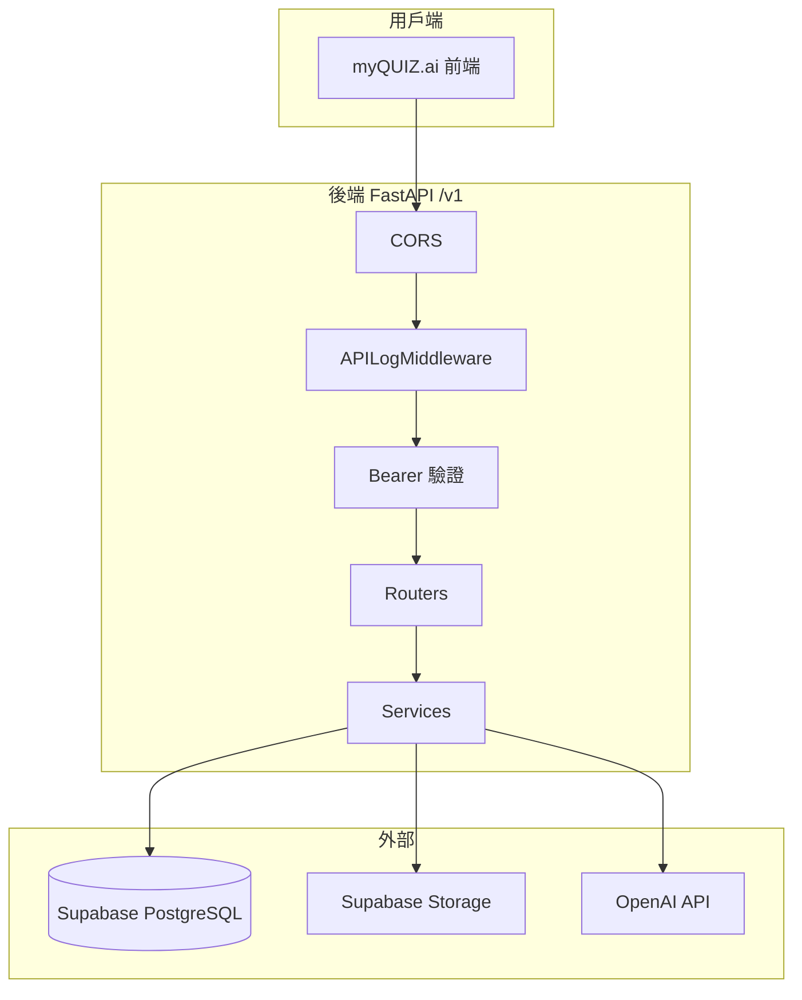
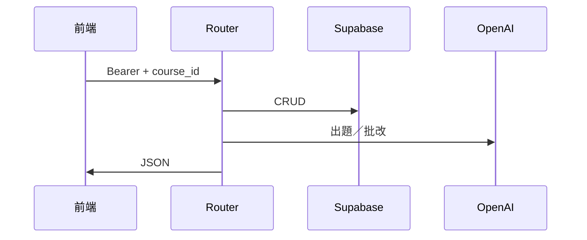
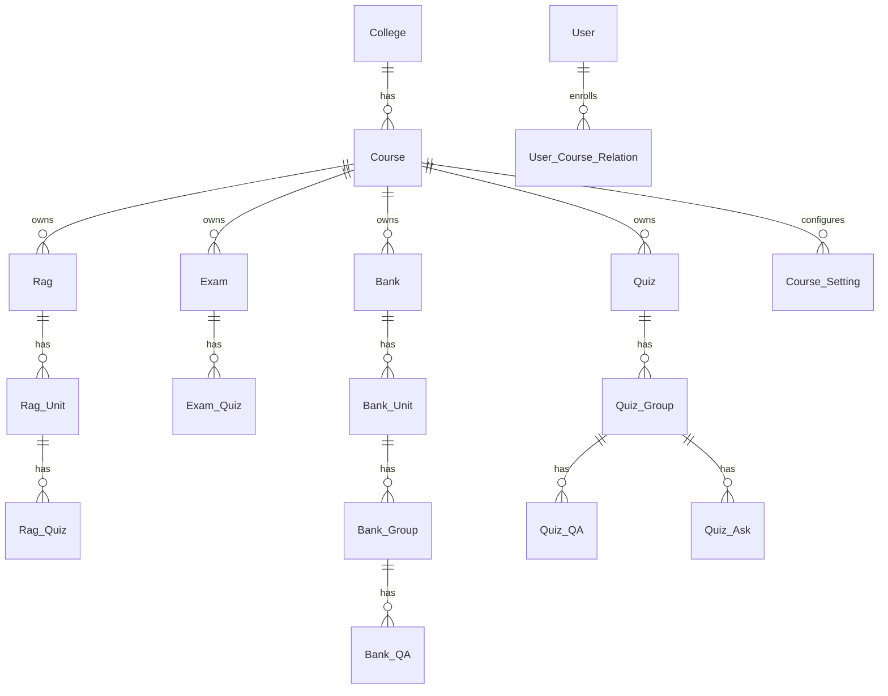
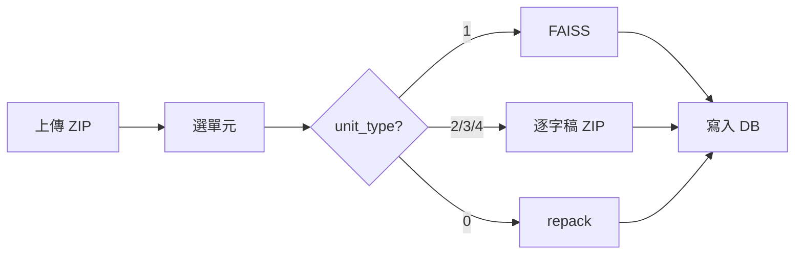
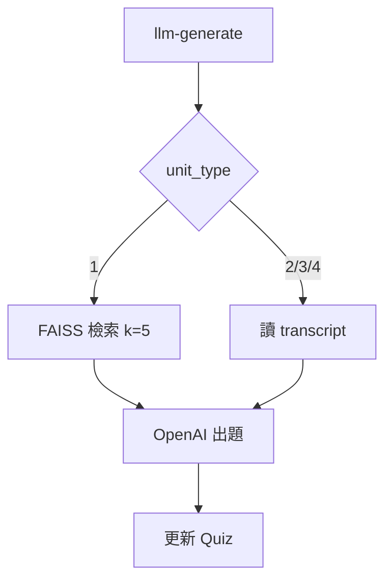
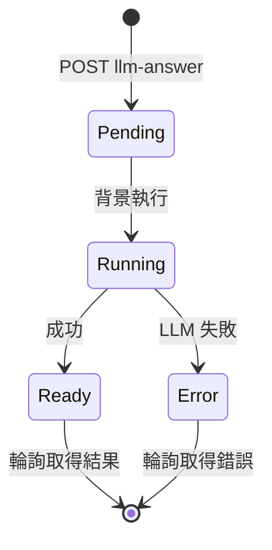

# myQUIZ.ai 後端教學手冊

[myQUIZ.ai](https://myquiz-ai.vercel.app) 的 **FastAPI 後端**教學文件。

這份文件回答四個問題：**系統在做什麼 → 怎麼跑起來 → 各核心流程怎麼串 → 每支 API 怎麼呼叫**。

---

## 怎麼讀

| 你是… | 建議路線 |
|-------|----------|
| 第一次接觸 | 依序讀第 1～7 章 |
| 前端／整合工程師 | 第 3 章（認證）→ 第 5 章（流程）→ 第 9 章（API 手冊） |
| 串接 Bank／Quiz 模組 | 第 5.5～5.6 節 → [docs/BANK_API.md](docs/BANK_API.md)、[docs/QUIZ_API.md](docs/QUIZ_API.md) |
| 維運／部署 | 第 2 章 → 第 8 章 |
| 查欄位格式 | 直接翻第 9 章 API 手冊 |

**圖片**：JPG 放到 `docs/images/`，檔名 `img-01.jpg`～`img-22.jpg`，對應內文【圖 XX】編號（目前待補）。

<details>
<summary>圖片索引（點開看 22 張圖的建議內容）</summary>

| 編號 | 章節 | 建議內容 |
|------|------|----------|
| 01 | 1.1 | 前端、後端、Supabase、OpenAI 四方總覽 |
| 02 | 1.2 | 六大業務模組與路由對應 |
| 03 | 2.2 | 請求處理流程（Middleware → Router） |
| 04 | 2.3 | 程式分層（routers / services / utils） |
| 05 | 3.1 | 登入取得 token 流程 |
| 06 | 3.2 | Bearer 驗證解析 |
| 07 | 3.4 | user_type 權限對照 |
| 08 | 4.1 | 資料表 ER 關係 |
| 09 | 4.3 | unit_type 五種類型 |
| 10 | 2.4 | Storage 路徑結構（rag／bank 命名空間） |
| 11 | 5.1 | 教材建置（build-zip）全流程 |
| 12 | 5.1 | build-zip NDJSON 串流 |
| 13 | 5.2 | LLM 出題流程 |
| 14 | 5.3 | LLM 批改非同步輪詢 |
| 15 | 5.7 | 弱點分析流程 |
| 16 | 5.4 | Exam 測驗流程 |
| 17 | 6.2 | llm_error vs 一般錯誤 |
| 18 | 8.1 | 本機 uvicorn + Swagger |
| 19 | 8.4 | Render 部署設定 |
| 20 | 8.1 | Swagger 端點分組 |
| 21 | 5.5 | Bank 題庫：題組逐題出題 |
| 22 | 5.6 | Quiz 試卷：快照、出題、追問 |

</details>

---

## 目錄

**入門**
- [第 1 章 系統在做什麼](#第-1-章-系統在做什麼)
- [第 2 章 架構一覽](#第-2-章-架構一覽)
- [第 3 章 認證與權限](#第-3-章-認證與權限)
- [第 4 章 資料怎麼存](#第-4-章-資料怎麼存)
- [第 5 章 七大核心流程](#第-5-章-七大核心流程)
- [第 6 章 設計慣例與錯誤處理](#第-6-章-設計慣例與錯誤處理)
- [第 7 章 目錄結構與技術棧](#第-7-章-目錄結構與技術棧)

**實作**
- [第 8 章 本機開發與部署](#第-8-章-本機開發與部署)

**參考**
- [第 9 章 API 手冊](#第-9-章-api-手冊)

---

## 第 1 章 系統在做什麼

### 1.1 一句話

myQUIZ.ai 讓老師**上傳教材 → AI 自動出題批改 → 學生做測驗 → 產生弱點報告**。

後端負責四件事：存資料、管權限、呼叫 OpenAI、建向量庫。


### 1.2 後端有哪些模組

| 模組 | 路由前綴 | 白話說明 |
|------|---------|----------|
| 認證 | `/v1/auth` | 登入拿 token、換發 token |
| 使用者 | `/v1/users` | 查使用者、查自己、改自己密碼 |
| 學院／課程 | `/v1/colleges`、`/v1/courses` | 列出學院與課程 |
| 課程成員 | `/v1/rag/course-members` | 加人、改身份、移出課程 |
| RAG 練習 | `/v1/rag/pages`、`/v1/rag/units`、`/v1/rag/quizzes` | 上傳教材建庫、單題練習出題／批改、追問 |
| Exam 測驗 | `/v1/exam` | 把 RAG 練習題匯成正式測驗卷，出題、批改、評分 |
| Bank 題庫 | `/v1/bank` | 獨立題庫：教材管理＋「題組」連續出題／批改（RAG 的姊妹版） |
| Quiz 試卷 | `/v1/quiz` | 搭配 Bank 的試卷：快照題組、逐題出題、作答批改、課程內容追問 |
| 弱點分析 | `/v1/person-analyses`、`/v1/course-analyses`、`/v1/user-analyses`、`/v1/quiz-analyses` | 個人／全班弱點報告（RAG/Exam 與 Bank/Quiz 各一組） |
| 課程設定 | `/v1/{rag,exam,bank,quiz}/llm-api-key` 等 | 各模組 API Key、模型、prompt 預設 |
| Prompt 模板 | `/v1/prompt-templates` | 查內建 LLM 模板 |
| Log | `/v1/logs` | API 呼叫稽核紀錄 |

兩條產品線的對應關係（資料互不相通、程式不互相 import）：

```
教材 → 練習 → 正式測驗
RAG  → Rag_Quiz（單題＋追問） → Exam（測驗卷）
Bank → Bank_Group（題組連續出題） → Quiz（試卷＋課程內容追問）
```


### 1.3 三個一定要記的規則

**規則 1：所有 API 都在 `/v1` 底下**

未來 breaking change 走 `/v2`，現行一律 `/v1/...`。

**規則 2：除登入外，都要帶 Bearer token**

```
Authorization: Bearer <access_token>
```

token 從 `POST /v1/auth/login` 取得。query 帶 `person_id` 的舊做法已移除（2026-06-07），沒 token 就 **401**。
例外：RAG／Bank 的「單元媒體」端點不驗 Bearer（見 3.3）。

**規則 3：除認證／學院／課程／個人分析列表外，都要帶 `course_id`**

放在 query，例如 `?course_id=1`。沒帶回 **400**。

### 1.4 欄位命名（前後端對接用）

| 情境 | RAG／Exam | Bank／Quiz |
|------|-----------|------------|
| 題幹 | `quiz_content` | `question_content` |
| 提示 | `quiz_hint` | `question_hint` |
| 參考答案 | `quiz_answer_reference` | `question_answer_reference` |
| 學生作答（request body） | `quiz_answer`（相容 `answer`） | `answer_content` |
| 學生作答（DB） | `answer_content` | `answer_content` |
| AI 評語（DB） | `answer_critique`（純文字 Markdown） | `answer_critique`（同左） |

### 1.5 API Key 與模型放哪

**不放在 `.env`**，而是依課程存在 `Course_Setting` 表，各模組獨立一把：

| Course_Setting key | 用途 | 管理端點 |
|-----|------|----------|
| `rag-api-key` | RAG 出題／批改、FAISS 建庫 | `/v1/rag/llm-api-key` |
| `exam-api-key` | Exam 出題／批改、個人弱點分析 | `/v1/exam/llm-api-key` |
| `bank-api-key` | Bank 題組出題／批改、Bank FAISS 建庫 | `/v1/bank/llm-api-key` |
| `quiz-api-key` | Quiz 出題／批改／課程內容追問 | `/v1/quiz/llm-api-key` |
| `course-analysis-api-key` | 課程（全班）弱點分析 | ⚠️ 程式讀取但目前**無設定端點**（待補，見備註） |
| `user-analysis-api-key` | 使用者弱點分析（Bank/Quiz 線） | `/v1/user-analyses/llm-api-key` |
| `quiz-analysis-api-key` | 試卷弱點分析 | `/v1/quiz-analyses/llm-api-key` |
| `llm-model` | RAG／Exam 出題批改、個人／課程弱點分析共用模型（預設 `gpt-5.4`） | `/v1/rag/llm-model` |
| `bank-llm-model` | Bank 出題／批改模型 | `/v1/bank/llm-model` |
| `quiz-llm-model` | Quiz 出題／批改／追問模型 | `/v1/quiz/llm-model` |
| `user-analysis-llm-model` | 使用者弱點分析模型 | `/v1/user-analyses/llm-model` |
| `quiz-analysis-llm-model` | 試卷弱點分析模型 | `/v1/quiz-analyses/llm-model` |

> ⚠️ **備註**：`course-analysis-api-key` 被 `get_course_analysis_api_key`（`utils/analysis_llm_key.py`）讀取，但程式並未註冊對應的 GET/PUT 設定端點（只有 `user-analyses`、`quiz-analyses` 有）。因此課程弱點分析目前無法經由 API 設定其 Key，`POST /v1/course-analyses/{id}/llm-analysis` 會回 `llm_error: 未設定 API Key`。屬待修的功能缺口。個人弱點分析則共用 `exam-api-key`（`/v1/exam/llm-api-key`）。

每把 key 都有 `GET …/llm-api-key/exists` 端點：**不回傳 key 內容**、一般使用者可查，供前端在出題前提示「請先請老師設定 API Key」。

---

## 第 2 章 架構一覽

### 2.1 整體架構

前端（Vercel）透過 HTTPS 呼叫後端。後端再連 Supabase（資料庫＋檔案）與 OpenAI（LLM＋embedding）。



### 2.2 一筆請求怎麼走

1. 前端帶 `Bearer` + `course_id` 發請求
2. `APILogMiddleware` 記錄（失敗不影響回應）
3. Router 驗證 token → 得到 `person_id`
4. 需要時讀寫 DB、下載 Storage ZIP、呼叫 LLM
5. 回 JSON；Middleware 非同步寫 Log




### 2.3 程式分層

| 層 | 目錄 | 做什麼 |
|----|------|--------|
| 入口 | `main.py` | 掛路由、CORS、Middleware |
| 路由 | `routers/` | HTTP 端點、權限檢查 |
| 服務 | `services/` | LLM 出題／批改／追問／弱點報告 |
| 工具 | `utils/` | DB、Storage、FAISS、token、課程設定 |
| 依賴 | `dependencies/` | 注入 person_id、course_id |
| 中介 | `middleware/` | API 紀錄、遮罩敏感欄位 |


### 2.4 Storage 檔案放哪

Bucket：RAG 用 `SUPABASE_RAG_BUCKET`（預設 `myQUIZ.ai`）；Bank 用 `SUPABASE_BANK_BUCKET`（未設時沿用 RAG bucket），但路徑加 `bank/` 命名空間。

```
RAG：
{person_id}/{rag_page_id}/upload/{rag_page_id}.zip    ← 原始上傳
{person_id}/{rag_page_id}/repack/{stem}.zip           ← 單元 repack
{person_id}/{rag_page_id}/rag/{stem}_rag.zip          ← FAISS 或逐字稿

Bank：
bank/{person_id}/{bank_page_id}/upload/{bank_page_id}.zip
bank/{person_id}/{bank_page_id}/repack/{stem}.zip
bank/{person_id}/{bank_page_id}/rag/{stem}_rag.zip
```


---

## 第 3 章 認證與權限

### 3.1 登入拿 token（教學步驟）

**步驟 1** — 呼叫登入（不需 Bearer）

```bash
curl -X POST http://127.0.0.1:8000/v1/auth/login \
  -H 'Content-Type: application/json' \
  -d '{"person_id": "你的帳號", "password": "你的密碼"}'
```

**步驟 2** — 從回應取出 `access_token`

**步驟 3** — 之後每個請求帶標頭

```
Authorization: Bearer <access_token>
```

**步驟 4** — token 快到期可換發

`POST /v1/auth/refresh`（帶舊 token，無 body）。需要重抓自己的最新資料（含選課）時用 `GET /v1/users/me`。


### 3.2 Token 怎麼做的

自簽 HMAC-SHA256（`utils/auth.py`），不依賴外部 JWT 套件：

```
token = base64url(payload) + "." + base64url(簽章)
payload = {"sub": person_id, "iat": 簽發時間, "exp": 到期時間}
```

| 項目 | 值 |
|------|-----|
| 效期 | 預設 30 天（`AUTH_TOKEN_TTL_SECONDS` 可調） |
| 密鑰 | `AUTH_TOKEN_SECRET`（正式環境必設） |


### 3.3 三層檢查

| 檢查 | 說明 |
|------|------|
| Bearer token | 除登入與「單元媒體」端點外，全部必帶 |
| course_id | 除認證／學院／課程／個人分析列表外，必填 query |
| user_type | 依課程決定身份（見 3.4） |

**不驗 Bearer 的例外**（給 `<audio src>` 等直接嵌入用，owner 由 page_id 反查）：

- `GET /v1/rag/units/{id}/text|mp3-file|youtube-url`
- `GET /v1/bank/units/{id}/text|mp3-file|youtube-url`

建置前預覽 `unit-preview/*` 則**要** Bearer。

### 3.4 身份與權限（user_type）

同一人在不同課程可有不同身份：

| user_type | 身份 | 能做什麼 |
|-----------|------|----------|
| 1 | 管理者 | 全部；可建 FAISS |
| 2 | 教師 | 設 API Key、模型、prompt 預設、成員管理 |
| 3 | 學生 | 作答、查詢；不能改設定 |

需 **1 或 2** 才能：讀寫各模組 API Key／模型／prompt 課程預設、分析指令、課程成員管理。

資源層級另有**擁有權檢查**：RAG／Bank／Quiz／Exam 的分頁、題組、題目都記 `person_id`，只有建立者本人能改寫或刪除（否則 403）。


---

## 第 4 章 資料怎麼存

### 4.1 核心表關係




### 4.2 主要資料表

| 表 | 存什麼 |
|----|--------|
| `User` | 帳號（`person_id` 登入用） |
| `User_Course_Relation` | 選課 + `user_type` |
| `Rag` / `Rag_Unit` / `Rag_Quiz` | RAG 教材分頁、單元、練習題 |
| `Exam` / `Exam_Quiz` | 測驗卷、測驗題（含追問鏈） |
| `Bank` / `Bank_Unit` | Bank 題庫教材分頁、單元（結構同 Rag） |
| `Bank_Group` / `Bank_QA` | Bank 題組（出題規則＋題數上限）、題組內逐題 |
| `Quiz` / `Quiz_Group` / `Quiz_QA` | 試卷、題組快照、試卷題目 |
| `Quiz_Ask` | 試卷題組的「課程內容追問」紀錄 |
| `Course_Setting` | 各模組 API Key、模型、prompt 預設、分析指令 |
| `Person_Analysis` / `Course_Analysis` | 弱點分析結果 |
| `Log` | API 呼叫紀錄 |

> 刪除都是**軟刪除**（`deleted=true`）。時間戳為台北時區 `+08:00`。

### 4.3 單元類型 unit_type（RAG 與 Bank 共用）

教材 ZIP 建庫時，每個資料夾是一個「單元」：

| 值 | 名稱 | 建庫結果 | 出題時用什麼 |
|----|------|----------|-------------|
| 0 | 未指定 | repack 複製 | 依 ZIP 推斷 |
| 1 | Office/PDF/MD | **FAISS 向量庫** | 向量檢索 top-5 |
| 2 | 純文字 | 逐字稿 ZIP | 全文 transcript |
| 3 | MP3 音訊 | 逐字稿 ZIP | 音訊旁文字檔 |
| 4 | YouTube | 逐字稿 ZIP | URL + 逐字稿 |


**自動推斷**：一音訊＋一文字 → 3；僅文字 → 2；YouTube 須手動指定 4。

**FAISS 條件**：`unit_type=1` 且 `allow_faiss=true`（由 user_type、`build_faiss`、`repack_only` 決定）。

### 4.4 Course_Setting 全部 key 一覽

| key | 用途 | 誰用 |
|-----|------|------|
| `rag-api-key` | RAG 出題／批改／建庫 | RAG |
| `exam-api-key` | Exam 出題／批改 + 個人分析 | Exam、Person_Analysis |
| `bank-api-key` | Bank 出題／批改／建庫 | Bank |
| `quiz-api-key` | Quiz 出題／批改／追問 | Quiz |
| `course-analysis-api-key` | 課程（全班）弱點分析 | Course_Analysis |
| `user-analysis-api-key` | 使用者弱點分析 | User_Analysis |
| `quiz-analysis-api-key` | 試卷弱點分析 | Quiz_Analysis |
| `llm-model` | RAG／Exam／個人＋課程分析共用模型 | RAG、Exam、Person/Course_Analysis |
| `bank-llm-model` | Bank 模型 | Bank |
| `quiz-llm-model` | Quiz 模型 | Quiz |
| `user-analysis-llm-model` | 使用者分析模型 | User_Analysis |
| `quiz-analysis-llm-model` | 試卷分析模型 | Quiz_Analysis |
| `person_analysis_user_prompt_text` | 個人分析規則 | Person_Analysis |
| `course_analysis_user_prompt_text` | 課程分析規則 | Course_Analysis |
| `user_analysis_user_prompt_text` | 使用者分析規則 | User_Analysis |
| `quiz_analysis_user_prompt_text` | 試卷分析規則 | Quiz_Analysis |
| `bank_question_system_prompt_text` | Bank 題組「連續出題規定」課程預設 | 建 Bank_Group 時帶入 |
| `bank_question_user_prompt_text` | Bank 題組「出題規定」課程預設 | 同上 |
| `bank_answer_user_prompt_text` | Bank 題組「批改規定」課程預設 | 同上 |
| `quiz_question_system_prompt_text` | Quiz 同名課程預設 | Quiz 設定端點 |
| `quiz_question_user_prompt_text` | Quiz 同名課程預設 | 同上 |
| `quiz_answer_user_prompt_text` | Quiz 同名課程預設 | 同上 |

---

## 第 5 章 七大核心流程

| 流程 | 一句話 | 章節 |
|------|--------|------|
| A 教材建置 | 上傳 ZIP → build-zip 轉成 AI 能讀的格式（RAG／Bank 同模式） | 5.1 |
| B RAG 出題 | 依教材讓 AI 產生題幹、提示、參考答案（單題＋追問） | 5.2 |
| C LLM 批改 | 非同步：202 + job_id → 輪詢拿評語（全系統共用模式） | 5.3 |
| D Exam 測驗 | RAG 練習題匯入正式測驗卷 | 5.4 |
| E Bank 題庫 | 題組設定一次，AI 連續出題（不重複、可越來越難） | 5.5 |
| F Quiz 試卷 | 快照 Bank 題組成試卷，逐題出題、作答、追問課程內容 | 5.6 |
| G 弱點分析 | 彙整已作答題目，AI 產生 Markdown 弱點報告 | 5.7 |

### 5.1 流程 A：教材建置（build-zip）

**目的**：把上傳的 ZIP 轉成 AI 能讀的格式。RAG 與 Bank 完全同模式，只差路由前綴與表名。

**步驟**

1. `POST /v1/rag/pages/upload-zip`（或 `/v1/bank/pages/upload-zip`）— 上傳 ZIP
2. 前端選資料夾、指定 unit_type（可先用 `unit-preview/*` 預覽內容）
3. `POST /v1/rag/pages/{rag_page_id}/build-zip` — 建庫
4. 全部成功後才寫入 `Rag_Unit`（或 `Bank_Unit`）列




**回應格式**：`application/x-ndjson` 串流（逐行 JSON）

- 前端用 `fetch` 讀 `response.body` 逐行解析，**不要用** `response.json()`
- HTTP 永遠 200，看最後一行 `type:"complete"` 的 `success` 判斷成敗


**注意**

- 建 FAISS 前須設定該模組的 API Key（RAG 用 `rag-api-key`、Bank 用 `bank-api-key`），embedding 需要
- 建置前預覽用 `unit-preview/*`（此時還沒有 unit_id）；建置後媒體用 `units/{id}/*`（不驗 Bearer）

---

### 5.2 流程 B：RAG 出題（單題＋追問）

**目的**：依教材內容，AI 產生題幹、提示、參考答案。

**步驟**

1. 確認 `rag-api-key` 已設定（可查 `GET /v1/rag/llm-api-key/exists`）
2. `POST /v1/rag/quizzes` 建空白題（或直接對既有題出題）
3. `POST /v1/rag/quizzes/llm-generate`
4. 後端依 unit_type 取 context → 呼叫 LLM → 寫入 `quiz_content` 等欄位；清空舊作答




**變體速查**

| 後綴 | 意思 |
|------|------|
| `-db` | 沿用 DB 既有 prompt，body 不帶 prompt |
| `-followup` | 依前次作答／評語追問 |
| `create-`（Exam） | 先建題目列再出題，一次完成 |

**失敗時**：HTTP 200 + `llm_error`（不是 5xx，見 6.2）

---

### 5.3 流程 C：LLM 批改（非同步，全系統共用模式）

**目的**：學生作答後，AI 產生評語。因為較慢，採**非同步 + 輪詢**。RAG、Exam、Bank、Quiz 四個模組都是同一套模式。

**步驟**

1. `POST .../llm-answer` → 立刻回 **202** + `job_id`
2. 背景跑 LLM 批改
3. 前端輪詢 `GET .../answer-result/{job_id}`
4. `status=ready` 時讀 `answer_critique`；LLM 失敗則 `status=error`、`result` 為 null、錯誤在 `error`／`llm_error`

| 模組 | 送出批改 | 輪詢 |
|------|----------|------|
| RAG | `POST /v1/rag/quizzes/llm-answer` | `GET /v1/rag/quizzes/answer-result/{job_id}` |
| Exam | `POST /v1/exam/quizzes/llm-answer` | `GET /v1/exam/quizzes/answer-result/{job_id}` |
| Bank | `POST /v1/bank/qa/{bank_qa_id}/llm-answer` | `GET /v1/bank/qa/answer-result/{job_id}` |
| Quiz | `POST /v1/quiz/qa/{quiz_qa_id}/llm-answer` | `GET /v1/quiz/qa/answer-result/{job_id}` |




**注意**

- Job 存在**記憶體**，服務重啟後 `job_id` 失效（404）→ 要重新送出
- LLM 失敗：`status=error`、`result` 為 null，頂層 `error`／`llm_error` 帶錯誤訊息（不再回 ready）

---

### 5.4 流程 D：Exam 測驗

**目的**：把 RAG 練習題匯入正式測驗，學生作答並取得 AI 評語。

**步驟**

1. RAG 題目設 `for_exam=true`（`PUT /v1/rag/quizzes/{id}/for-exam`）
2. `GET /v1/exam/rag-for-exams` — 查可匯入題目
3. `POST /v1/exam/pages` — 建測驗卷
4. `POST /v1/exam/quizzes/create-llm-generate` — 建題並出題
5. `POST /v1/exam/quizzes/llm-answer` — 批改（非同步，流程 C）
6. 可 `create-llm-generate-followup` 追問、`quiz-rate`／`answer-rate` 評分


---

### 5.5 流程 E：Bank 題庫（題組連續出題）

**目的**：RAG 是「一題一題手動出」；Bank 把出題規則收進**題組（Bank_Group）**，AI 依規則**連續出題**（彼此不重複、可越來越難），上限 `qa_count`（1–20）。

**資料階層**

```
Bank（題庫頁）─< Bank_Unit（單元）─< Bank_Group（題組）─< Bank_QA（題目）
```

**步驟**

1. 教材建置同流程 A（`/v1/bank/pages/upload-zip` → `build-zip`）
2. `PUT /v1/bank/llm-api-key` 設定 `bank-api-key`（與 RAG 的 key 完全分開）
3. `POST /v1/bank/pages/{page}/units/{unit}/groups` — 建題組，設定：
   - `qa_count`：本題組要出幾題（1–20）
   - `question_system_prompt_text`：連續出題規定（如「越來越深入且不重複」），織入 system prompt 最高優先
   - `question_user_prompt_text`：出題規定
   - `answer_user_prompt_text`：批改規定
   - 留空的 prompt 會自動帶入課程預設（`Course_Setting` 的 `bank_question_*`／`bank_answer_*`）
4. `POST /v1/bank/groups/{id}/qa/llm-generate` — **每呼叫一次出下一題**（同步、無 body）；同題組既有題幹會作為「已出過題目（勿重複）」送入；達 `qa_count` 上限回 **409**
5. 題目不滿意？`POST /v1/bank/qa/{id}/llm-regenerate` — **原地重出同一題**（不新增列、不改題號，舊作答清空）
6. 作答批改走流程 C（`POST /v1/bank/qa/{id}/llm-answer`）
7. 題組設 `for_exam=true` 後可供 Quiz 試卷選用


**與 RAG 的差異速記**

| | RAG 練習 | Bank 題庫 |
|---|----------|----------|
| 出題單位 | 單題（Rag_Quiz） | 題組（Bank_Group → 逐題 Bank_QA） |
| prompt 來源 | 每題 body／DB | 題組設定（建立時可帶課程預設） |
| 追問 | `llm-generate-followup` | 無（連續出題本身就考慮歷史） |
| API Key | `rag-api-key` | `bank-api-key` |
| 下游 | Exam | Quiz |

> 完整欄位與範例見 [docs/BANK_API.md](docs/BANK_API.md)。

---

### 5.6 流程 F：Quiz 試卷（快照＋追問課程內容）

**目的**：Quiz 之於 Bank，等於 Exam 之於 RAG——「正式應試」層。把 Bank 題組**快照**成試卷題組，逐題出題、作答批改，還能對課程內容**發問**（Quiz_Ask）。

**資料階層**

```
Quiz（試卷）─< Quiz_Group（自 Bank_Group 快照）─< Quiz_QA（題目）
                └─< Quiz_Ask（課程內容追問紀錄）
```

**步驟**

1. `PUT /v1/quiz/llm-api-key` 設定 `quiz-api-key`
2. `POST /v1/quiz/pages` — 建試卷
3. `GET /v1/quiz/bank-groups` — 列出可選的 Bank 題組（`for_exam=true`）
4. `POST /v1/quiz/pages/{id}/groups` — 把選定的 Bank_Group **快照**成 Quiz_Group（prompt、`qa_count`、模型、單元資訊全部凍結；之後改 Bank 不影響試卷）
5. `POST /v1/quiz/groups/{id}/qa/llm-generate` — 逐題出題（同步、無 body；達 `qa_count` 回 409；**會把本題組的追問紀錄一併納入出題依據**）
6. 作答批改走流程 C（`POST /v1/quiz/qa/{id}/llm-answer`）
7. `POST /v1/quiz/groups/{id}/llm-ask` — 對該題組對應的 **Bank 單元課程內容**發問（同步）；prompt 自動帶入本題組全部測驗題紀錄與先前追問；每次新增一筆 `Quiz_Ask`
8. 評分回饋：`question-rate`／`answer-rate`（題目與評語，-1/0/1）、追問回答也可 `asks/{id}/answer-rate`


**注意**

- 出題／批改讀的是 **Bank 單元**的 FAISS 向量庫或逐字稿，所以對應 Bank 單元要先 build-zip 完成
- 刪除 Quiz_QA 後，同題組剩餘題目會自動**重編題號**（`question_series_index`）
- 批改規則／模型每次批改時自題組現值重抓；批改完成後把實際使用值寫回該題（QA 列記錄各次呼叫實際用了什麼）

> 完整欄位與範例見 [docs/QUIZ_API.md](docs/QUIZ_API.md)。

---

### 5.7 流程 G：弱點分析

**目的**：彙整已作答題目，AI 產生 Markdown 弱點報告。

**個人 vs 課程**

| | 個人 | 課程 |
|---|------|------|
| 表 | `Person_Analysis` | `Course_Analysis` |
| API Key | `exam-api-key` | `rag-api-key` |
| 範圍 | 該生已作答 | 全班已作答 |
| 規則來源 | `person_analysis_user_prompt_text` | `course_analysis_user_prompt_text` |

**步驟（兩者相同模式）**

1. `POST /v1/person-analyses?course_id=…` — 建空白列
2. `POST /v1/person-analyses/{id}/llm-analysis` — 產生報告寫入該列
3. `PATCH` 改名、`DELETE` 軟刪


---

## 第 6 章 設計慣例與錯誤處理

### 6.1 REST 慣例（2026-06-06 起）

| 慣例 | 範例 |
|------|------|
| 複數集合名 | `/v1/rag/pages` |
| 建立／列表巢狀於 parent | `POST /v1/bank/pages/{page}/units/{unit}/groups` |
| 單一資源以主鍵走淺路徑 | `GET /v1/bank/groups/{bank_group_id}` |
| 新增 POST → 201 | `POST /v1/rag/quizzes` |
| 刪除 DELETE（軟刪） | `DELETE /v1/rag/pages/{id}` |
| 部分更新 PATCH | `PATCH /v1/exam/pages/{id}` |
| kebab-case | `/v1/rag/llm-api-key` |
| LLM 動作用 `llm-` 前綴 | `llm-generate`、`llm-answer`、`llm-ask` |

### 6.2 一般錯誤 vs LLM 錯誤

**一般錯誤**（驗證、權限、找不到資源）→ HTTP 4xx/5xx

```json
{ "detail": "錯誤說明" }
```

**LLM 錯誤**（Key 錯、額度不足、逾時）→ **HTTP 200 + `llm_error`**

讓前端能把原因顯示給使用者，而不是只看到 500。前端要判斷 `llm_error` 是否存在，而非只看 HTTP 狀態碼。

| 情境 | 行為 |
|------|------|
| 出題失敗 | 200 + `llm_error`，題目欄位空字串 |
| 批改失敗 | `status=error` + `result=null` + `error`／`llm_error` |
| 追問失敗（Quiz） | 200 + `llm_error` |
| 分析失敗 | 200 + `weakness_report=null` + `llm_error` |


### 6.3 常見 HTTP 狀態碼

| 碼 | 意思 |
|----|------|
| 202 | 批改已接受（非同步） |
| 400 | 缺參數、person_id 不一致、API Key 未設定 |
| 401 | 沒 token 或過期 |
| 403 | 權限不足、非資源擁有者 |
| 404 | 資源不存在、job 查無 |
| 409 | 成員重複、跨學院衝突、題組達 qa_count 上限 |
| 413 | ZIP 太大 |
| 500 | 設定寫入失敗（Course_Setting 寫入遭 RLS 擋／service_role key 未設定）等伺服器錯誤 |

---

## 第 7 章 目錄結構與技術棧

### 7.1 技術棧

| 類別 | 技術 |
|------|------|
| 語言 | Python 3.10.12 |
| 框架 | FastAPI + Uvicorn |
| 認證 | 自簽 HMAC Bearer token |
| 資料庫 | Supabase PostgreSQL |
| 檔案 | Supabase Storage |
| 向量 | LangChain + FAISS + `text-embedding-3-small` |
| LLM | OpenAI gpt-5.4（可 per-course 覆寫） |
| 部署 | Render |

### 7.2 目錄結構

```
MyQuiz-ai-backend/
├── main.py                  # 入口：CORS、APILogMiddleware、掛 15 個 router
├── routers/
│   ├── zip/                 # RAG 教材（pages/units/媒體/build-zip）
│   ├── answer/              # RAG 出題批改（quizzes/llm-*）
│   ├── bank/                # Bank 題庫（pages/units/groups/qa）
│   ├── quiz/                # Quiz 試卷（pages/groups/qa/asks）
│   ├── exam/                # Exam 測驗
│   ├── person_analysis.py   # 個人弱點分析（RAG/Exam 線）
│   ├── course_analysis.py   # 課程弱點分析（RAG/Exam 線）
│   ├── user_analysis.py     # 使用者弱點分析（Bank/Quiz 線）
│   ├── quiz_analysis.py     # 試卷弱點分析（Bank/Quiz 線）
│   ├── analysis_prompt_settings.py  # user/quiz 分析的 api-key/model/prompt 設定 factory
│   ├── profile.py           # auth/login、users/me
│   ├── college.py / course.py
│   ├── course_settings.py   # 課程成員、RAG/Exam 設定
│   ├── llm_settings.py      # Bank/Quiz LLM 設定 routes factory（兩模組共用）
│   ├── prompt.py            # prompt-templates
│   └── log.py
├── services/                # LLM 業務邏輯（generation/answering/asking/analysis）
├── utils/                   # DB、Storage、FAISS、auth、課程設定
├── dependencies/            # person_id（Bearer 解析）、course_id 注入
├── middleware/              # APILogMiddleware
└── docs/
    ├── BANK_API.md          # Bank 模組逐端點詳細文件
    ├── QUIZ_API.md          # Quiz 模組逐端點詳細文件
    └── images/              # 本手冊圖片（img-01 ~ img-22）
```

> bank／quiz 的 `/llm-api-key`、`/llm-model` 與三個 prompt 課程預設端點同形，由 `routers/llm_settings.py` 的 factory 依參數產生，避免兩份檔案平行維護。

---

## 第 8 章 本機開發與部署

### 8.1 本機啟動（四步）

**步驟 1** — 複製環境變數

```bash
cp .env.example .env
# 填入 SUPABASE_URL、SUPABASE_SERVICE_ROLE_KEY 等
```

**步驟 2** — 安裝依賴

```bash
pip install -r requirements.txt
```

**步驟 3** — 啟動

```bash
uvicorn main:app --reload
```

**步驟 4** — 開 Swagger 確認

瀏覽 `http://127.0.0.1:8000/docs`


### 8.2 環境變數

| 變數 | 必填 | 說明 |
|------|------|------|
| `SUPABASE_URL` | ✅ | Supabase 專案 URL |
| `SUPABASE_SERVICE_ROLE_KEY` | ✅* | 後端用（略過 RLS） |
| `SUPABASE_ANON_KEY` | ✅* | 至少需其一 |
| `SUPABASE_RAG_BUCKET` | 選 | 預設 `myQUIZ.ai` |
| `SUPABASE_BANK_BUCKET` | 選 | Bank 專用 bucket；未設沿用 RAG bucket（`bank/` 前綴隔離） |
| `AUTH_TOKEN_SECRET` | 建議 | token 簽章密鑰（正式環境必設） |
| `AUTH_TOKEN_TTL_SECONDS` | 選 | 預設 30 天 |
| `CORS_EXTRA_ORIGINS` | 選 | 額外 CORS 網域（逗號分隔） |

### 8.3 macOS 注意

`main.py` 設 `KMP_DUPLICATE_LIB_OK=TRUE`，避免 FAISS/NumPy OpenMP 衝突。

### 8.4 部署到 Render

1. Build：`pip install -r requirements.txt`
2. Start：`uvicorn main:app --host 0.0.0.0 --port $PORT`
3. 環境變數同 `.env`
4. Python 版本看 `runtime.txt`


**Render 注意**

- 同步 LLM 超過 ~30 秒可能 502 → 批改已改非同步
- 重啟後評分 job 失效 → 前端要重新送
- 改 `AUTH_TOKEN_SECRET` → 所有人要重新登入

---

## 第 9 章 API 手冊

> 完整 API 參考，適合當字典查；教學重點請回第 3～5 章。
> Bank／Quiz 模組另有逐端點專文：[docs/BANK_API.md](docs/BANK_API.md)、[docs/QUIZ_API.md](docs/QUIZ_API.md)。

### 9.1 共通約定速查

- 除登入與 RAG／Bank 單元媒體外，皆需 `Authorization: Bearer <token>`。
- 除認證／學院／課程／`GET /v1/person-analyses` 外，皆需 query `course_id`。
- 時間戳為 ISO 8601 台北時區字串（範例以 `"2026-01-01T00:00:00+08:00"` 表示）。
- **一般錯誤**：`{ "detail": "錯誤說明" }` + 4xx/5xx。**LLM 錯誤**：HTTP 200 + `llm_error`（見第 6 章）。

### 9.2 API 目錄

RAG／Bank 採相同層級：**分頁（pages）→ 單元（units）→ 題目（quizzes）／題組（groups）→ 設定**。Swagger（`/docs`）路徑順序由 `utils/openapi_order.py` 統一排序。

| 方法 | 路徑 | 說明 |
|------|------|------|
| **認證** | | |
| POST | `/v1/auth/login` | 登入，簽發 access_token |
| POST | `/v1/auth/refresh` | 以有效 token 換發新 token |
| **使用者** | | |
| GET | `/v1/users` | 列出指定學院使用者（必填 query `college_id`，含選課） |
| GET | `/v1/users/me` | 呼叫者自己的 profile（含選課，不含 password） |
| PUT | `/v1/users/me/password` | 更新自己的密碼 |
| **學院／課程** | | |
| GET | `/v1/colleges` | 列出學院（含 courses、user_count） |
| GET | `/v1/courses` | 列出課程（含 college_name） |
| **課程成員** | | |
| GET | `/v1/rag/course-members` | 列出課程成員 |
| POST | `/v1/rag/course-members` | 新增成員（201） |
| POST | `/v1/rag/course-members/batch` | 批次新增成員（學生）（201） |
| PATCH | `/v1/rag/course-members/{member_person_id}` | 編輯成員 |
| DELETE | `/v1/rag/course-members/{member_person_id}` | 移出課程（軟刪除） |
| **RAG 教材管理** | | |
| GET | `/v1/rag/pages` | 列出 Rag（含 units→quizzes） |
| POST | `/v1/rag/pages/upload-zip` | 建立 Rag 並上傳 ZIP（201） |
| PATCH | `/v1/rag/pages/{rag_page_id}` | 更新 Rag tab_name |
| DELETE | `/v1/rag/pages/{rag_page_id}` | 軟刪除 Rag + 刪 Storage 資料夾 |
| GET | `/v1/rag/pages/{rag_page_id}/units` | 列出 Rag_Unit（含 quizzes） |
| POST | `/v1/rag/pages/{rag_page_id}/build-zip` | 建置 RAG ZIP（NDJSON 串流） |
| GET | `/v1/rag/pages/{rag_page_id}/unit-preview/{text,mp3-file,youtube-url}` | 建置前預覽（Bearer + owner） |
| **RAG 單元媒體（不驗 Bearer）** | | |
| GET | `/v1/rag/units/{rag_unit_id}/text` | 取得文字單元逐字稿 |
| GET | `/v1/rag/units/{rag_unit_id}/mp3-file` | 取得音訊與逐字稿 |
| GET | `/v1/rag/units/{rag_unit_id}/youtube-url` | 解析 YouTube URL 與逐字稿 |
| **RAG 題目管理** | | |
| POST | `/v1/rag/quizzes` | 新增空白 Rag_Quiz（201，不呼叫 LLM） |
| PATCH | `/v1/rag/quizzes/{rag_quiz_id}` | 更新 quiz_name |
| DELETE | `/v1/rag/quizzes/{rag_quiz_id}` | 軟刪除 Rag_Quiz |
| PUT | `/v1/rag/quizzes/{rag_quiz_id}/followup` | 更新 follow_up 旗標 |
| PUT | `/v1/rag/quizzes/{rag_quiz_id}/for-exam` | 更新 for_exam 旗標 |
| **RAG 出題與評分** | | |
| POST | `/v1/rag/quizzes/llm-generate` | LLM 出題 |
| POST | `/v1/rag/quizzes/llm-generate-db` | LLM 出題（沿用 DB prompt） |
| POST | `/v1/rag/quizzes/llm-generate-followup` | LLM 追問出題 |
| POST | `/v1/rag/quizzes/llm-generate-followup-db` | LLM 追問出題（沿用 DB prompt） |
| POST | `/v1/rag/quizzes/llm-answer` | 非同步評分（202 + job_id） |
| POST | `/v1/rag/quizzes/llm-answer-db` | 非同步評分（沿用 DB prompt） |
| GET | `/v1/rag/quizzes/answer-result/{job_id}` | 輪詢評分結果 |
| **RAG 課程設定** | | |
| GET/PUT | `/v1/rag/llm-api-key` | 讀寫 rag-api-key（user_type 1/2） |
| GET | `/v1/rag/llm-api-key/exists` | rag-api-key 是否已設定（一般使用者可查） |
| GET/PUT | `/v1/rag/llm-model` | 讀寫 llm-model（user_type 1/2） |
| GET/PUT | `/v1/rag/person-analysis-user-prompt-text` | 讀寫個人分析指令（寫入限 1/2） |
| GET/PUT | `/v1/rag/course-analysis-user-prompt-text` | 讀寫課程分析指令（寫入限 1/2） |
| **Bank 教材管理** | | |
| GET | `/v1/bank/pages` | 列出 Bank（含 units→groups→qas 巢狀） |
| POST | `/v1/bank/pages/upload-zip` | 建立 Bank 並上傳 ZIP（201） |
| PATCH | `/v1/bank/pages/{bank_page_id}` | 更新 Bank tab_name |
| DELETE | `/v1/bank/pages/{bank_page_id}` | 軟刪除 Bank + 刪 Storage 資料夾 |
| GET | `/v1/bank/pages/{bank_page_id}/units` | 列出 Bank_Unit |
| POST | `/v1/bank/pages/{bank_page_id}/build-zip` | 建置 Bank ZIP（NDJSON 串流） |
| GET | `/v1/bank/pages/{bank_page_id}/unit-preview/{text,mp3-file,youtube-url}` | 建置前預覽（Bearer + owner） |
| **Bank 單元媒體（不驗 Bearer）** | | |
| GET | `/v1/bank/units/{bank_unit_id}/{text,mp3-file,youtube-url}` | 同 RAG 單元媒體三端點 |
| **Bank 題組與題目** | | |
| POST | `/v1/bank/pages/{page}/units/{unit}/groups` | 新增題組（201，不呼叫 LLM） |
| GET | `/v1/bank/pages/{page}/units/{unit}/groups` | 列出題組（含 qas） |
| GET | `/v1/bank/groups/{bank_group_id}` | 讀取單一題組（含 qas） |
| PATCH | `/v1/bank/groups/{bank_group_id}` | 更新題組設定（部分更新） |
| PUT | `/v1/bank/groups/{bank_group_id}/for-exam` | 更新 for_exam 旗標 |
| DELETE | `/v1/bank/groups/{bank_group_id}` | 軟刪除題組 |
| GET/PUT | `/v1/bank/groups/{id}/question-system-prompt-text` | 讀寫題組連續出題規定 |
| GET/PUT | `/v1/bank/groups/{id}/question-user-prompt-text` | 讀寫題組出題規定 |
| GET/PUT | `/v1/bank/groups/{id}/answer-user-prompt-text` | 讀寫題組批改規定 |
| POST | `/v1/bank/groups/{bank_group_id}/qa/llm-generate` | LLM 出下一題（同步；達上限 409） |
| POST | `/v1/bank/qa/{bank_qa_id}/llm-regenerate` | LLM 原地重出同一題（同步） |
| POST | `/v1/bank/qa/{bank_qa_id}/llm-answer` | 非同步批改（202 + job_id） |
| GET | `/v1/bank/qa/answer-result/{job_id}` | 輪詢批改結果 |
| DELETE | `/v1/bank/qa/{bank_qa_id}` | 軟刪除單題 |
| **Bank 課程設定** | | |
| GET/PUT | `/v1/bank/llm-api-key`（+ `/exists`） | 讀寫 bank-api-key |
| GET/PUT | `/v1/bank/llm-model` | 讀寫 bank-llm-model |
| GET/PUT | `/v1/bank/{question-system,question-user,answer-user}-prompt-text` | 讀寫題組 prompt 課程預設 |
| **Quiz 試卷** | | |
| GET | `/v1/quiz/pages` | 列出試卷（含 quiz_groups→qas 巢狀） |
| POST | `/v1/quiz/pages` | 建立試卷（201） |
| PATCH | `/v1/quiz/pages/{quiz_page_id}` | 更新試卷 tab_name |
| DELETE | `/v1/quiz/pages/{quiz_page_id}` | 軟刪除試卷 |
| GET | `/v1/quiz/bank-groups` | 列出可加入試卷的 Bank 題組（for_exam=true） |
| **Quiz 題組與題目** | | |
| POST | `/v1/quiz/pages/{quiz_page_id}/groups` | 快照 Bank_Group 成 Quiz_Group（201，不呼叫 LLM） |
| GET | `/v1/quiz/groups/{quiz_group_id}` | 讀取單一題組（含 qas） |
| PATCH | `/v1/quiz/groups/{quiz_group_id}` | 更新題組快照（部分更新） |
| DELETE | `/v1/quiz/groups/{quiz_group_id}` | 軟刪除題組 |
| GET/PUT | `/v1/quiz/groups/{id}/{question-system,question-user,answer-user}-prompt-text` | 讀寫題組三種 prompt |
| POST | `/v1/quiz/groups/{quiz_group_id}/qa/llm-generate` | LLM 出下一題（同步；達上限 409） |
| POST | `/v1/quiz/qa/{quiz_qa_id}/llm-regenerate` | LLM 原地重出同一題（同步） |
| POST | `/v1/quiz/qa/{quiz_qa_id}/llm-answer` | 非同步批改（202 + job_id） |
| GET | `/v1/quiz/qa/answer-result/{job_id}` | 輪詢批改結果 |
| PUT | `/v1/quiz/qa/{quiz_qa_id}/question-rate` | 題目評價（-1/0/1） |
| PUT | `/v1/quiz/qa/{quiz_qa_id}/answer-rate` | 評語評價（-1/0/1） |
| DELETE | `/v1/quiz/qa/{quiz_qa_id}` | 軟刪除單題（剩餘題自動重編號） |
| **Quiz 課程內容追問** | | |
| POST | `/v1/quiz/groups/{quiz_group_id}/llm-ask` | 對課程內容發問（同步，新增 Quiz_Ask） |
| GET | `/v1/quiz/groups/{quiz_group_id}/asks` | 列出歷次提問 |
| PUT | `/v1/quiz/asks/{quiz_ask_id}/answer-rate` | 追問回答評價（-1/0/1） |
| DELETE | `/v1/quiz/asks/{quiz_ask_id}` | 軟刪除單筆提問 |
| **Quiz 課程設定** | | |
| GET/PUT | `/v1/quiz/llm-api-key`（+ `/exists`） | 讀寫 quiz-api-key |
| GET/PUT | `/v1/quiz/llm-model` | 讀寫 quiz-llm-model |
| GET/PUT | `/v1/quiz/{question-system,question-user,answer-user}-prompt-text` | 讀寫題組 prompt 課程預設 |
| **Exam 測驗** | | |
| GET | `/v1/exam/pages` | 列出 Exam（含 quizzes、follow_up_quiz 巢狀） |
| POST | `/v1/exam/pages` | 建立 Exam（201） |
| GET | `/v1/exam/rag-for-exams` | 列出 for_exam RAG 單元與題目 |
| PATCH | `/v1/exam/pages/{exam_page_id}` | 更新 Exam tab_name |
| DELETE | `/v1/exam/pages/{exam_page_id}` | 軟刪除 Exam |
| DELETE | `/v1/exam/quizzes/{exam_quiz_id}` | 軟刪除 Exam_Quiz（含追問鏈） |
| PUT | `/v1/exam/quizzes/{exam_quiz_id}/quiz-rate` | 題目評價（-1/0/1） |
| PUT | `/v1/exam/quizzes/{exam_quiz_id}/answer-rate` | 評語評價（-1/0/1） |
| POST | `/v1/exam/quizzes/llm-generate` | LLM 出題 |
| POST | `/v1/exam/quizzes/llm-generate-followup` | LLM 追問出題 |
| POST | `/v1/exam/quizzes/create-llm-generate` | 建立並 LLM 出題 |
| POST | `/v1/exam/quizzes/create-llm-generate-followup` | 建立並 LLM 追問出題 |
| POST | `/v1/exam/quizzes/llm-answer` | 非同步評分（202 + job_id） |
| GET | `/v1/exam/quizzes/answer-result/{job_id}` | 輪詢評分結果 |
| **Exam 課程設定** | | |
| GET/PUT | `/v1/exam/llm-api-key`（+ `/exists`） | 讀寫 exam-api-key |
| **個人弱點分析** | | |
| GET | `/v1/person-analyses` | 列出自己所有結果列（跨課程） |
| POST | `/v1/person-analyses` | 新增空白分析列（201） |
| POST | `/v1/person-analyses/{id}/llm-analysis` | 產生個人弱點報告寫入該列 |
| PATCH | `/v1/person-analyses/{id}` | 更新分析名稱 |
| DELETE | `/v1/person-analyses/{id}` | 軟刪除分析列 |
| **課程弱點分析** | | |
| GET | `/v1/course-analyses` | 列出課程所有結果列 |
| POST | `/v1/course-analyses` | 新增空白分析列（201） |
| POST | `/v1/course-analyses/{id}/llm-analysis` | 產生課程弱點報告寫入該列 |
| PATCH | `/v1/course-analyses/{id}` | 更新分析名稱 |
| DELETE | `/v1/course-analyses/{id}` | 軟刪除分析列 |
| **使用者弱點分析（Bank/Quiz 線）** | | |
| GET | `/v1/user-analyses` | 列出使用者所有結果列 |
| POST | `/v1/user-analyses` | 新增空白分析列（201） |
| POST | `/v1/user-analyses/{id}/llm-analysis` | 產生使用者弱點報告寫入該列 |
| PATCH | `/v1/user-analyses/{id}` | 更新分析名稱 |
| DELETE | `/v1/user-analyses/{id}` | 軟刪除分析列 |
| GET/PUT | `/v1/user-analyses/llm-api-key`（+ `/exists`） | 讀寫 user-analysis-api-key |
| GET/PUT | `/v1/user-analyses/llm-model` | 讀寫 user-analysis-llm-model |
| GET/PUT | `/v1/user-analyses/analysis-user-prompt-text` | 讀寫使用者分析規則課程預設 |
| **試卷弱點分析** | | |
| GET | `/v1/quiz-analyses` | 列出試卷所有結果列 |
| POST | `/v1/quiz-analyses` | 新增空白分析列（201） |
| POST | `/v1/quiz-analyses/{id}/llm-analysis` | 產生試卷弱點報告寫入該列 |
| PATCH | `/v1/quiz-analyses/{id}` | 更新分析名稱 |
| DELETE | `/v1/quiz-analyses/{id}` | 軟刪除分析列 |
| GET/PUT | `/v1/quiz-analyses/llm-api-key`（+ `/exists`） | 讀寫 quiz-analysis-api-key |
| GET/PUT | `/v1/quiz-analyses/llm-model` | 讀寫 quiz-analysis-llm-model |
| GET/PUT | `/v1/quiz-analyses/analysis-user-prompt-text` | 讀寫試卷分析規則課程預設 |
| **Prompt 模板** | | |
| GET | `/v1/prompt-templates` | 內建 LLM prompt 模板全文 |
| **Log** | | |
| GET | `/v1/logs` | 列出 API 呼叫紀錄 |

> 另有少數隱藏的舊路徑別名（`include_in_schema=False`，不出現在 Swagger）：`/v1/rag/generate-quiz`、`/v1/exam/generate-quiz`、`/v1/exam/quizzes/answer`、`/v1/{rag,bank}/pages/{id}/build-zip-stream`。新程式請一律用上表的新路徑。

---

### 9.3 API 詳細文件

### 認證 `/v1/auth`

#### `POST /v1/auth/login`

**不需 Bearer**。以 `person_id` + `password` 登入，簽發 access_token。Body：

```json
{ "person_id": "string", "password": "string" }
```

成功時回傳使用者資訊（**不含 password**）、選課列表與 token：

```json
{
  "user": {
    "user_id": 1,
    "person_id": "string",
    "college_id": "string",
    "college_name": "string",
    "name": "string",
    "courses": [ /* 同頂層 courses */ ],
    "user_metadata": null,
    "updated_at": "2026-01-01T00:00:00+08:00",
    "created_at": "2026-01-01T00:00:00+08:00"
  },
  "courses": [
    {
      "course_user_id": 1,
      "course_id": 1,
      "college_id": 1,
      "course_name": "string",
      "semester": "113-1",
      "user_type": 3
    }
  ],
  "access_token": "eyJ…（base64url payload）.（base64url 簽章）",
  "token_type": "bearer",
  "expires_in": 2592000
}
```

- 帳號或密碼錯誤回 **401**。
- `expires_in` 為秒數（預設 30 天，env `AUTH_TOKEN_TTL_SECONDS` 可調）。
- 前端應保存 `access_token`，後續所有請求帶 `Authorization: Bearer <access_token>`。

---

#### `POST /v1/auth/refresh`

持**仍有效**的 token 換發新 token（延長效期）。無 body。

```json
{
  "access_token": "新 token",
  "token_type": "bearer",
  "expires_in": 2592000
}
```

> token 已過期則回 401，須重新登入。

---

### 使用者 `/v1/users`

> 使用者的新增／編輯／刪除已改由 [`/v1/rag/course-members`](#課程成員-v1ragcourse-members) 管理；此處保留列表、查自己、改自己密碼。

#### `GET /v1/users`

列出**指定學院**（必填 query `college_id`，對應 `User.college_id`）的未刪除使用者，含各使用者選課 `courses` 列表（`user_type` 依課程）。**含 `password` 欄位**（僅此端點回傳）。缺 `college_id` 回 422。

```json
{
  "users": [
    {
      "user_id": 1,
      "person_id": "string",
      "college_id": "string",
      "college_name": "string",
      "name": "string",
      "password": "string",
      "courses": [
        {
          "course_user_id": 1,
          "course_id": 1,
          "college_id": 1,
          "course_name": "string",
          "semester": "113-1",
          "user_type": 3
        }
      ],
      "user_metadata": null,
      "updated_at": "2026-01-01T00:00:00+08:00",
      "created_at": "2026-01-01T00:00:00+08:00"
    }
  ],
  "count": 1
}
```

---

#### `GET /v1/users/me`

回傳**呼叫者自己**的 profile（由 token 解析），**不含 password**。欄位與 login 回傳的 `user` 相同；登入後需重新取得最新使用者／選課資料時使用。

```json
{
  "user_id": 1,
  "person_id": "string",
  "college_id": "string",
  "college_name": "string",
  "name": "string",
  "courses": [ /* 同 login 之 courses */ ],
  "user_metadata": null,
  "updated_at": "2026-01-01T00:00:00+08:00",
  "created_at": "2026-01-01T00:00:00+08:00"
}
```

---

#### `PUT /v1/users/me/password`

更新**自己**（token 呼叫者）的密碼。Body 只有一個欄位：

```json
{ "password": "新密碼" }
```

```json
{
  "message": "密碼已更新",
  "person_id": "string",
  "updated_at": "2026-01-01T00:00:00+08:00"
}
```

---

### 學院／課程 `/v1/colleges`、`/v1/courses`

#### `GET /v1/colleges`

列出所有未刪除學院，含所屬課程列表與該學院 User 數（`user_count`，未刪除）。

```json
{
  "colleges": [
    {
      "college_id": 1,
      "college_name": "string",
      "user_count": 3,
      "courses": [
        {
          "course_id": 1,
          "college_id": 1,
          "semester": "113-1",
          "course_name": "string"
        }
      ],
      "updated_at": "2026-01-01T00:00:00+08:00",
      "created_at": "2026-01-01T00:00:00+08:00"
    }
  ],
  "count": 1
}
```

---

#### `GET /v1/courses`

列出所有未刪除課程，含 `college_id`、`college_name`。

```json
{
  "courses": [
    {
      "course_id": 1,
      "college_id": 1,
      "college_name": "string",
      "semester": "113-1",
      "course_name": "string",
      "updated_at": "2026-01-01T00:00:00+08:00",
      "created_at": "2026-01-01T00:00:00+08:00"
    }
  ],
  "count": 1
}
```

---

### 課程成員 `/v1/rag/course-members`

課程成員管理（操作者須為該課程 user_type 1／2，否則 403）。所有端點必填 query `course_id`。

成員單筆結構（`CourseMemberItem`）：

```json
{
  "course_user_id": 1,
  "user_id": 1,
  "person_id": "string",
  "name": "string",
  "password": "string",
  "user_type": 3,
  "college_id": 1
}
```

#### `GET /v1/rag/course-members`

列出課程所有成員（`User_Course_Relation` ⋈ `User`，僅未刪除列）。

```json
{
  "course_id": 1,
  "members": [ /* CourseMemberItem[] */ ],
  "count": 1
}
```

---

#### `POST /v1/rag/course-members`

新增單一成員至課程，回 **201**。若 `User` 不存在則一併建立（**預設密碼 `0000`**）。Body：

```json
{
  "person_id": "string",
  "name": "string",
  "user_type": 3
}
```

> `user_type`：1 管理者、2 教師、3 學生。回傳新增之 `CourseMemberItem`。
> 409：成員已在課程、或 `person_id` 已屬其他學院。

---

#### `POST /v1/rag/course-members/batch`

批次新增成員，回 **201**；每筆僅 `person_id`、`name`，**`user_type` 固定 3（學生）**。Body 為**陣列**：

```json
[
  { "person_id": "student01", "name": "王小明" },
  { "person_id": "student02", "name": "李小華" }
]
```

回應（單筆失敗不影響其他筆）：

```json
{
  "created": [ /* CourseMemberItem[] */ ],
  "failed": [
    { "person_id": "string", "detail": "失敗原因" }
  ],
  "created_count": 1,
  "failed_count": 1
}
```

---

#### `PATCH /v1/rag/course-members/{member_person_id}`

更新成員 `name`、`user_type`（path `member_person_id` 為要編輯的成員）。Body：

```json
{ "name": "string", "user_type": 3 }
```

回傳更新後 `CourseMemberItem`。

---

#### `DELETE /v1/rag/course-members/{member_person_id}`

自課程移出成員（`User_Course_Relation.deleted=true`，**不刪 `User` 表**）。回傳被移出成員之 `CourseMemberItem`。

---

### RAG 教材管理 `/v1/rag/pages`

所有端點需 Bearer + query `course_id`。

#### `GET /v1/rag/pages`

列出**呼叫者擁有**的 Rag（含 units→quizzes）。query `local`（選填 bool）過濾 `Rag.local`，未帶時依連線自動判斷（localhost → true）。

音訊單元（unit_type=3 且 mp3_file_name 非空）附 `mp3_audio_url`（指向 `GET /v1/rag/units/{id}/mp3-file`，不驗 Bearer，可直接作 `<audio src>`）；YouTube 單元（unit_type=4 且 youtube_url 非空）附 `youtube_url_api`（指向 `GET /v1/rag/units/{id}/youtube-url`）。

```json
{
  "rags": [
    {
      "rag_id": 1,
      "rag_page_id": "string",
      "tab_name": "string",
      "person_id": "string",
      "course_id": 1,
      "local": false,
      "deleted": false,
      "file_metadata": { "filename": "...", "second_folders": [], "file_size": 1.23 },
      "updated_at": "2026-01-01T00:00:00+08:00",
      "created_at": "2026-01-01T00:00:00+08:00",
      "units": [
        {
          "rag_unit_id": 1,
          "rag_page_id": "string",
          "person_id": "string",
          "course_id": 1,
          "unit_name": "string",
          "folder_combination": "string",
          "unit_type": 1,
          "repack_file_name": "string",
          "rag_file_name": "string",
          "rag_file_size": 1.23,
          "rag_chunk_size": 1000,
          "rag_chunk_overlap": 200,
          "transcript": "string",
          "text_file_name": "string",
          "mp3_file_name": "string",
          "youtube_url": "string",
          "deleted": false,
          "updated_at": "2026-01-01T00:00:00+08:00",
          "created_at": "2026-01-01T00:00:00+08:00",
          "mp3_audio_url": "/v1/rag/units/1/mp3-file?rag_page_id=...&course_id=...",
          "youtube_url_api": "/v1/rag/units/1/youtube-url?rag_page_id=...&course_id=...",
          "quizzes": [
            {
              "rag_quiz_id": 1,
              "rag_page_id": "string",
              "rag_unit_id": 1,
              "person_id": "string",
              "course_id": 1,
              "quiz_name": "string",
              "quiz_user_prompt_text": "string",
              "quiz_content": "string",
              "quiz_hint": "string",
              "quiz_answer_reference": "string",
              "answer_user_prompt_text": "string",
              "quiz_answer": "string",
              "answer_content": "string",
              "answer_critique": "string | null",
              "quiz_llm_model": "gpt-5.4 | null",
              "answer_llm_model": "gpt-5.4 | null",
              "quiz_history_list": [],
              "quiz_history_list_prompt_text": [],
              "for_exam": false,
              "follow_up": false,
              "deleted": false,
              "updated_at": "2026-01-01T00:00:00+08:00",
              "created_at": "2026-01-01T00:00:00+08:00"
            }
          ]
        }
      ]
    }
  ],
  "count": 1
}
```

---

#### `POST /v1/rag/pages/upload-zip`

建立 Rag 並上傳 ZIP，回 **201**（multipart/form-data）。

| form 欄位 | 必填 | 說明 |
|-----------|------|------|
| `file` | ✅ | ZIP 檔（副檔名須為 `.zip`） |
| `rag_page_id` | ✅ | 分頁識別字串（不可含 `/`、`\`） |
| `tab_name` | ✅ | 顯示名稱 |
| `person_id` | 選 | 預設 token 呼叫者；有傳須一致 |
| `local` | 選 | 預設 false |

```json
{
  "rag_id": 1,
  "rag_page_id": "string",
  "tab_name": "string",
  "person_id": "string",
  "course_id": 1,
  "local": false,
  "created_at": "2026-01-01T00:00:00+08:00",
  "file_metadata": {
    "rag_id": 1,
    "rag_page_id": "string",
    "created_at": "2026-01-01T00:00:00+08:00",
    "filename": "upload.zip",
    "second_folders": ["folder1", "folder2"],
    "file_size": 1.23
  }
}
```

> 413：ZIP 超過 Storage 大小限制；502：Storage 上傳失敗。`second_folders` 為 ZIP 內第二層資料夾清單（即可建置的單元）。

---

#### `PATCH /v1/rag/pages/{rag_page_id}`

更新 Rag 的 tab_name（owner 限定）。Body：`{ "tab_name": "新名稱" }`。

```json
{
  "rag_id": 1,
  "rag_page_id": "string",
  "person_id": "string",
  "tab_name": "新名稱",
  "updated_at": "2026-01-01T00:00:00+08:00"
}
```

---

#### `DELETE /v1/rag/pages/{rag_page_id}`

軟刪除 Rag 及其 Rag_Unit，並刪除 Storage 資料夾。

```json
{
  "message": "已將 RAG 資料標記為刪除並刪除儲存資料夾",
  "rag_page_id": "string",
  "person_id": "string",
  "rag_updated": true,
  "folder_deleted": true
}
```

---

#### `GET /v1/rag/pages/{rag_page_id}/units`

列出該分頁所有 Rag_Unit（含 quizzes），單元結構同 `GET /v1/rag/pages` 之 `units[]`。

```json
{
  "units": [ /* Rag_Unit[]（含 quizzes） */ ],
  "count": 1
}
```

---

#### `POST /v1/rag/pages/{rag_page_id}/build-zip`

依 `unit_list` 建置各單元 RAG ZIP（owner 限定）。query `repack_only`（選填 bool，預設 false）強制不建 FAISS。

**Body（`PackRequest`）**：

| 欄位 | 必填 | 預設 | 說明 |
|------|------|------|------|
| `unit_list` | ✅ | | 資料夾清單，`+` 或 `,` 分隔（如 `folder1+folder2`） |
| `unit_names` | 選 | | 顯示名稱覆寫（逗號分隔字串或 JSON 陣列） |
| `unit_types` | 選 | 自動推斷 | 各單元 unit_type（逗號分隔 0–4） |
| `transcripts` | 選 | | 逐字稿覆寫（字串陣列） |
| `rag_chunk_size` | 選 | 1000 | FAISS chunk 大小（夾限 64–32000） |
| `rag_chunk_overlap` | 選 | 200 | chunk 重疊（夾限 0–size-1） |
| `rag_chunk_sizes` / `rag_chunk_overlaps` | 選 | | 逐單元覆寫（逗號分隔或 JSON 陣列） |
| `build_faiss` | 選 | null | null=依 user_type 自動、true=強制建、false=等同 repack_only |
| `person_id` | 選 | token 呼叫者 | 有傳須一致 |

**回應**：`application/x-ndjson` 串流，逐行 JSON。請以 `fetch` 讀取 `response.body` 逐行解析，**勿**使用 `response.json()`。HTTP 狀態碼恆為 200，以最後一行 `type === "complete"` 的 `success` 判斷成敗。

**第 1 行 — start**
```json
{
  "type": "start",
  "total": 2,
  "source_rag_page_id": "string",
  "unit_list": "folder1+folder2",
  "user_type": 1,
  "build_faiss_request": null,
  "repack_only": false,
  "allow_faiss": true
}
```

**每單元前一行 — building**
```json
{
  "type": "building",
  "index": 1,
  "total": 2,
  "completed_before": 0,
  "filename": "folder1.zip"
}
```

**每單元結果 — unit**
```json
{
  "type": "unit",
  "index": 1,
  "total": 2,
  "output": {
    "filename": "folder1.zip",
    "folder_combination": "folder1",
    "unit_name": "folder1",
    "repack_filename": "abc123.zip",
    "rag_filename": "abc123_rag.zip",
    "unit_type": 1,
    "rag_mode": "faiss",
    "transcript_plain": "string",
    "text_file_name": "string",
    "mp3_file_name": "string",
    "youtube_url": "string",
    "rag_chunk_size": 1000,
    "rag_chunk_overlap": 200,
    "file_size": 0.45,
    "rag_error": "string（僅失敗時出現）"
  }
}
```

**最後一行 — complete**
```json
{
  "type": "complete",
  "success": true,
  "source_rag_page_id": "string",
  "unit_list": "folder1+folder2",
  "outputs": [ /* 同 unit.output */ ],
  "total": 2,
  "built_ok": 2,
  "built_failed": 0,
  "message": "RAG ZIP 建立失敗（請修正後重試）（僅失敗時出現）"
}
```

> - `rag_mode`：`"faiss"`（向量庫）、`"transcript_md"`（逐字稿 md ZIP）、`"repack_copy"`（與 repack 同內容）。
> - `rag_chunk_size`／`rag_chunk_overlap` 於 unit_type≠1 時回傳 0；自動推斷 unit_type 與宣告不同時另附 `unit_type_declared`。
> - 全部成功後才寫入 `Rag_Unit` 列並更新 `Rag.rag_metadata`。
> - `allow_faiss=true` 時須已設定 `rag-api-key`（embedding 用），否則開始前即回 400。

---

#### `GET /v1/rag/pages/{rag_page_id}/unit-preview/{text,mp3-file,youtube-url}`

**建置前**（upload-zip 後、build-zip 前，`Rag_Unit` 尚無列）預覽單元內容；直接讀 upload ZIP。須 Bearer + owner 檢查；query `folder_name`（必填）、`course_id`。

**`/unit-preview/text`**（unit_type=2 預覽）
```json
{
  "rag_page_id": "string",
  "folder_name": "string",
  "text_file_name": "content.md",
  "transcript": "全文 Markdown 內容"
}
```

**`/unit-preview/mp3-file`**（unit_type=3 預覽；音訊 + 同資料夾至多一個文字檔）
```json
{
  "rag_page_id": "string",
  "folder_name": "string",
  "audio_base64": "base64 encoded audio string",
  "media_type": "audio/mpeg",
  "filename": "audio.mp3",
  "text_file_name": "transcript.md",
  "transcript": "文字檔全文"
}
```

**`/unit-preview/youtube-url`**（unit_type=4 預覽；文字檔第一行 URL、第二行起逐字稿）
```json
{
  "rag_page_id": "string",
  "folder_name": "string",
  "youtube_url": "https://www.youtube.com/watch?v=VIDEO_ID",
  "text_file_name": "unit.md",
  "transcript": "第二行起的逐字稿"
}
```

---

### RAG 單元媒體 `/v1/rag/units`

**已建置單元**（`Rag_Unit` 已有列）的媒體端點。**不驗 Bearer**（owner 由 `rag_page_id` 解析）；query 必填 `rag_page_id`、`course_id`。資料以 `Rag_Unit` 欄位為準，缺值時讀 upload ZIP 備援。

#### `GET /v1/rag/units/{rag_unit_id}/text`

僅 unit_type=2。

```json
{
  "rag_unit_id": 1,
  "rag_page_id": "string",
  "folder_name": "string",
  "text_file_name": "content.md",
  "transcript": "全文 Markdown 內容"
}
```

---

#### `GET /v1/rag/units/{rag_unit_id}/mp3-file`

僅 unit_type=3。音訊優先讀 repack ZIP（`repack_file_name`），備援 upload ZIP；逐字稿讀 `Rag_Unit.transcript`。可直接作 `<audio src>` 來源（回傳 JSON 內含 base64）。

```json
{
  "rag_unit_id": 1,
  "rag_page_id": "string",
  "audio_base64": "base64 encoded audio string",
  "media_type": "audio/mpeg",
  "filename": "audio.mp3",
  "transcript": "string"
}
```

---

#### `GET /v1/rag/units/{rag_unit_id}/youtube-url`

僅 unit_type=4。

```json
{
  "rag_unit_id": 1,
  "rag_page_id": "string",
  "folder_name": "string",
  "youtube_url": "https://www.youtube.com/watch?v=VIDEO_ID",
  "text_file_name": "unit.md",
  "transcript": "第二行起的逐字稿"
}
```

> 三端點共通錯誤：`rag_page_id` 與單元不符、unit_type 不符 → 400；單元不存在／已刪除、無內容 → 404。

---

### RAG 題目管理 `/v1/rag/quizzes`

所有端點需 Bearer + `course_id`；寫入操作驗證 owner。

#### `POST /v1/rag/quizzes`

新增空白 Rag_Quiz（不呼叫 LLM），回 **201**。Body：

```json
{ "rag_page_id": "string", "rag_unit_id": 1 }
```

> 兩欄擇一即可：`rag_unit_id > 0` 優先以主鍵查；否則以 `rag_page_id` 查（該分頁須恰有一個單元，否則 400）。

```json
{
  "rag_quiz_id": 1,
  "rag_page_id": "string",
  "rag_unit_id": 1,
  "person_id": "string",
  "quiz_name": "（取自 Rag_Unit.unit_name）",
  "quiz_user_prompt_text": "",
  "quiz_content": "",
  "quiz_hint": "",
  "quiz_answer_reference": "",
  "answer_user_prompt_text": "",
  "quiz_answer": "",
  "answer_content": "",
  "answer_critique": null,
  "for_exam": false,
  "follow_up": false,
  "deleted": false,
  "updated_at": "2026-01-01T00:00:00+08:00",
  "created_at": "2026-01-01T00:00:00+08:00"
}
```

---

#### `PATCH /v1/rag/quizzes/{rag_quiz_id}`

更新 quiz_name。Body：`{ "quiz_name": "新名稱" }`。

```json
{
  "rag_quiz_id": 1,
  "rag_page_id": "string",
  "rag_unit_id": 1,
  "person_id": "string",
  "quiz_name": "新名稱",
  "updated_at": "2026-01-01T00:00:00+08:00"
}
```

---

#### `DELETE /v1/rag/quizzes/{rag_quiz_id}`

軟刪除 Rag_Quiz。

```json
{
  "message": "已將 Rag_Quiz 標記為刪除",
  "rag_quiz_id": 1,
  "rag_page_id": "string",
  "rag_unit_id": 1,
  "person_id": "string",
  "rag_quiz_updated": true,
  "updated_at": "2026-01-01T00:00:00+08:00"
}
```

---

#### `PUT /v1/rag/quizzes/{rag_quiz_id}/followup`

更新 Rag_Quiz.follow_up 旗標。Body：`{ "followup": true }`（相容別名 `follow_up`、`followUp`；預設 false）。回傳 Rag_Quiz 整列（結構同 `GET /v1/rag/pages` 之 `quizzes[]`）。

---

#### `PUT /v1/rag/quizzes/{rag_quiz_id}/for-exam`

更新 Rag_Quiz.for_exam 旗標（標記可供測驗匯入）。Body：`{ "for_exam": true }`（預設 true）。回傳 Rag_Quiz 整列。

---

### RAG 出題與評分

#### `POST /v1/rag/quizzes/llm-generate`

四個變體（皆 Bearer + `course_id` + owner 檢查）：

| 端點 | Body 差異 | 說明 |
|------|----------|------|
| `llm-generate` | 含 `quiz_user_prompt_text` | body 帶出題 prompt（空字串時沿用 DB 值） |
| `llm-generate-db` | 無 prompt 欄位 | 沿用 DB 既存 `quiz_user_prompt_text` |
| `llm-generate-followup` | 含 prompt + followup 歷史 | 依前次作答／評語追問出題 |
| `llm-generate-followup-db` | followup 歷史 | 追問出題，沿用 DB prompt |

**Body（`GenerateQuizRequest`）**：

```json
{
  "rag_quiz_id": 1,
  "quiz_name": "",
  "quiz_user_prompt_text": "",
  "quiz_history_list": [
    {
      "rag_unit_id": 1,
      "quiz_name": "string",
      "follow_up": false,
      "quiz_content": "string",
      "quiz_hint": "",
      "answer_content": "",
      "quiz_answer_reference": "",
      "answer_critique": ""
    }
  ],
  "quiz_history_list_prompt_text": [
    { "quiz_content": "前次題幹" }
  ]
}
```

> - `quiz_history_list`：8 欄歷史問答，**僅寫入 DB**。
> - `quiz_history_list_prompt_text`：注入 LLM prompt。一般出題為 1 欄（`quiz_content`）；followup 變體為 4 欄（`quiz_content`、`quiz_answer_reference`、`answer_content`、`answer_critique`）。
> - unit_type=1 → 下載 rag ZIP + FAISS 檢索（k=5，query 固定「課程重點概念」）；unit_type=2/3/4 → 用 `Rag_Unit.transcript`。

**回應（HTTP 200）**：LLM 出題後更新 Rag_Quiz（並清空 `answer_content`／`answer_critique`）。

```json
{
  "rag_quiz_id": 1,
  "quiz_name": "string",
  "quiz_content": "題幹",
  "quiz_hint": "提示",
  "quiz_answer_reference": "參考答案",
  "quiz_user_prompt_text": "出題 prompt",
  "answer_user_prompt_text": "批改 prompt",
  "transcript": "逐字稿（unit_type=1 時為空字串）",
  "rag_output": {
    "rag_page_id": "stem string",
    "unit_name": "stem string",
    "filename": "stem.zip"
  },
  "follow_up": false,
  "quiz_history_list": [ /* echo */ ],
  "quiz_history_list_prompt_text": [ /* echo */ ],
  "quiz_llm_model": "gpt-5.4"
}
```

`quiz_llm_model` 為本次出題實際使用的模型（`Course_Setting` key=`llm-model`；未設定時為程式預設 `gpt-5.4`）。followup 變體的 `follow_up` 為 true。

**LLM 呼叫失敗時**（HTTP 200）：

```json
{
  "llm_error": "錯誤原因",
  "rag_quiz_id": 1,
  "quiz_content": "",
  "quiz_hint": "",
  "quiz_answer_reference": "",
  "follow_up": false,
  "quiz_llm_model": "gpt-5.4"
}
```

> 未設定 `rag-api-key` 時回 400（`請設定 RAG API Key`）。

---

#### `POST /v1/rag/quizzes/llm-answer`

兩個變體：`llm-answer`（body 帶批改 prompt）、`llm-answer-db`（沿用 DB `answer_user_prompt_text`）。

**Body（`QuizAnswerRequest`）**：

```json
{
  "rag_id": "1",
  "rag_page_id": "string",
  "rag_quiz_id": "1",
  "quiz_content": "",
  "answer_user_prompt_text": "",
  "quiz_answer": "學生作答文字"
}
```

> `rag_id`、`rag_quiz_id` 為**數字字串**；`quiz_answer` 必填（相容別名 `answer`）；`quiz_content` 空字串時沿用 DB 值。

非同步評分，回 **HTTP 202**：

```json
{
  "job_id": "uuid-string",
  "answer_llm_model": "gpt-5.4"
}
```

---

#### `GET /v1/rag/quizzes/answer-result/{job_id}`

輪詢評分結果。`status` 為 `"pending"` | `"ready"` | `"error"`。

**pending 時**
```json
{
  "status": "pending",
  "result": null,
  "error": null,
  "llm_error": null
}
```

**ready 時**（另附 rag_quiz 整列）
```json
{
  "status": "ready",
  "result": {
    "quiz_comments": ["評語 Markdown 段落 1", "評語 Markdown 段落 2"],
    "rag_quiz_id": 1,
    "rag_answer_id": 1
  },
  "error": null,
  "llm_error": null,
  "rag_quiz": {
    "rag_quiz_id": 1,
    "rag_page_id": "string",
    "rag_unit_id": 1,
    "person_id": "string",
    "quiz_name": "string",
    "quiz_content": "string",
    "quiz_hint": "string",
    "quiz_answer_reference": "string",
    "answer_content": "學生作答",
    "answer_critique": "批改評語純文字（非 JSON 物件）",
    "for_exam": false,
    "follow_up": false,
    "deleted": false,
    "updated_at": "2026-01-01T00:00:00+08:00",
    "created_at": "2026-01-01T00:00:00+08:00"
  }
}
```

**LLM 呼叫失敗時**：`status="error"`、`result` 為 `null`、頂層 `error` 與 `llm_error` 皆為錯誤原因。

**其他錯誤（DB 寫入失敗等）**：`status="error"`、`result` 為 `null`、`error` 為錯誤原因（`llm_error` 為 `null`）。

> `result.quiz_comments`：字串陣列（Markdown）。DB 的 `Rag_Quiz.answer_critique` 寫入以 `\n\n` 合併後的純文字。`rag_answer_id` 為 `rag_quiz_id` 的向下相容別名。
> 查無 `job_id`（服務重啟／冷啟動）回 **404**，前端應重新送出評分。

---

### RAG 課程設定

皆掛在 `/v1/rag`，依 query `course_id` 讀寫 `Course_Setting`。

#### `GET /v1/rag/llm-api-key`／`PUT /v1/rag/llm-api-key`／`GET /v1/rag/llm-api-key/exists`

讀寫 `Course_Setting` key=`rag-api-key`。GET/PUT 限該課程 user_type 1／2；PUT Body：`{ "api_key": "sk-…" }`。

```json
{
  "course_setting_id": 1,
  "course_id": 1,
  "api_key": "sk-…（無設定時為 null）"
}
```

`/exists` 查詢是否已設定（value 非空），**不回傳 key 內容**，一般使用者可查：

```json
{ "course_id": 1, "exists": true }
```

---

#### `GET /v1/rag/llm-model`／`PUT /v1/rag/llm-model`

讀寫 `Course_Setting` key=`llm-model`（user_type 1／2）。PUT Body：`{ "llm_model": "gpt-5.4" }`。無設定時 `llm_model` 為 null（執行時 fallback 至程式預設 `gpt-5.4`）。

```json
{
  "course_setting_id": 1,
  "course_id": 1,
  "llm_model": "gpt-5.4（無設定時為 null）"
}
```

適用範圍：RAG／Exam **出題**、RAG／Exam **批改**、**個人／課程弱點分析**（三者共用）。Bank／Quiz 各有自己的 `bank-llm-model`／`quiz-llm-model`。

---

#### `GET/PUT /v1/rag/person-analysis-user-prompt-text`、`GET/PUT /v1/rag/course-analysis-user-prompt-text`

讀寫個人／課程分析指令（`Course_Setting` key=`person_analysis_user_prompt_text`／`course_analysis_user_prompt_text`，依 `course_id` upsert；寫入限 user_type 1／2；傳空字串可清除）。

PUT Body：`{ "person_analysis_user_prompt_text": "string" }`（course 版同形）。回應：

```json
{
  "course_id": 2,
  "person_analysis_user_prompt_text": "string（無設定時為 null）"
}
```

---

### Bank 題庫 `/v1/bank`

> Bank 是獨立題庫模組：教材管理複製自 RAG（表名換 `Bank`／`Bank_Unit`、Storage 加 `bank/` 前綴），出題改以**題組**為單位連續出題。逐欄位文件見 [docs/BANK_API.md](docs/BANK_API.md)，此處列重點與差異。

所有端點需 Bearer + query `course_id`（單元媒體三端點除外）。資料階層：

```
Bank ─< Bank_Unit ─< Bank_Group ─< Bank_QA
```

#### Bank 教材管理（與 RAG 同形）

下列端點的 request／response 與 RAG 對應端點**同構**，欄位前綴 `rag_` 換成 `bank_`（如 `bank_id`、`bank_page_id`、`bank_unit_id`），頂層 key 為 `banks`：

| Bank 端點 | 對應 RAG 端點 |
|-----------|---------------|
| `GET /v1/bank/pages` | `GET /v1/rag/pages`（巢狀多一層：units→**groups→qas**） |
| `POST /v1/bank/pages/upload-zip` | `POST /v1/rag/pages/upload-zip` |
| `PATCH /v1/bank/pages/{bank_page_id}` | `PATCH /v1/rag/pages/{rag_page_id}` |
| `DELETE /v1/bank/pages/{bank_page_id}` | `DELETE /v1/rag/pages/{rag_page_id}` |
| `GET /v1/bank/pages/{bank_page_id}/units` | `GET /v1/rag/pages/{rag_page_id}/units` |
| `POST /v1/bank/pages/{bank_page_id}/build-zip` | `POST /v1/rag/pages/{rag_page_id}/build-zip`（NDJSON 串流，行格式相同） |
| `GET /v1/bank/pages/{id}/unit-preview/*` | `GET /v1/rag/pages/{id}/unit-preview/*` |
| `GET /v1/bank/units/{id}/{text,mp3-file,youtube-url}` | `GET /v1/rag/units/{id}/*`（同樣**不驗 Bearer**） |

> 差異：建 FAISS 用 `bank-api-key`（不是 `rag-api-key`）；Storage 路徑為 `bank/{person_id}/{bank_page_id}/…`。

#### `POST /v1/bank/pages/{bank_page_id}/units/{bank_unit_id}/groups`

在單元下新增題組（**不呼叫 LLM**），回 **201**。Body：

```json
{
  "group_name": "第一回測驗",
  "qa_count": 5,
  "question_system_prompt_text": "請連續出題，題目越來越深入且彼此不重複。",
  "question_user_prompt_text": "請就課程內容出一道問答題。",
  "question_llm_model": "",
  "answer_user_prompt_text": "請依參考答案批改，指出學生答得不足之處。",
  "answer_llm_model": "",
  "for_exam": false
}
```

> - `qa_count`：題數上限 1–20（預設 5）；逐題產生不會超過此數。
> - `question_system_prompt_text`：連續出題規定，織入出題 system prompt（最高優先）。
> - 三個 prompt 留空時自動帶入課程預設（`Course_Setting` 之 `bank_question_system_prompt_text` 等）。
> - 模型欄留空 → 用課程 `bank-llm-model`（再無則程式預設）。
> - `group_name` 留空 → 沿用單元 `unit_name`。

回傳新增之 Bank_Group 整列。

---

#### `GET /v1/bank/pages/{page}/units/{unit}/groups`、`GET /v1/bank/groups/{bank_group_id}`

列出單元下所有題組／讀取單一題組。皆含 `qas`（Bank_QA[]，依 `question_series_index` 升序）。

Bank_QA 單筆結構：

```json
{
  "bank_qa_id": 1,
  "bank_page_id": "string",
  "bank_unit_id": 1,
  "bank_group_id": 1,
  "person_id": "string",
  "course_id": 1,
  "question_series_index": 1,
  "question_system_prompt_text": "出題當下凍結的快照",
  "question_user_prompt_text": "出題當下凍結的快照",
  "question_content": "題幹",
  "question_hint": "提示",
  "question_answer_reference": "參考答案",
  "question_reason": "出題理由",
  "question_llm_model": "本次出題實際使用模型",
  "answer_user_prompt_text": "批改規則（出題時快照；批改後寫回實際使用值）",
  "answer_llm_model": "批改實際使用模型（批改完成後寫入）",
  "answer_content": "學生作答",
  "answer_critique": "批改評語 | null",
  "deleted": false,
  "updated_at": "2026-01-01T00:00:00+08:00",
  "created_at": "2026-01-01T00:00:00+08:00"
}
```

---

#### `PATCH /v1/bank/groups/{bank_group_id}`

更新題組設定（**僅更新有傳入的欄位**；可更新 `group_name`、`qa_count`、三種 prompt、兩個模型欄）。owner 限定；全空 body 回 400。回傳更新後 Bank_Group 整列。

#### `GET/PUT /v1/bank/groups/{id}/{question-system,question-user,answer-user}-prompt-text`

單獨讀寫題組的三種 prompt。PUT 限 owner。回應如：

```json
{ "bank_group_id": 1, "question_system_prompt_text": "string" }
```

#### `PUT /v1/bank/groups/{bank_group_id}/for-exam`

Body：`{ "for_exam": true }`。owner 限定。設 true 後此題組可被 Quiz 試卷選用。回傳 Bank_Group 整列。

#### `DELETE /v1/bank/groups/{bank_group_id}`

軟刪除題組（不動其 Bank_QA）。owner 限定。

```json
{
  "message": "已將 Bank_Group 標記為刪除",
  "bank_group_id": 1,
  "person_id": "string",
  "updated_at": "2026-01-01T00:00:00+08:00"
}
```

---

#### `POST /v1/bank/groups/{bank_group_id}/qa/llm-generate`

在題組內產生**下一題**（LLM，同步）。**無 request body**。

- prompt 一律自 Bank_Group 現值讀取；同題組既有題幹作為「已出過題目（勿重複）」一併送入。
- 已產生題數達 `qa_count` 上限 → **409**。
- unit_type=1 載入該單元 FAISS ZIP 檢索；2/3/4 用 transcript。
- 未設 `bank-api-key` → 400。

**回應（HTTP 200）**：新增之 Bank_QA 整列，外加：

```json
{
  "question_llm_model": "gpt-5.4",
  "qa_count": 5,
  "generated_count": 3
  /* …Bank_QA 全欄位… */
}
```

**LLM 失敗時**（HTTP 200）：

```json
{
  "llm_error": "錯誤原因",
  "bank_group_id": 1,
  "question_content": "",
  "question_hint": "",
  "question_answer_reference": "",
  "question_llm_model": "gpt-5.4"
}
```

---

#### `POST /v1/bank/qa/{bank_qa_id}/llm-regenerate`

**原地重出同一題**（LLM，同步）。無 request body。

- 只重新產生這一題的 `question_*` 內容並覆寫回**同一個 bank_qa_id**；不刪除、不新增、不改 `question_series_index`。
- 「勿重複」清單為題組內**其他**題（此題之前的題）。
- 重出後本題舊作答／批改清空（`answer_content=""`、`answer_critique=null`）。
- 不檢查 `qa_count` 上限（重出佔用既有名額）。

回應同 `llm-generate`（更新後 Bank_QA 整列 + `question_llm_model` 等）。

---

#### `POST /v1/bank/qa/{bank_qa_id}/llm-answer`

非同步批改。Body：

```json
{ "answer_content": "學生作答文字" }
```

回 **HTTP 202**：

```json
{ "job_id": "uuid-string", "answer_llm_model": "gpt-5.4" }
```

> - 批改規則／模型每次自 **Bank_Group 現值**重抓（題組規則為空才回退此題出題當下的快照）；批改完成後把實際使用的模型／規則寫回 `Bank_QA.answer_llm_model`／`answer_user_prompt_text`。
> - 題幹為空（尚未出題）→ 400；未設 `bank-api-key` → 400；非 owner → 403。

---

#### `GET /v1/bank/qa/answer-result/{job_id}`

輪詢批改結果，語意同 [RAG answer-result](#get-v1ragquizzesanswer-resultjob_id)。`ready` 時 `result` 含 `quiz_comments`（Markdown 字串陣列）、`bank_qa_id`，並另附 `bank_qa`（Bank_QA 整列）。LLM 失敗 → `status="error"`、`result` 為 null、錯誤訊息在 `error`／`llm_error`。查無 job → 404（請重新送出批改）。

#### `DELETE /v1/bank/qa/{bank_qa_id}`

軟刪除單題。owner 限定。

```json
{
  "message": "已將 Bank_QA 標記為刪除",
  "bank_qa_id": 1,
  "bank_group_id": 1,
  "person_id": "string",
  "updated_at": "2026-01-01T00:00:00+08:00"
}
```

---

#### Bank 課程設定

行為同 [RAG 課程設定](#rag-課程設定)，只是 key 與路徑換成 bank 版（GET/PUT 限 user_type 1／2；`/exists` 一般使用者可查）：

| 端點 | Course_Setting key | PUT Body |
|------|--------------------|----------|
| `GET/PUT /v1/bank/llm-api-key`（+ `/exists`） | `bank-api-key` | `{ "api_key": "sk-…" }` |
| `GET/PUT /v1/bank/llm-model` | `bank-llm-model` | `{ "llm_model": "gpt-5.4" }` |
| `GET/PUT /v1/bank/question-system-prompt-text` | `bank_question_system_prompt_text` | `{ "question_system_prompt_text": "…" }` |
| `GET/PUT /v1/bank/question-user-prompt-text` | `bank_question_user_prompt_text` | `{ "question_user_prompt_text": "…" }` |
| `GET/PUT /v1/bank/answer-user-prompt-text` | `bank_answer_user_prompt_text` | `{ "answer_user_prompt_text": "…" }` |

> 三個 prompt 課程預設在**建立題組時**帶入（body 對應欄位留空才套用）；傳空字串可清除設定。

---

### Quiz 試卷 `/v1/quiz`

> Quiz 之於 Bank ＝ Exam 之於 RAG。試卷題組為 Bank_Group 的**快照**，逐題出題、作答批改、可對課程內容追問。逐欄位文件見 [docs/QUIZ_API.md](docs/QUIZ_API.md)。

所有端點需 Bearer + query `course_id`。資料階層：

```
Quiz ─< Quiz_Group（快照）─< Quiz_QA
            └─< Quiz_Ask（追問）
```

#### `GET /v1/quiz/pages`

列出**呼叫者擁有**的試卷，每筆帶 `quiz_groups[]`（每組帶 `qas[]`，依 `question_series_index` 升序）。

```json
{
  "quizzes": [
    {
      "quiz_id": 1,
      "quiz_page_id": "string",
      "person_id": "string",
      "course_id": 1,
      "tab_name": "string",
      "deleted": false,
      "updated_at": "2026-01-01T00:00:00+08:00",
      "created_at": "2026-01-01T00:00:00+08:00",
      "quiz_groups": [ /* Quiz_Group[]（含 qas[]） */ ]
    }
  ],
  "count": 1
}
```

#### `POST /v1/quiz/pages`

建立試卷，回 **201**。Body：

```json
{ "quiz_page_id": "", "person_id": "", "tab_name": "第一回測驗" }
```

> `quiz_page_id` 選填（空字串由後端產生，不可含 `/`、`\`）；`person_id` 選填（有傳須與 token 呼叫者一致，否則 400）。回傳 Quiz 整列。

#### `PATCH /v1/quiz/pages/{quiz_page_id}`

更新試卷 tab_name（owner 限定）。Body：`{ "tab_name": "新名稱" }`。

```json
{
  "quiz_id": 1,
  "quiz_page_id": "string",
  "tab_name": "新名稱",
  "person_id": "string",
  "updated_at": "2026-01-01T00:00:00+08:00"
}
```

#### `DELETE /v1/quiz/pages/{quiz_page_id}`

軟刪除試卷（不動其 Quiz_Group／Quiz_QA）。owner 限定。

```json
{ "message": "已將 Quiz 標記為刪除", "quiz_page_id": "string", "person_id": "string", "updated_at": "…" }
```

---

#### `GET /v1/quiz/bank-groups`

列出**可加入試卷**的 Bank_Group（`for_exam=true`、未刪除；不限擁有者），附其單元資訊：

```json
{
  "groups": [
    {
      "bank_group_id": 1,
      "bank_page_id": "string",
      "bank_unit_id": 1,
      "unit_name": "string",
      "unit_type": 1,
      "group_name": "string",
      "qa_count": 5
    }
  ],
  "count": 1
}
```

---

#### `POST /v1/quiz/pages/{quiz_page_id}/groups`

挑選一個 Bank_Group，**快照**成此試卷下的 Quiz_Group（**不呼叫 LLM**），回 **201**。Body：

```json
{ "bank_group_id": 1, "group_name": "" }
```

> 快照凍結：三種 prompt、`qa_count`、`question_llm_model`／`answer_llm_model`、單元資訊（`unit_name`／`unit_type`）與來源鍵（`bank_page_id`／`bank_unit_id`／`bank_group_id`）。**之後改 Bank 不影響已建立的試卷。**`group_name` 留空沿用 Bank_Group 名稱。

回傳 Quiz_Group 整列：

```json
{
  "quiz_group_id": 1,
  "quiz_page_id": "string",
  "bank_page_id": "string",
  "bank_unit_id": 1,
  "bank_group_id": 1,
  "person_id": "string",
  "course_id": 1,
  "unit_name": "string",
  "unit_type": 1,
  "group_name": "string",
  "question_system_prompt_text": "string",
  "question_user_prompt_text": "string",
  "qa_count": 5,
  "question_llm_model": "",
  "answer_user_prompt_text": "string",
  "answer_llm_model": "",
  "deleted": false,
  "updated_at": "2026-01-01T00:00:00+08:00",
  "created_at": "2026-01-01T00:00:00+08:00"
}
```

---

#### `GET /v1/quiz/groups/{quiz_group_id}`、`PATCH`、`DELETE`、prompt 三端點

與 [Bank 題組](#patch-v1bankgroupsbank_group_id)同形：

- `GET` 讀取單一題組，含 `qas`（Quiz_QA[]）。
- `PATCH` 部分更新快照（`group_name`、`qa_count`、三種 prompt、兩個模型欄）；owner 限定。
- `DELETE` 軟刪除題組（不動其 Quiz_QA）。
- `GET/PUT /v1/quiz/groups/{id}/{question-system,question-user,answer-user}-prompt-text` 單獨讀寫三種 prompt（回應 key 為 `quiz_group_id`）。

Quiz_QA 結構＝Bank_QA 結構（前綴換 `quiz_`），**另多兩個評分欄**：

```json
{
  "quiz_qa_id": 1,
  "quiz_group_id": 1,
  "quiz_page_id": "string",
  "question_rate": 0,
  "answer_rate": 0
  /* …其餘同 Bank_QA：question_series_index、question_*、answer_* … */
}
```

---

#### `POST /v1/quiz/groups/{quiz_group_id}/qa/llm-generate`

在題組內產生**下一題**（LLM，同步、無 body）。行為同 Bank 版，外加一點：**會把本題組的 Quiz_Ask 追問紀錄一併納入出題依據**（學生問過的內容會影響後續出題）。達 `qa_count` 上限 → 409；未設 `quiz-api-key` → 400。回應為新增之 Quiz_QA 整列 + `question_llm_model`、`qa_count`、`generated_count`；LLM 失敗回 200 + `llm_error`。

#### `POST /v1/quiz/qa/{quiz_qa_id}/llm-regenerate`

原地重出同一題（同步、無 body），行為同 Bank 版（亦納入 Quiz_Ask 紀錄）。重出後本題舊作答／批改／**評分**清空。

#### `POST /v1/quiz/qa/{quiz_qa_id}/llm-answer`、`GET /v1/quiz/qa/answer-result/{job_id}`

非同步批改，同 Bank 版：Body `{ "answer_content": "學生作答文字" }` → 202 + `{ job_id, answer_llm_model }`；輪詢 `ready` 時 `result` 含 `quiz_comments`，並另附 `quiz_qa`（Quiz_QA 整列）。

#### `PUT /v1/quiz/qa/{quiz_qa_id}/question-rate`、`PUT /v1/quiz/qa/{quiz_qa_id}/answer-rate`

題目／評語評價（僅 -1、0、1）。owner 限定。Body：`{ "question_rate": 1 }`／`{ "answer_rate": 1 }`。

```json
{ "quiz_qa_id": 1, "question_rate": 1, "updated_at": "2026-01-01T00:00:00+08:00" }
```

#### `DELETE /v1/quiz/qa/{quiz_qa_id}`

軟刪除單題；同題組剩餘題目自動**重編 `question_series_index`**。owner 限定。

```json
{
  "message": "已將 Quiz_QA 標記為刪除",
  "quiz_qa_id": 1,
  "quiz_group_id": 1,
  "person_id": "string",
  "updated_at": "2026-01-01T00:00:00+08:00"
}
```

---

#### `POST /v1/quiz/groups/{quiz_group_id}/llm-ask`

出題後，對該題組對應 **Bank 單元的課程內容**發問（LLM，同步）。owner 限定。Body：

```json
{ "ask_user_prompt_text": "想再問：粒線體與葉綠體的內共生證據有哪些？" }
```

> 相容別名 `ask`、`question`。prompt 自動帶入：題組出題規定、本題組**全部測驗題紀錄**（題目／提示／參考答案／作答／評閱）、先前追問紀錄與本次提問。unit_type=2/3/4 以 transcript 純 LLM 回答，其餘載入 RAG ZIP 檢索。未設 `quiz-api-key` → 400。

每次呼叫於 `Quiz_Ask` 新增一列並回傳：

```json
{
  "quiz_ask_id": 1,
  "quiz_group_id": 1,
  "quiz_page_id": "string",
  "bank_page_id": "string",
  "bank_unit_id": 1,
  "bank_group_id": 1,
  "person_id": "string",
  "course_id": 1,
  "unit_name": "string",
  "unit_type": 1,
  "group_name": "string",
  "ask_user_prompt_text": "本次提問",
  "ask_llm_model": "gpt-5.4",
  "answer_content": "LLM 回答（Markdown）",
  "answer_rate": 0,
  "deleted": false,
  "updated_at": "2026-01-01T00:00:00+08:00",
  "created_at": "2026-01-01T00:00:00+08:00"
}
```

LLM 失敗回 200 + `llm_error`。

#### `GET /v1/quiz/groups/{quiz_group_id}/asks`

列出該題組歷次提問（依 created_at 由舊到新）：

```json
{ "asks": [ /* Quiz_Ask[] */ ], "count": 1 }
```

#### `PUT /v1/quiz/asks/{quiz_ask_id}/answer-rate`、`DELETE /v1/quiz/asks/{quiz_ask_id}`

追問回答評價（-1/0/1）／軟刪除單筆提問。owner 限定。

---

#### Quiz 課程設定

行為同 [Bank 課程設定](#bank-課程設定)（GET/PUT 限 user_type 1／2；`/exists` 一般使用者可查）：

| 端點 | Course_Setting key |
|------|--------------------|
| `GET/PUT /v1/quiz/llm-api-key`（+ `/exists`） | `quiz-api-key` |
| `GET/PUT /v1/quiz/llm-model` | `quiz-llm-model` |
| `GET/PUT /v1/quiz/{question-system,question-user,answer-user}-prompt-text` | `quiz_question_system_prompt_text` 等 |

<!-- __APPEND__ -->
