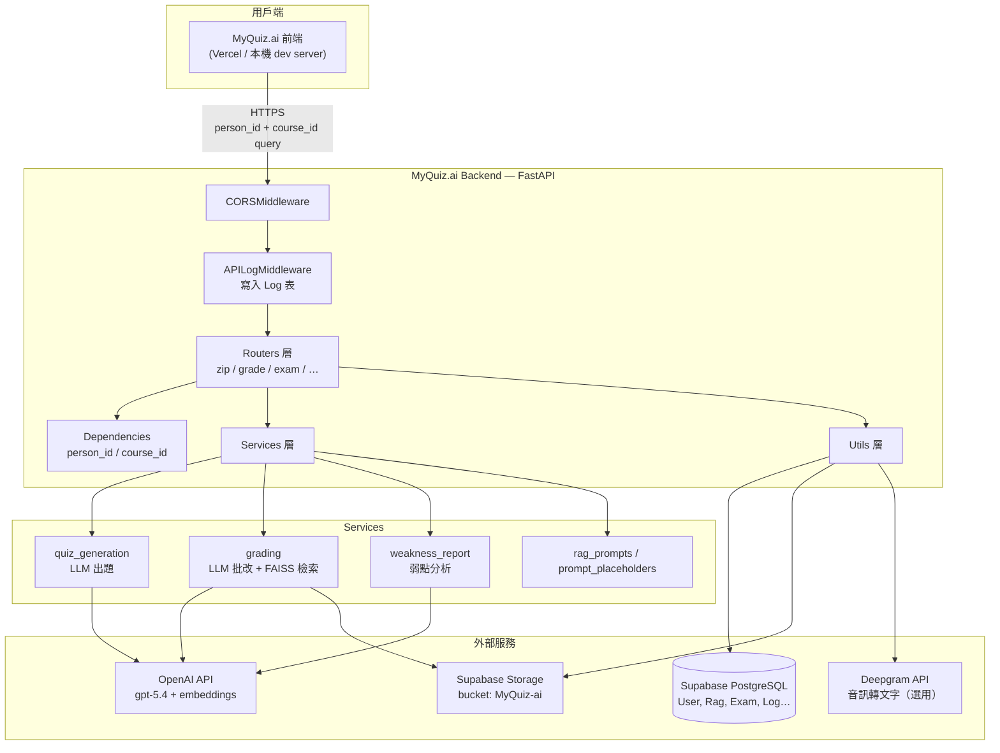
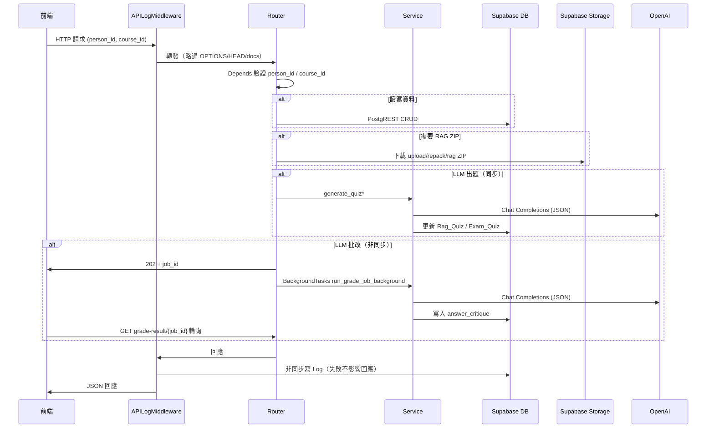
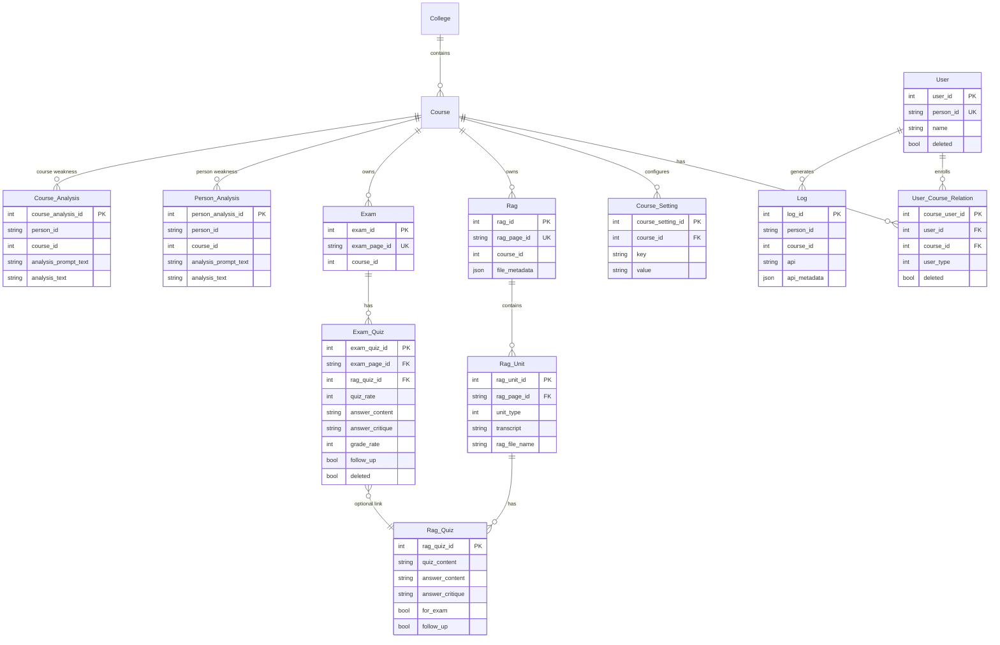
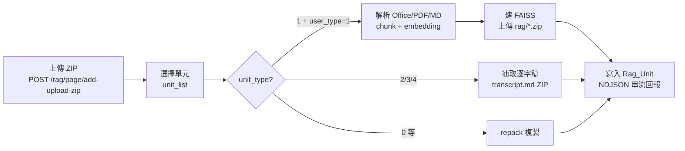
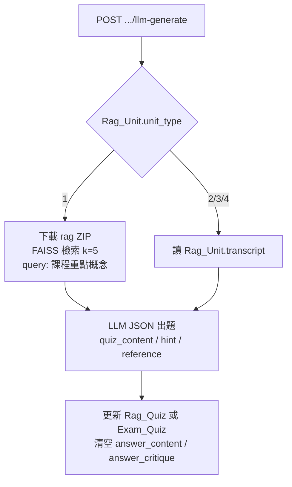
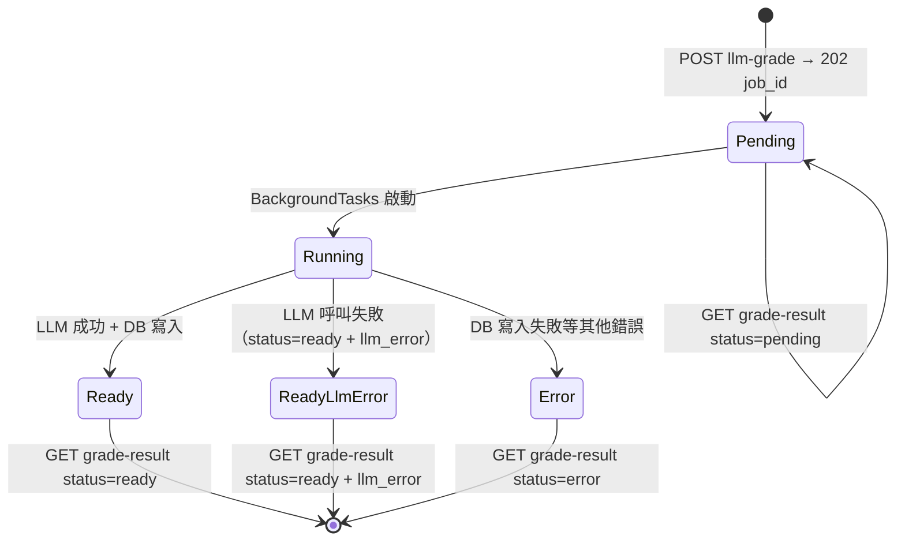

# MyQuiz.ai Backend

[MyQuiz.ai](https://myquiz-ai.vercel.app) 的 **FastAPI 後端**：課程測驗平台之 REST API，負責使用者與課程成員管理、教材 ZIP 上傳與 RAG 向量庫建置、LLM 自動出題／批改、測驗（Exam）管理，以及個人／課程弱點分析報告。

---

## 目錄

- [專案概覽](#專案概覽)
- [系統架構](#系統架構)
- [技術棧](#技術棧)
- [目錄結構](#目錄結構)
- [資料模型](#資料模型)
- [權限模型](#權限模型)
- [核心業務流程](#核心業務流程)
- [LLM 錯誤處理約定](#llm-錯誤處理約定)
- [環境變數](#環境變數)
- [本機開發](#本機開發)
- [部署（Render）](#部署render)
- [認證與授權](#認證與授權)
- [API 回傳格式](#api-回傳格式)
- [API 目錄](#api-目錄)
- [API 詳細文件](#api-詳細文件)
- [開發備註](#開發備註)

---

## 專案概覽

MyQuiz.ai 是一套 **AI 輔助測驗與學習分析** 系統。教師上傳課程教材（Office、PDF、Markdown、音訊、YouTube 逐字稿等），後端依單元類型建置 FAISS 向量庫或逐字稿 ZIP，再透過 OpenAI LLM（預設 **gpt-5.4**，可依課程覆寫）自動出題、批改與產生弱點報告；學生則在 Exam 模組完成測驗並取得 AI 評語。

| 模組 | 路由前綴 | 說明 |
|------|---------|------|
| **帳號** | `/profile` | 登入、使用者列表（新增／編輯／刪除改由 course-members 管理） |
| **學院／課程** | `/college`、`/course` | 學院與課程列表 |
| **課程成員** | `/rag/course-members` | 課程成員 CRUD（新增、批次新增、編輯、移出課程） |
| **RAG 教材** | `/rag` | 教材 ZIP 上傳、建庫、單元管理、練習題出題與批改 |
| **課程設定** | `/rag`、`/exam` | LLM API Key、LLM 模型、弱點分析指令 |
| **測驗** | `/exam` | 正式測驗卷、從 RAG 匯入題目、追問出題、評分與題目評價 |
| **弱點分析** | `/person-analysis`、`/course-analysis` | 個人／課程層級弱點報告（LLM Markdown） |
| **Prompt 模板** | `/prompt` | 內建 LLM prompt 模板全文查詢 |
| **Log** | `/log` | 每次業務 API 請求寫入 `Log` 表供稽核 |

### 重要資料約定

- 學生作答欄位：請求 body 使用 **`quiz_answer`**（仍相容舊欄位 `answer`）；寫入 DB 欄位 **`answer_content`**。
- 批改評語寫入 **`answer_critique`**（純文字 Markdown，非 JSON）。
- 已無獨立 `Rag_Answer`／`Exam_Answer` 表，亦無 `quiz_grade`／`answer_grade` 數值評分欄位。
- LLM API Key 存於 **`Course_Setting`**（依 `course_id`）：
  - `rag-api-key` → RAG 出題／批改、**課程弱點分析**（GET/PUT `/rag/llm_api_key`）
  - `exam-api-key` → Exam 出題／批改、**個人弱點分析**（GET/PUT `/exam/llm_api_key`）
  - 前端可用 `GET /rag/llm_api_key/exists`、`GET /exam/llm_api_key/exists` 查詢是否已設定（不回傳 key 內容、不需管理權限）。
- LLM 模型（出題、批改、弱點分析**共用**）存於 **`Course_Setting`** key=`llm-model`，以 GET/PUT `/rag/llm_model` 管理；未設定時預設 **`gpt-5.4`**（`services/quiz_generation.QUIZ_LLM_MODEL`）。
- LLM 呼叫失敗時，多數端點回 **HTTP 200 + `llm_error` 欄位**（而非 5xx），詳見 [LLM 錯誤處理約定](#llm-錯誤處理約定)。

---

## 系統架構

### 整體架構圖



### 請求處理流程



### 模組分層

| 層級 | 目錄 | 職責 |
|------|------|------|
| **入口** | `main.py` | FastAPI app、CORS、Middleware、路由掛載、OpenAPI 排序 |
| **路由** | `routers/` | HTTP 端點、Pydantic 模型、權限檢查 |
| **服務** | `services/` | LLM 出題／批改／弱點報告、Prompt 模板、Exam 查詢 |
| **工具** | `utils/` | Supabase、Storage、FAISS、ZIP、序列化、LLM 錯誤格式化 |
| **依賴** | `dependencies/` | 全域 `person_id`、`course_id` query 注入 |
| **中介** | `middleware/` | API 呼叫紀錄、敏感欄位遮罩 |

路由掛載順序（`main.py`）：`zip` → `grade` → `exam` → `person_analysis` → `course_analysis` → `profile` → `college` → `course` → `course_settings`（掛在 `/rag`）→ `prompt` → `log`。Swagger（`/docs`）路徑順序由 `utils/openapi_order.py` 統一排序，與掛載順序無關。

### Supabase Storage 路徑

Bucket 名稱由環境變數 `SUPABASE_RAG_BUCKET` 指定（預設 `MyQuiz-ai`）：

```
{person_id}/{rag_page_id}/upload/{rag_page_id}.zip   ← 原始上傳 ZIP
{person_id}/{rag_page_id}/repack/{unit_id}.zip      ← 單元 repack
{person_id}/{rag_page_id}/rag/{unit_id}_rag.zip     ← FAISS 或 transcript ZIP
```

根目錄 `_metadata.json` 記錄 page_id → 路徑對照，供 `get_zip_path()` 查詢。

---

## 技術棧

| 類別 | 技術 |
|------|------|
| 語言／Runtime | Python 3.10.12 |
| Web 框架 | FastAPI + Uvicorn |
| 資料庫 | Supabase（PostgreSQL + PostgREST） |
| 檔案儲存 | Supabase Storage |
| 向量檢索 | LangChain + FAISS-CPU + OpenAI Embeddings (`text-embedding-3-small`) |
| LLM | OpenAI **gpt-5.4**（出題、批改、弱點分析共用；可經 `/rag/llm_model` 依課程覆寫） |
| 文件解析 | PyPDF、python-docx、python-pptx、unstructured、docx2txt |
| 語音（選用） | Deepgram（音訊轉逐字稿） |
| 部署 | Render（`runtime.txt` 指定 Python 版本） |

---

## 目錄結構

```
MyQuiz-ai-backend/
├── main.py                   # FastAPI 入口、CORS、路由掛載、OpenAPI 排序
├── requirements.txt          # Python 依賴
├── runtime.txt               # Render Python 版本（python-3.10.12）
├── .env.example              # 環境變數範例
├── dependencies/
│   ├── person_id.py          # 全域必填 query person_id
│   └── course_id.py          # RAG / Exam 相關必填 query course_id
├── middleware/
│   └── api_log_middleware.py # 業務 API 請求寫入 Log 表（遮罩敏感欄位）
├── routers/
│   ├── profile.py            # /profile — 登入、使用者列表
│   ├── college.py            # /college — 學院列表
│   ├── course.py             # /course — 課程列表
│   ├── zip/                  # /rag — Rag 分頁、ZIP 上傳、建庫、Quiz 基本 CRUD
│   │   ├── schemas.py        #   Pydantic 模型
│   │   ├── helpers.py        #   建庫 / Storage 輔助
│   │   └── routes.py         #   端點
│   ├── grade/                # /rag — 標記、出題、批改、單元媒體、API Key、模型設定
│   │   ├── schemas.py
│   │   ├── helpers.py
│   │   └── routes.py
│   ├── exam/                 # /exam — 測驗 CRUD、出題、批改、評價、API Key
│   │   ├── schemas.py
│   │   ├── helpers.py
│   │   └── routes.py
│   ├── course_settings.py    # /rag — 課程成員管理、弱點分析指令
│   ├── person_analysis.py    # /person-analysis — 個人弱點分析
│   ├── course_analysis.py    # /course-analysis — 課程弱點分析
│   ├── prompt.py             # /prompt — 內建 LLM 模板查詢
│   └── log.py                # /log — API 呼叫紀錄
├── services/
│   ├── quiz_generation.py    # LLM 出題（FAISS / 逐字稿）；QUIZ_LLM_MODEL 預設值
│   ├── grading.py            # LLM 批改、Background Job
│   ├── weakness_report.py    # 個人／課程弱點報告
│   ├── analysis_setting.py   # Person_Analysis / Course_Analysis 讀寫
│   ├── exam_queries.py       # Exam / Exam_Quiz 查詢與組裝
│   ├── rag_prompts.py        # RAG 檢索參數
│   └── prompt_placeholders.py
└── utils/
    ├── supabase.py           # Supabase client
    ├── zip_storage.py        # Storage 上傳／下載
    ├── rag_faiss.py          # FAISS 建庫
    ├── rag_transcript.py     # 逐字稿抽取（unit_type 2/3/4）
    ├── course_setting.py     # Course_Setting 讀寫
    ├── llm_key.py            # API Key / LLM 模型解析（rag-api-key / exam-api-key / llm-model）
    ├── llm_error.py          # LLM 呼叫錯誤判斷與 llm_error 回應格式化
    ├── db_schema.py          # 表名與 SELECT 欄位常數
    ├── openapi_order.py      # Swagger 路徑排序
    └── …
```

---

## 資料模型

### ER 關係圖（簡化）



### 主要資料表

| 表名 | 說明 |
|------|------|
| `User` | 使用者（`person_id` 為登入帳號） |
| `User_Course_Relation` | 選課關係；**`user_type` 依課程**（見[權限模型](#權限模型)） |
| `College` / `Course` | 學院與課程 |
| `Course_Setting` | 課程級 key-value 設定（API Key、LLM 模型） |
| `Rag` / `Rag_Unit` / `Rag_Quiz` | RAG 分頁、教材單元、練習題 |
| `Exam` / `Exam_Quiz` | 測驗卷與測驗題（可連結 `rag_quiz_id`） |
| `Person_Analysis` | 個人弱點分析指令與報告（`person_id` 空字串列＝課程共用指令） |
| `Course_Analysis` | 課程弱點分析指令與報告 |
| `Log` | API 呼叫紀錄 |

### Rag_Unit.unit_type

| 值 | 名稱 | 建庫行為 | 出題／批改 context |
|----|------|----------|-------------------|
| 0 | 未指定 | repack 複製至 rag | 依 ZIP 內容推斷 |
| 1 | RAG（Office/PDF/MD） | 建 **FAISS** 向量 ZIP | 向量檢索 top-k chunks |
| 2 | 文字 | repack + **transcript.md** ZIP | 全文逐字稿 |
| 3 | MP3 音訊 | repack + transcript ZIP | 音訊同資料夾文字檔逐字稿 |
| 4 | YouTube | repack + transcript ZIP | URL 第一行 + 第二行起逐字稿 |

> `user_type == 1`（開發者）且 `unit_type == 1` 時，`build-rag-zip` 才會實際建 FAISS；其餘類型以逐字稿 ZIP 供 LLM 使用。

### Course_Setting 常用 key

| key | 用途 | 管理端點 |
|-----|------|----------|
| `rag-api-key` | RAG 出題／批改、課程弱點分析 OpenAI Key | GET/PUT `/rag/llm_api_key`、GET `/rag/llm_api_key/exists` |
| `exam-api-key` | Exam 出題／批改、個人弱點分析 OpenAI Key | GET/PUT `/exam/llm_api_key`、GET `/exam/llm_api_key/exists` |
| `llm-model` | 出題／批改／弱點分析共用 LLM 模型名 | GET/PUT `/rag/llm_model` |

> 弱點分析**指令**不在 `Course_Setting`：個人分析指令存於 `Person_Analysis`（GET/PUT `/rag/person_analysis_user_prompt_text`）、課程分析指令存於 `Course_Analysis`（GET/PUT `/rag/course_analysis_user_prompt_text`）。

---

## 權限模型

`user_type` 存於 `User_Course_Relation`，**依課程**指定（同一人在不同課程可有不同身份）：

| user_type | 身份 | 權限 |
|-----------|------|------|
| 1 | 開發者 | 全部管理權限；`build-rag-zip` 可實際建 FAISS |
| 2 | 管理者 | 課程設定（API Key、模型、分析指令）、課程成員管理 |
| 3 | 學生 | 作答、查詢；不可變更課程設定 |

需 **user_type 1／2** 的操作：

- 讀／寫 `rag-api-key`、`exam-api-key`（`/exists` 查詢不需）
- 讀／寫 `llm-model`
- 寫個人／課程弱點分析指令
- 課程成員管理（`/rag/course-members/*`）

其餘端點僅需 `person_id` 為有效（未刪除）使用者；多數寫入操作另驗證 `person_id` 與 Rag/Exam 資源擁有者一致。

---

## 核心業務流程

### RAG 建置流程（build-rag-zip）



- 回應格式：`application/x-ndjson`，逐行 JSON（`start` → `building` → `unit` → … → `complete`）。
- 前端須用 `fetch` 逐行讀取，**不可** `response.json()`。

### LLM 出題流程



- **追問出題**（`llm-generate-followup`）：依前次作答與評語決定追問弱點或出新題。
- **`-db` 變體**（僅 RAG）：body 不帶 prompt 文字，沿用 DB 既有 `quiz_user_prompt_text` 或 `answer_user_prompt_text`。
- **`create-` 變體**（僅 Exam）：先建立 Exam_Quiz 列再出題，一次完成。
- LLM 呼叫失敗時回 HTTP 200 + `llm_error`（quiz 欄位為空字串），見 [LLM 錯誤處理約定](#llm-錯誤處理約定)。

### LLM 批改流程（非同步）



1. `POST .../llm-grade` 立即回 **HTTP 202** + `{ "job_id": "uuid", "grade_llm_model": "…" }`。
2. 背景執行 `run_grade_job_background`：有逐字稿走 transcript 路徑，否則 FAISS 檢索（以**題幹**為 query，k=5）。
3. LLM 回傳 JSON → 解析 `quiz_comments` → 合併寫入 `answer_critique`（純文字）。
4. 前端輪詢 `GET .../grade-result/{job_id}` 直到 `status` 為 `ready` 或 `error`；`ready` 時若 `llm_error` 非 null 表示 LLM 呼叫失敗（`quiz_comments` 為空陣列）。
5. Job 結果存於**程序記憶體**（重啟後遺失；查無 job_id 時回 404，前端應重新送出評分）。

### 弱點分析流程

| | 個人分析 | 課程分析 |
|---|---------|---------|
| 資料表 | `Person_Analysis` | `Course_Analysis` |
| API Key | `exam-api-key` | `rag-api-key` |
| 指令來源 | 該生列優先，其次 `person_id` 空字串之課程共用列 | 課程列 |
| 指令寫入 | PUT `/rag/person_analysis_user_prompt_text` | PUT `/rag/course_analysis_user_prompt_text` |
| 讀取結果 | GET `/person-analysis/analysis` | GET `/course-analysis/analysis` |
| 產生報告 | **POST** `/person-analysis/llm-analysis` | **POST** `/course-analysis/llm-analysis` |
| 分析範圍 | 該生已作答 Exam_Quiz | 全課程已作答題目 |

- LLM 成功時將報告寫入 `analysis_text`；模型同樣使用 `llm-model` 設定。
- 模板全文可從 `GET /prompt/templates` 查閱。

---

## LLM 錯誤處理約定

LLM（OpenAI）呼叫失敗（金鑰錯誤、額度不足、逾時、回傳非 JSON 等）統一由 `utils/llm_error.py` 格式化，**以 HTTP 200 + `llm_error` 欄位回傳**，讓前端能將錯誤原因顯示給使用者，而非籠統的 5xx：

| 情境 | 行為 |
|------|------|
| 出題（`llm-generate` 系列） | HTTP 200，payload 含 `llm_error` 與識別欄位（`rag_quiz_id`／`exam_quiz_id`、`quiz_llm_model`），quiz 欄位為空字串 |
| 批改 job | `grade-result` 回 `status="ready"` + 頂層 `llm_error`，`result.quiz_comments` 為空陣列 |
| 弱點分析（`llm-analysis`） | HTTP 200，`weakness_report=null` + `llm_error` 說明原因（含「未設定 API Key」「無已作答題目」等前置檢查） |

非 LLM 的錯誤（驗證失敗、找不到資源、DB 寫入失敗）仍走標準 HTTP 4xx／5xx + `{ "detail": "…" }`。

---

## 環境變數

複製 `.env.example` 為 `.env` 並填入：

| 變數 | 必填 | 說明 |
|------|------|------|
| `SUPABASE_URL` | ✅ | Supabase 專案 URL |
| `SUPABASE_ANON_KEY` | ✅* | 公開 anon key |
| `SUPABASE_SERVICE_ROLE_KEY` | ✅* | 後端 service role（略過 RLS） |
| `SUPABASE_RAG_BUCKET` | 選 | Storage bucket 名（預設 `MyQuiz-ai`） |
| `CORS_EXTRA_ORIGINS` | 選 | 額外 CORS origin，逗號分隔 |
| `DEEPGRAM_API_KEY` | 選 | 音訊轉文字（使用 Deepgram 時） |
| `DEEPGRAM_MODEL` | 選 | 預設 `nova-2` |
| `DEEPGRAM_REQUEST_TIMEOUT_SECONDS` | 選 | 預設 900 |

\* `ANON_KEY` 與 `SERVICE_ROLE_KEY` 至少需其一；後端建議使用 service role（anon 可能遭 RLS 擋下寫入）。

LLM API Key **不**放在 `.env`，而是依課程存入 `Course_Setting`。

---

## 本機開發

### 前置需求

- Python 3.10+
- Supabase 專案（PostgreSQL + Storage bucket）
- OpenAI API Key（寫入各課程 `Course_Setting`）

### 啟動步驟

```bash
# 1. 環境變數
cp .env.example .env
# 編輯 .env 填入 Supabase 憑證

# 2. 依賴
pip install -r requirements.txt

# 3. 啟動（熱重載）
uvicorn main:app --reload
```

- API 文件：`http://127.0.0.1:8000/docs`（Swagger UI；亦可作為啟動健康確認）
- 驗證連線：`GET /course/courses?person_id=YOUR_ID`

### macOS 注意事項

`main.py` 啟動時設定 `KMP_DUPLICATE_LIB_OK=TRUE`，避免 FAISS/NumPy 多份 OpenMP runtime 衝突。

### CORS

內建允許：`localhost`／`127.0.0.1` 埠 8080–8086、5173（Vite）、4173、3000，以及 `https://myquiz-ai.vercel.app`、`https://kevin7261.github.io`。區網 IP 或其他網域請設 `CORS_EXTRA_ORIGINS`。

---

## 部署（Render）

1. 連接 GitHub repo，Build Command：`pip install -r requirements.txt`
2. Start Command：`uvicorn main:app --host 0.0.0.0 --port $PORT`
3. Environment 新增與 `.env` 相同變數（至少 Supabase 三項）
4. Python 版本由 `runtime.txt`（`python-3.10.12`）指定

**Render 代理逾時**：同步 LLM 請求若超過約 30 秒可能回 502；批改已改非同步（202 + 輪詢）以避免此問題。若 502 回應不含 CORS 標頭，前端會看到跨域錯誤——應確認使用輪詢端點而非長時間阻塞 POST。

**重啟／scale-out**：評分 job 結果存於程序記憶體，服務重啟或多 instance 下 `job_id` 可能查無（回 404），前端應重新送出評分。

---

## 認證與授權

本後端**不使用 JWT middleware**；身分以 query **`person_id`** 識別呼叫者（所有端點必填，少數媒體端點例外）。

| 機制 | 說明 |
|------|------|
| `person_id` | 必填 query；對應 `User.person_id` |
| `course_id` | RAG／Exam／分析／Log 等端點必填；對應目前操作課程 |
| `user_type` | 存於 `User_Course_Relation`，見[權限模型](#權限模型) |
| 資源擁有權 | 多數寫入操作驗證 `person_id` 與 Rag/Exam 擁有者一致 |

登入流程：`POST /profile/login`（body：`person_id` + `password`）→ 回傳使用者與選課列表；前端自行保存 `person_id` 供後續 API 使用。

---

## API 回傳格式

所有端點皆需 query 參數 `person_id`（RAG／Exam／分析相關端點另需 `course_id`；少數媒體端點如 `GET /rag/page/unit/mp3-file` 不需 `person_id`）。

### 通用錯誤格式

HTTP 4xx / 5xx 時統一回傳：

```json
{ "detail": "錯誤說明文字" }
```

### LLM 錯誤

LLM 呼叫失敗時回 HTTP 200 + `llm_error` 欄位（見 [LLM 錯誤處理約定](#llm-錯誤處理約定)）。

---

## API 目錄

RAG 與 Exam 採相同層級：**分頁（page）→ 單元（unit，僅 RAG）→ 題目（quiz）→ 設定**。Swagger（`/docs`）路徑順序由 `utils/openapi_order.py` 統一排序。

| 方法 | 路徑 | 說明 |
|------|------|------|
| **學院／課程** | | |
| GET | [`/college/colleges`](#get-collegecolleges) | 列出學院（含 courses） |
| GET | [`/course/courses`](#get-coursecourses) | 列出課程（含 college_name） |
| **帳號** | | |
| GET | [`/profile/users`](#get-profileusers) | 列出所有使用者（含選課） |
| POST | [`/profile/login`](#post-profilelogin) | 登入 |
| **課程成員** | | |
| GET | [`/rag/course-members`](#get-ragcourse-members) | 列出課程成員 |
| POST | [`/rag/course-members/add`](#post-ragcourse-membersadd) | 新增成員 |
| POST | [`/rag/course-members/add-batch`](#post-ragcourse-membersadd-batch) | 批次新增成員（學生） |
| PUT | [`/rag/course-members/edit/{person_id}`](#put-ragcourse-memberseditperson_id) | 編輯成員 |
| PUT | [`/rag/course-members/delete/{person_id}`](#put-ragcourse-membersdeleteperson_id) | 移出課程（軟刪除） |
| **RAG 教材管理** | | |
| GET | [`/rag/pages`](#get-ragpages) | 列出 Rag（含 units→quizzes） |
| GET | [`/rag/page/units`](#get-ragpageunits) | 列出 Rag_Unit（含 quizzes） |
| POST | [`/rag/page/add-upload-zip`](#post-ragpageadd-upload-zip) | 建立 Rag 並上傳 ZIP |
| PUT | [`/rag/page/tab-name`](#put-ragpagetab-name) | 更新 Rag tab_name |
| PUT | [`/rag/page/delete/{rag_page_id}`](#put-ragpagedeleterag_page_id) | 軟刪除 Rag |
| POST | [`/rag/page/build-rag-zip`](#post-ragpagebuild-rag-zip) | 建置 RAG ZIP（NDJSON 串流） |
| GET | [`/rag/page/unit/mp3-file`](#get-ragpageunitmp3-file) | 取得音訊（unit_type=3，不需 person_id） |
| **RAG 題目管理** | | |
| POST | [`/rag/page/unit/quiz/add`](#post-ragpageunitquizadd) | 新增空白 Rag_Quiz |
| PUT | [`/rag/page/unit/quiz/quiz-name`](#put-ragpageunitquizquiz-name) | 更新 Rag_Quiz quiz_name |
| PUT | [`/rag/page/unit/quiz/delete/{rag_quiz_id}`](#put-ragpageunitquizdeleterag_quiz_id) | 軟刪除 Rag_Quiz |
| POST | [`/rag/page/unit/quiz/followup`](#post-ragpageunitquizfollowup) | 更新 follow_up 標記 |
| POST | [`/rag/page/unit/quiz/for-exam`](#post-ragpageunitquizfor-exam) | 更新 for_exam 標記 |
| **RAG 出題與評分** | | |
| POST | [`/rag/page/unit/quiz/llm-generate`](#post-ragpageunitquizllm-generate) | LLM 出題 |
| POST | [`/rag/page/unit/quiz/llm-generate-db`](#post-ragpageunitquizllm-generate) | LLM 出題（沿用 DB prompt） |
| POST | [`/rag/page/unit/quiz/llm-generate-followup`](#post-ragpageunitquizllm-generate) | LLM 追問出題 |
| POST | [`/rag/page/unit/quiz/llm-generate-followup-db`](#post-ragpageunitquizllm-generate) | LLM 追問出題（沿用 DB prompt） |
| POST | [`/rag/page/unit/quiz/llm-grade`](#post-ragpageunitquizllm-grade) | 非同步評分（202 + job_id） |
| POST | [`/rag/page/unit/quiz/llm-grade-db`](#post-ragpageunitquizllm-grade) | 非同步評分（沿用 DB prompt） |
| GET | [`/rag/page/unit/quiz/grade-result/{job_id}`](#get-ragpageunitquizgrade-resultjob_id) | 輪詢評分結果 |
| **RAG 單元媒體** | | |
| GET | [`/rag/pages/{rag_page_id}/unit-preview/text`](#get-ragpagesrag_page_idunit-previewtext) | 建置前預覽：文字單元逐字稿（讀 upload ZIP） |
| GET | [`/rag/pages/{rag_page_id}/unit-preview/mp3-file`](#get-ragpagesrag_page_idunit-previewmp3-file) | 建置前預覽：音訊＋逐字稿（讀 upload ZIP） |
| GET | [`/rag/pages/{rag_page_id}/unit-preview/youtube-url`](#get-ragpagesrag_page_idunit-previewyoutube-url) | 建置前預覽：YouTube URL＋逐字稿（讀 upload ZIP） |
| GET | [`/rag/units/{rag_unit_id}/text`](#get-ragunitsrag_unit_idtext) | 已建置文字單元逐字稿 |
| GET | [`/rag/units/{rag_unit_id}/mp3-file`](#get-ragunitsrag_unit_idmp3-file) | 已建置音訊單元音訊＋逐字稿 |
| GET | [`/rag/units/{rag_unit_id}/youtube-url`](#get-ragunitsrag_unit_idyoutube-url) | 已建置 YouTube 單元 URL＋逐字稿 |
| **RAG 課程設定** | | |
| GET | [`/rag/llm_api_key`](#get-ragllm_api_key) | 讀取 rag-api-key（user_type 1/2） |
| PUT | [`/rag/llm_api_key`](#put-ragllm_api_key) | 寫入 rag-api-key（user_type 1/2） |
| GET | [`/rag/llm_api_key/exists`](#get-ragllm_api_keyexists) | rag-api-key 是否已設定（一般使用者可查） |
| GET | [`/rag/llm_model`](#get-ragllm_model) | 讀取 llm-model（user_type 1/2） |
| PUT | [`/rag/llm_model`](#put-ragllm_model) | 寫入 llm-model（user_type 1/2） |
| GET | [`/rag/person_analysis_user_prompt_text`](#get-ragperson_analysis_user_prompt_text) | 取得個人分析指令 |
| PUT | [`/rag/person_analysis_user_prompt_text`](#put-ragperson_analysis_user_prompt_text) | 寫入個人分析指令（user_type 1/2） |
| GET | [`/rag/course_analysis_user_prompt_text`](#get-ragcourse_analysis_user_prompt_text) | 取得課程分析指令 |
| PUT | [`/rag/course_analysis_user_prompt_text`](#put-ragcourse_analysis_user_prompt_text) | 寫入課程分析指令（user_type 1/2） |
| **測驗** | | |
| GET | [`/exam/pages`](#get-exampages) | 列出 Exam（含 quizzes） |
| GET | [`/exam/rag-for-exams`](#get-examrag-for-exams) | 列出 for_exam RAG 單元 |
| POST | [`/exam/page/add`](#post-exampageadd) | 建立 Exam |
| PUT | [`/exam/page/tab-name`](#put-exampagetab-name) | 更新 Exam tab_name |
| PUT | [`/exam/page/delete/{exam_page_id}`](#put-exampagedeleteexam_page_id) | 軟刪除 Exam |
| PUT | [`/exam/page/quiz/delete/{exam_quiz_id}`](#put-exampagequizdeleteexam_quiz_id) | 軟刪除 Exam_Quiz |
| POST | [`/exam/page/quiz/llm-generate`](#post-exampagequizllm-generate) | LLM 出題 |
| POST | [`/exam/page/quiz/llm-generate-followup`](#post-exampagequizllm-generate-followup) | LLM 追問出題 |
| POST | [`/exam/page/quiz/create-llm-generate`](#post-exampagequizllm-generate) | 建立並 LLM 出題 |
| POST | [`/exam/page/quiz/create-llm-generate-followup`](#post-exampagequizllm-generate-followup) | 建立並 LLM 追問出題 |
| POST | [`/exam/page/quiz/llm-grade`](#post-exampagequizllm-grade) | 非同步評分（202 + job_id） |
| GET | [`/exam/page/quiz/grade-result/{job_id}`](#get-exampagequizgrade-resultjob_id) | 輪詢評分結果 |
| POST | [`/exam/page/quiz/quiz-rate`](#post-exampagequizquiz-rate) | 更新 quiz_rate |
| POST | [`/exam/page/quiz/grade-rate`](#post-exampagequizgrade-rate) | 更新 grade_rate |
| **Exam 課程設定** | | |
| GET | [`/exam/llm_api_key`](#get-examllm_api_key) | 讀取 exam-api-key（user_type 1/2） |
| PUT | [`/exam/llm_api_key`](#put-examllm_api_key) | 寫入 exam-api-key（user_type 1/2） |
| GET | [`/exam/llm_api_key/exists`](#get-examllm_api_keyexists) | exam-api-key 是否已設定（一般使用者可查） |
| **弱點分析** | | |
| GET | [`/person-analysis/analysis`](#get-person-analysisanalysis) | 讀取最新 `Person_Analysis`（不呼叫 LLM） |
| POST | [`/person-analysis/llm-analysis`](#post-person-analysisllm-analysis) | 產生個人弱點報告 |
| GET | [`/course-analysis/analysis`](#get-course-analysisanalysis) | 讀取最新 `Course_Analysis`（不呼叫 LLM） |
| POST | [`/course-analysis/llm-analysis`](#post-course-analysisllm-analysis) | 產生課程弱點報告 |
| **Prompt 模板** | | |
| GET | [`/prompt/templates`](#get-prompttemplates) | 內建 LLM prompt 模板全文 |
| **Log** | | |
| GET | [`/log/logs`](#get-loglogs) | 列出 API 呼叫紀錄 |

---

## API 詳細文件

### 學院 `/college`

#### `GET /college/colleges`

列出所有未刪除學院，含所屬課程列表。需 query `person_id`。

```json
{
  "colleges": [
    {
      "college_id": 1,
      "college_name": "string",
      "courses": [
        {
          "course_id": 1,
          "college_id": 1,
          "semester": "113-1",
          "course_name": "string"
        }
      ],
      "updated_at": "2024-01-01T00:00:00+08:00",
      "created_at": "2024-01-01T00:00:00+08:00"
    }
  ],
  "count": 1
}
```

---

### 課程 `/course`

#### `GET /course/courses`

列出所有未刪除課程，含 `college_id`、`college_name`。需 query `person_id`。

```json
{
  "courses": [
    {
      "course_id": 1,
      "college_id": 1,
      "college_name": "string",
      "semester": "113-1",
      "course_name": "string",
      "updated_at": "2024-01-01T00:00:00+08:00",
      "created_at": "2024-01-01T00:00:00+08:00"
    }
  ],
  "count": 1
}
```

---

### 帳號 `/profile`

> 使用者的新增／編輯／刪除已改由 [`/rag/course-members/*`](#課程成員-ragcourse-members) 管理；`/profile` 僅保留列表與登入。

#### `GET /profile/users`

列出所有未刪除使用者，含各使用者選課 `courses` 列表（`user_type` 依課程，見 courses 各項）。**含 `password` 欄位**（僅此端點回傳）。

```json
{
  "users": [
    {
      "user_id": 1,
      "person_id": "string",
      "college_id": "string",
      "college_name": "string",
      "name": "string",
      "password": "string",
      "courses": [
        {
          "course_user_id": 1,
          "course_id": 1,
          "college_id": 1,
          "course_name": "string",
          "semester": "113-1",
          "user_type": 3
        }
      ],
      "user_metadata": null,
      "updated_at": "2024-01-01T00:00:00+08:00",
      "created_at": "2024-01-01T00:00:00+08:00"
    }
  ],
  "count": 1
}
```

---

#### `POST /profile/login`

以 `person_id` + `password` 登入。Body：

```json
{ "person_id": "string", "password": "string" }
```

成功時回傳使用者資訊（**不含 password**）與該帳號選課列表：

```json
{
  "user": {
    "user_id": 1,
    "person_id": "string",
    "college_id": "string",
    "college_name": "string",
    "name": "string",
    "courses": [ /* 同頂層 courses */ ],
    "user_metadata": null,
    "updated_at": "2024-01-01T00:00:00+08:00",
    "created_at": "2024-01-01T00:00:00+08:00"
  },
  "courses": [
    {
      "course_user_id": 1,
      "course_id": 1,
      "college_id": 1,
      "course_name": "string",
      "semester": "113-1",
      "user_type": 3
    }
  ]
}
```

---

### 課程成員 `/rag/course-members`

課程成員管理（操作者須為該課程 user_type 1／2）。所有端點必填 query `person_id`（操作者）、`course_id`。

成員單筆結構（`CourseMemberItem`）：

```json
{
  "course_user_id": 1,
  "user_id": 1,
  "person_id": "string",
  "name": "string",
  "password": "string",
  "user_type": 3,
  "college_id": 1
}
```

#### `GET /rag/course-members`

列出課程所有成員。

```json
{
  "course_id": 1,
  "members": [ /* CourseMemberItem[] */ ],
  "count": 1
}
```

---

#### `POST /rag/course-members/add`

新增單一成員至課程（必要時一併建立 `User` 列）。Body：

```json
{
  "person_id": "string",
  "name": "string",
  "user_type": 3
}
```

> `user_type`：1 開發者、2 管理者、3 學生。回傳新增之 `CourseMemberItem`。

---

#### `POST /rag/course-members/add-batch`

批次新增成員；每筆僅 `person_id`、`name`，**`user_type` 固定 3（學生）**。Body：

```json
{
  "members": [
    { "person_id": "student01", "name": "王小明" },
    { "person_id": "student02", "name": "李小華" }
  ]
}
```

回應：

```json
{
  "created": [ /* CourseMemberItem[] */ ],
  "failed": [
    { "person_id": "string", "detail": "失敗原因" }
  ],
  "created_count": 1,
  "failed_count": 1
}
```

---

#### `PUT /rag/course-members/edit/{person_id}`

更新成員 `name`、`user_type`（path `person_id` 為要編輯的成員）。Body：

```json
{ "name": "string", "user_type": 3 }
```

回傳更新後 `CourseMemberItem`。

---

#### `PUT /rag/course-members/delete/{person_id}`

自課程移出成員（`User_Course_Relation.deleted=true`，**不刪 `User` 表**）。回傳被移出成員之 `CourseMemberItem`。

---

### RAG 教材管理 `/rag`

#### `GET /rag/pages`

列出 Rag（含 units→quizzes）。音訊單元（unit_type=3 且 mp3_file_name 非空）含 `mp3_audio_url`（指向 `GET /rag/units/{rag_unit_id}/mp3-file`，不需 person_id，可直接作 `<audio src>`）；YouTube 單元（unit_type=4 且 youtube_url 非空）含 `youtube_url_api`（指向 `GET /rag/units/{rag_unit_id}/youtube-url`）。

```json
{
  "rags": [
    {
      "rag_id": 1,
      "rag_page_id": "string",
      "tab_name": "string",
      "person_id": "string",
      "course_id": 1,
      "local": false,
      "deleted": false,
      "file_metadata": { "filename": "...", "second_folders": [], "file_size": 1.23 },
      "updated_at": "2024-01-01T00:00:00+08:00",
      "created_at": "2024-01-01T00:00:00+08:00",
      "units": [
        {
          "rag_unit_id": 1,
          "rag_page_id": "string",
          "person_id": "string",
          "course_id": 1,
          "unit_name": "string",
          "folder_combination": "string",
          "unit_type": 1,
          "repack_file_name": "string",
          "rag_file_name": "string",
          "rag_file_size": 1.23,
          "rag_chunk_size": 1000,
          "rag_chunk_overlap": 200,
          "transcript": "string",
          "text_file_name": "string",
          "mp3_file_name": "string",
          "youtube_url": "string",
          "deleted": false,
          "updated_at": "2024-01-01T00:00:00+08:00",
          "created_at": "2024-01-01T00:00:00+08:00",
          "mp3_audio_url": "/rag/units/{rag_unit_id}/mp3-file?rag_page_id=...&course_id=...",
          "youtube_url_api": "/rag/units/{rag_unit_id}/youtube-url?rag_page_id=...&course_id=...",
          "quizzes": [
            {
              "rag_quiz_id": 1,
              "rag_page_id": "string",
              "rag_unit_id": 1,
              "person_id": "string",
              "quiz_name": "string",
              "quiz_user_prompt_text": "string",
              "quiz_content": "string",
              "quiz_hint": "string",
              "quiz_answer_reference": "string",
              "answer_user_prompt_text": "string",
              "answer_content": "string",
              "answer_critique": "string | null",
              "for_exam": false,
              "follow_up": false,
              "deleted": false,
              "updated_at": "2024-01-01T00:00:00+08:00",
              "created_at": "2024-01-01T00:00:00+08:00"
            }
          ]
        }
      ]
    }
  ],
  "count": 1
}
```

---

#### `GET /rag/page/units`

依 `rag_page_id` 列出所有 Rag_Unit（含 quizzes），單元結構同 `GET /rag/pages` 之 `units[]`。

```json
{
  "units": [ /* Rag_Unit[]（含 quizzes） */ ],
  "count": 1
}
```

---

#### `POST /rag/page/add-upload-zip`

建立 Rag 並上傳 ZIP（multipart/form-data）。

```json
{
  "rag_id": 1,
  "rag_page_id": "string",
  "tab_name": "string",
  "person_id": "string",
  "course_id": 1,
  "local": false,
  "created_at": "2024-01-01T00:00:00+08:00",
  "file_metadata": {
    "rag_id": 1,
    "rag_page_id": "string",
    "created_at": "2024-01-01T00:00:00+08:00",
    "filename": "upload.zip",
    "second_folders": ["folder1", "folder2"],
    "file_size": 1.23
  }
}
```

---

#### `PUT /rag/page/tab-name`

更新 Rag 的 tab_name。

```json
{
  "rag_id": 1,
  "rag_page_id": "string",
  "person_id": "string",
  "tab_name": "新名稱",
  "updated_at": "2024-01-01T00:00:00+08:00"
}
```

---

#### `PUT /rag/page/delete/{rag_page_id}`

軟刪除 Rag 及其 Rag_Unit，並刪除 Storage 資料夾。

```json
{
  "message": "已將 RAG 資料標記為刪除並刪除儲存資料夾",
  "rag_page_id": "string",
  "person_id": "string",
  "rag_updated": true,
  "folder_deleted": true
}
```

---

#### `POST /rag/page/build-rag-zip`

依 `unit_list` 建置各單元 RAG ZIP。NDJSON 串流回應（`application/x-ndjson`）。請以 `fetch` 逐行讀取，**勿**使用 `response.json()`。HTTP 狀態碼恆為 200，以最後一行 `type === "complete"` 的 `success` 判斷成敗。

**第 1 行 — start**
```json
{
  "type": "start",
  "total": 2,
  "source_rag_page_id": "string",
  "unit_list": "folder1+folder2",
  "user_type": 1,
  "build_faiss_request": null,
  "repack_only": false,
  "allow_faiss": true
}
```

**第 N 行 — building（每單元前一行）**
```json
{
  "type": "building",
  "index": 1,
  "total": 2,
  "completed_before": 0,
  "filename": "folder1.zip"
}
```

**第 N+1 行 — unit（每單元結果）**
```json
{
  "type": "unit",
  "index": 1,
  "total": 2,
  "output": {
    "filename": "folder1.zip",
    "folder_combination": "folder1",
    "unit_name": "folder1",
    "repack_filename": "abc123.zip",
    "rag_filename": "abc123_rag.zip",
    "unit_type": 1,
    "rag_mode": "faiss",
    "transcript_plain": "string",
    "text_file_name": "string",
    "mp3_file_name": "string",
    "youtube_url": "string",
    "rag_chunk_size": 1000,
    "rag_chunk_overlap": 200,
    "file_size": 0.45,
    "rag_error": "string（僅失敗時出現）"
  }
}
```

> `rag_mode`：`"faiss"`（向量庫）、`"transcript_md"`（逐字稿 md ZIP）、`"repack_copy"`（與 repack 同內容）。
> `rag_chunk_size`／`rag_chunk_overlap` 於 unit_type≠1 時回傳 0。

**最後一行 — complete**
```json
{
  "type": "complete",
  "success": true,
  "source_rag_page_id": "string",
  "unit_list": "folder1+folder2",
  "outputs": [ /* 同 unit.output */ ],
  "total": 2,
  "built_ok": 2,
  "built_failed": 0,
  "message": "RAG ZIP 建立失敗（請修正後重試）（僅失敗時出現）"
}
```

---

#### `GET /rag/page/unit/mp3-file`

依 `rag_page_id`、`rag_unit_id` 回傳音訊（unit_type=3）。**不需 person_id**（供 `<audio src>` 直接使用）。

```json
{
  "rag_unit_id": 1,
  "rag_page_id": "string",
  "audio_base64": "base64 encoded audio string",
  "media_type": "audio/mpeg",
  "filename": "audio.mp3",
  "transcript": "string"
}
```

---

### RAG 題目管理 `/rag`

#### `POST /rag/page/unit/quiz/add`

新增空白 Rag_Quiz（不呼叫 LLM）。

```json
{
  "rag_quiz_id": 1,
  "rag_page_id": "string",
  "rag_unit_id": 1,
  "person_id": "string",
  "quiz_name": "string",
  "quiz_user_prompt_text": "",
  "quiz_content": "",
  "quiz_hint": "",
  "quiz_answer_reference": "",
  "answer_user_prompt_text": "",
  "quiz_answer": "",
  "answer_content": "",
  "answer_critique": null,
  "for_exam": false,
  "follow_up": false,
  "deleted": false,
  "updated_at": "2024-01-01T00:00:00+08:00",
  "created_at": "2024-01-01T00:00:00+08:00"
}
```

---

#### `PUT /rag/page/unit/quiz/quiz-name`

更新 Rag_Quiz 的 quiz_name。

```json
{
  "rag_quiz_id": 1,
  "rag_page_id": "string",
  "rag_unit_id": 1,
  "person_id": "string",
  "quiz_name": "新名稱",
  "updated_at": "2024-01-01T00:00:00+08:00"
}
```

---

#### `PUT /rag/page/unit/quiz/delete/{rag_quiz_id}`

軟刪除 Rag_Quiz。

```json
{
  "message": "已將 Rag_Quiz 標記為刪除",
  "rag_quiz_id": 1,
  "rag_page_id": "string",
  "rag_unit_id": 1,
  "person_id": "string",
  "rag_quiz_updated": true,
  "updated_at": "2024-01-01T00:00:00+08:00"
}
```

---

#### `POST /rag/page/unit/quiz/followup`

更新 Rag_Quiz.follow_up（`followup=true` 標記追問、`false` 取消）。回傳 Rag_Quiz 整列。

---

#### `POST /rag/page/unit/quiz/for-exam`

更新 Rag_Quiz.for_exam 標記。回傳 Rag_Quiz 整列（結構同 `GET /rag/pages` 之 `quizzes[]`，另含 `quiz_answer` 相容欄位）。

---

### RAG 出題與評分 `/rag`

#### `POST /rag/page/unit/quiz/llm-generate`

四個變體：

| 端點 | 說明 |
|------|------|
| `llm-generate` | body 帶出題 prompt |
| `llm-generate-db` | 沿用 DB 既存 `quiz_user_prompt_text` |
| `llm-generate-followup` | 依前次作答／評語追問出題 |
| `llm-generate-followup-db` | 追問出題，沿用 DB prompt |

LLM 出題後更新 Rag_Quiz 並回傳出題結果。`follow_up` 在 followup 端點為 true。

```json
{
  "rag_quiz_id": 1,
  "quiz_name": "string",
  "quiz_content": "題幹",
  "quiz_hint": "提示",
  "quiz_answer_reference": "參考答案",
  "quiz_user_prompt_text": "出題 prompt",
  "answer_user_prompt_text": "批改 prompt",
  "transcript": "逐字稿（unit_type=1 時為空字串）",
  "rag_output": {
    "rag_page_id": "stem string",
    "unit_name": "stem string",
    "filename": "stem.zip"
  },
  "follow_up": false,
  "quiz_llm_model": "gpt-5.4"
}
```

`quiz_llm_model` 為本次出題實際使用的模型（`Course_Setting` key=`llm-model`；未設定時為程式預設 `gpt-5.4`）。

**LLM 呼叫失敗時**（HTTP 200）：

```json
{
  "llm_error": "錯誤原因",
  "rag_quiz_id": 1,
  "quiz_content": "",
  "quiz_hint": "",
  "quiz_answer_reference": "",
  "follow_up": false,
  "quiz_llm_model": "gpt-5.4"
}
```

---

#### `POST /rag/page/unit/quiz/llm-grade`

兩個變體：`llm-grade`（body 帶批改 prompt）、`llm-grade-db`（沿用 DB `answer_user_prompt_text`）。

非同步評分。回傳 **HTTP 202**。

```json
{
  "job_id": "uuid-string",
  "grade_llm_model": "gpt-5.4"
}
```

`grade_llm_model` 為本次排程批改實際使用的模型（與出題共用 `llm-model` 設定）。

---

#### `GET /rag/page/unit/quiz/grade-result/{job_id}`

輪詢評分結果。`status` 為 `"pending"` | `"ready"` | `"error"`。

**pending 時**
```json
{
  "status": "pending",
  "result": null,
  "error": null,
  "llm_error": null
}
```

**ready 時**（另附 rag_quiz 整列）
```json
{
  "status": "ready",
  "result": {
    "quiz_comments": ["評語 Markdown 段落 1", "評語 Markdown 段落 2"],
    "rag_quiz_id": 1,
    "rag_answer_id": 1
  },
  "error": null,
  "llm_error": null,
  "rag_quiz": {
    "rag_quiz_id": 1,
    "rag_page_id": "string",
    "rag_unit_id": 1,
    "person_id": "string",
    "quiz_name": "string",
    "quiz_content": "string",
    "quiz_hint": "string",
    "quiz_answer_reference": "string",
    "answer_content": "學生作答",
    "answer_critique": "批改評語純文字（非 JSON 物件）",
    "for_exam": false,
    "follow_up": false,
    "deleted": false,
    "updated_at": "2024-01-01T00:00:00+08:00",
    "created_at": "2024-01-01T00:00:00+08:00"
  }
}
```

**LLM 呼叫失敗時**：`status="ready"`、頂層 `llm_error` 為錯誤原因、`result.quiz_comments` 為空陣列。

**其他錯誤（DB 寫入失敗等）**：`status="error"`、`error` 為錯誤原因。

> `result.quiz_comments`：字串陣列（Markdown）。DB 的 `Rag_Quiz.answer_critique` 寫入合併後純文字，非 JSON 物件。`rag_answer_id` 為 `rag_quiz_id` 的向下相容別名。
> 查無 `job_id`（服務重啟／冷啟動）回 **404**，前端應重新送出評分。

---

### RAG 單元媒體 `/rag`

兩組端點：**unit-preview**（建置前，Rag_Unit 尚無列；以 `folder_name` 讀 upload ZIP，須 Bearer 且呼叫者為該 tab 擁有者）與 **units/{rag_unit_id}**（已建置；DB 優先、upload ZIP 備援，**不需** Bearer／person_id，擁有者由 `rag_page_id` 解析）。皆**永遠回 JSON**；`transcript` 為空時回 4xx（detail 可直接顯示給使用者），**唯** `GET /rag/units/{rag_unit_id}/mp3-file` 例外（兼作 `<audio src>` 來源，逐字稿空仍回 200 出音訊）。

#### `GET /rag/pages/{rag_page_id}/unit-preview/text`

query：`folder_name`、`course_id`。自 upload ZIP 讀取該資料夾下**恰好一個**文字檔全文（unit_type=2，與 build-rag-zip 一致）；內容為空回 400。

```json
{
  "rag_page_id": "string",
  "folder_name": "string",
  "text_file_name": "content.md",
  "transcript": "全文 Markdown 內容"
}
```

#### `GET /rag/pages/{rag_page_id}/unit-preview/mp3-file`

query：`folder_name`、`course_id`。自 upload ZIP 擷取音訊（base64）與**恰好一個**文字檔全文（unit_type=3；缺音訊或逐字稿、逐字稿為空皆回 400）。

```json
{
  "rag_page_id": "string",
  "folder_name": "string",
  "audio_base64": "base64 encoded audio string",
  "media_type": "audio/mpeg",
  "filename": "audio.mp3",
  "text_file_name": "transcript.md",
  "transcript": "文字檔全文"
}
```

#### `GET /rag/pages/{rag_page_id}/unit-preview/youtube-url`

query：`folder_name`、`course_id`。自 upload ZIP 讀取文字檔：**第一行**為 YouTube URL，**第二行起**為 `transcript`（unit_type=4；無 URL 或第二行起為空回 400）。

```json
{
  "rag_page_id": "string",
  "folder_name": "string",
  "youtube_url": "https://www.youtube.com/watch?v=VIDEO_ID",
  "text_file_name": "unit.md",
  "transcript": "第二行起的逐字稿"
}
```

#### `GET /rag/units/{rag_unit_id}/text`

query：`rag_page_id`、`course_id`。僅 unit_type=2；`Rag_Unit.transcript` 優先，DB 無逐字稿時改讀 upload ZIP（`folder_combination` 或 `unit_name`）；兩者皆空回 404。回應同 unit-preview/text 另含 `rag_unit_id`。

#### `GET /rag/units/{rag_unit_id}/mp3-file`

query：`rag_page_id`、`course_id`。僅 unit_type=3；音訊**優先**自該單元 repack ZIP、無法讀取時改讀 upload ZIP；`transcript` 取自 DB（可為空，不回錯——本端點兼作 `<audio src>` 來源）。回應欄位：`rag_unit_id`、`rag_page_id`、`audio_base64`、`media_type`、`filename`、`transcript`。

#### `GET /rag/units/{rag_unit_id}/youtube-url`

query：`rag_page_id`、`course_id`。僅 unit_type=4；`youtube_url`／`transcript` 以 DB 為準、缺值時讀 upload ZIP 備援；無 URL 或逐字稿為空回 404。回應同 unit-preview/youtube-url 另含 `rag_unit_id`。

---

### RAG 課程設定 `/rag`

#### `GET /rag/llm_api_key`

讀取 `Course_Setting` key=`rag-api-key`（依 query `course_id`）。僅該課程 user_type 1／2 可讀。

```json
{
  "course_setting_id": 1,
  "course_id": 1,
  "api_key": "sk-…（無設定時為 null）"
}
```

---

#### `PUT /rag/llm_api_key`

寫入 `rag-api-key`。僅 user_type 1／2 可操作。Body：`{ "api_key": "sk-…" }`。回應同 GET。

---

#### `GET /rag/llm_api_key/exists`

查詢 `rag-api-key` 是否已設定（value 非空）。**不回傳 key 內容**，一般使用者（有效 person_id）即可查詢——供前端在出題前提示「請先請老師設定 API Key」。

```json
{ "course_id": 1, "exists": true }
```

---

#### `GET /rag/llm_model`

讀取 `Course_Setting` key=`llm-model`（依 query `course_id`）。出題、批改、弱點分析共用同一模型；僅 user_type 1／2 可讀。無設定時 `llm_model` 為 null（執行時 fallback 至程式預設 `gpt-5.4`）。

```json
{
  "course_setting_id": 1,
  "course_id": 1,
  "llm_model": "gpt-5.4（無設定時為 null）"
}
```

---

#### `PUT /rag/llm_model`

寫入 `llm-model`。僅 user_type 1／2 可操作。Body：`{ "llm_model": "gpt-5.4" }`。

適用範圍：

- RAG／Exam **出題**（`QUIZ_LLM_MODEL`）
- RAG／Exam **批改**（`GRADE_LLM_MODEL`）
- **個人／課程弱點分析**（`WEAKNESS_LLM_MODEL`）

---

#### `GET /rag/person_analysis_user_prompt_text`

取得課程共用個人分析指令（`Person_Analysis`，`person_id` 空字串列）。必填 query `course_id`。

```json
{
  "person_analysis_id": 1,
  "course_id": 2,
  "person_analysis_user_prompt_text": "string（無設定時為 null）"
}
```

---

#### `PUT /rag/person_analysis_user_prompt_text`

寫入課程共用個人分析指令至 `Person_Analysis`（僅該課程 user_type 1／2）。必填 query `course_id`。Body：`{ "person_analysis_user_prompt_text": "string" }`。回應同 GET。

---

#### `GET /rag/course_analysis_user_prompt_text`

取得課程分析指令（`Course_Analysis`）。必填 query `course_id`。

```json
{
  "course_analysis_id": 1,
  "course_id": 2,
  "course_analysis_user_prompt_text": "string（無設定時為 null）"
}
```

---

#### `PUT /rag/course_analysis_user_prompt_text`

寫入課程分析指令至 `Course_Analysis`（僅該課程 user_type 1／2）。必填 query `course_id`。Body：`{ "course_analysis_user_prompt_text": "string" }`。回應同 GET。

---

### 測驗 `/exam`

#### `GET /exam/pages`

列出 Exam（含 quizzes）。追問題以 `follow_up_quiz` 巢狀附在母題之下（可遞迴）。

```json
{
  "exams": [
    {
      "exam_id": 1,
      "exam_page_id": "string",
      "tab_name": "string",
      "person_id": "string",
      "course_id": 1,
      "local": false,
      "deleted": false,
      "updated_at": "2024-01-01T00:00:00+08:00",
      "created_at": "2024-01-01T00:00:00+08:00",
      "quizzes": [
        {
          "exam_quiz_id": 1,
          "exam_page_id": "string",
          "rag_page_id": "string",
          "rag_unit_id": 1,
          "rag_quiz_id": 1,
          "person_id": "string",
          "course_id": 1,
          "unit_name": "string",
          "quiz_name": "string",
          "quiz_user_prompt_text": "string",
          "quiz_content": "string",
          "quiz_hint": "string",
          "quiz_answer_reference": "string",
          "quiz_rate": 0,
          "answer_user_prompt_text": "string",
          "answer_content": "string | null",
          "answer_critique": "string | null",
          "grade_rate": 0,
          "follow_up": false,
          "follow_up_exam_quiz_id": 0,
          "updated_at": "2024-01-01T00:00:00+08:00",
          "created_at": "2024-01-01T00:00:00+08:00",
          "follow_up_quiz": { /* 下一筆 follow_up Exam_Quiz，結構相同，可遞迴 */ }
        }
      ]
    }
  ],
  "count": 1
}
```

---

#### `GET /exam/rag-for-exams`

列出 for_exam=true 的 RAG 單元與題目（供測驗匯入題目）。

```json
{
  "units": [
    {
      "rag_unit_id": 1,
      "rag_page_id": "string",
      "unit_name": "string",
      "unit_type": 1,
      "for_exam": true,
      "deleted": false,
      "updated_at": "2024-01-01T00:00:00+08:00",
      "created_at": "2024-01-01T00:00:00+08:00",
      "quizzes": [
        {
          "rag_quiz_id": 1,
          "rag_page_id": "string",
          "rag_unit_id": 1,
          "person_id": "string",
          "course_id": 1,
          "follow_up": false,
          "quiz_name": "string",
          "quiz_user_prompt_text": "string",
          "quiz_content": "string",
          "quiz_hint": "string",
          "quiz_answer_reference": "string",
          "answer_user_prompt_text": "string"
        }
      ]
    }
  ],
  "count": 1
}
```

---

#### `POST /exam/page/add`

建立一筆 Exam。

```json
{
  "exam_id": 1,
  "exam_page_id": "string",
  "tab_name": "string",
  "person_id": "string",
  "course_id": 1,
  "local": false,
  "deleted": false,
  "updated_at": "2024-01-01T00:00:00+08:00",
  "created_at": "2024-01-01T00:00:00+08:00"
}
```

---

#### `PUT /exam/page/tab-name`

更新 Exam 的 tab_name。

```json
{
  "exam_id": 1,
  "exam_page_id": "string",
  "tab_name": "新名稱",
  "person_id": "string",
  "updated_at": "2024-01-01T00:00:00+08:00"
}
```

---

#### `PUT /exam/page/delete/{exam_page_id}`

軟刪除 Exam。

```json
{
  "message": "已將 Exam 標記為刪除",
  "exam_page_id": "string",
  "person_id": "string"
}
```

---

#### `PUT /exam/page/quiz/delete/{exam_quiz_id}`

軟刪除 Exam_Quiz（`deleted=true`）；並一併軟刪除 `follow_up_exam_quiz_id` 指向該題的追問子題鏈。`GET /exam/pages` 等僅回傳未刪除題。

```json
{
  "message": "已將 Exam_Quiz 標記為刪除",
  "exam_quiz_id": 1,
  "exam_page_id": "string",
  "person_id": "string",
  "exam_quiz_updated": true,
  "updated_at": "2024-01-01T00:00:00+08:00"
}
```

---

#### `POST /exam/page/quiz/llm-generate`

兩個變體：`llm-generate`（對既有 Exam_Quiz 出題）、`create-llm-generate`（先建立 Exam_Quiz 列再出題，一次完成）。

LLM 出題後更新 Exam_Quiz 並回傳出題結果。

```json
{
  "exam_quiz_id": 1,
  "quiz_name": "string",
  "quiz_content": "題幹",
  "quiz_hint": "提示",
  "quiz_answer_reference": "參考答案",
  "quiz_user_prompt_text": "出題 prompt",
  "answer_user_prompt_text": "批改 prompt",
  "unit_name": "string",
  "rag_page_id": "string",
  "rag_unit_id": 1,
  "rag_quiz_id": 1,
  "transcript": "逐字稿（unit_type=1 時為空字串）",
  "rag_output": {
    "rag_page_id": "stem string",
    "unit_name": "stem string",
    "filename": "stem.zip"
  },
  "created_at": "2024-01-01T00:00:00+08:00",
  "quiz_llm_model": "gpt-5.4"
}
```

**LLM 呼叫失敗時**（HTTP 200）：

```json
{
  "llm_error": "錯誤原因",
  "exam_quiz_id": 1,
  "quiz_content": "",
  "quiz_hint": "",
  "quiz_answer_reference": "",
  "rag_page_id": "string",
  "rag_unit_id": 1,
  "rag_quiz_id": 1,
  "quiz_llm_model": "gpt-5.4"
}
```

---

#### `POST /exam/page/quiz/llm-generate-followup`

兩個變體：`llm-generate-followup`、`create-llm-generate-followup`。接續追問出題；`follow_up_exam_quiz_id > 0` 且有傳入歷史問答時回傳帶 follow_up 欄位的結果。

```json
{
  "exam_quiz_id": 2,
  "quiz_name": "string",
  "quiz_content": "追問題幹",
  "quiz_hint": "提示",
  "quiz_answer_reference": "參考答案",
  "quiz_user_prompt_text": "出題 prompt",
  "answer_user_prompt_text": "批改 prompt",
  "unit_name": "string",
  "rag_page_id": "string",
  "rag_unit_id": 1,
  "rag_quiz_id": 1,
  "transcript": "string",
  "rag_output": {
    "rag_page_id": "stem string",
    "unit_name": "stem string",
    "filename": "stem.zip"
  },
  "follow_up": true,
  "follow_up_exam_quiz_id": 1,
  "quiz_history_list": [
    {
      "quiz_content": "string",
      "answer_content": "string",
      "quiz_answer_reference": "string",
      "answer_critique": "string"
    }
  ],
  "created_at": "2024-01-01T00:00:00+08:00",
  "quiz_llm_model": "gpt-5.4"
}
```

> `follow_up`、`follow_up_exam_quiz_id`、`quiz_history_list` 僅在 `follow_up_exam_quiz_id > 0` 且有傳入歷史問答時才出現。LLM 失敗時同樣回 HTTP 200 + `llm_error`。

---

#### `POST /exam/page/quiz/llm-grade`

非同步評分。回傳 **HTTP 202**。

```json
{
  "job_id": "uuid-string",
  "grade_llm_model": "gpt-5.4"
}
```

---

#### `GET /exam/page/quiz/grade-result/{job_id}`

輪詢評分結果。`status` 為 `"pending"` | `"ready"` | `"error"`，語意與 [RAG grade-result](#get-ragpageunitquizgrade-resultjob_id) 相同（LLM 失敗 → `status="ready"` + `llm_error`）。

**ready 時**（另附 exam_quiz 整列）
```json
{
  "status": "ready",
  "result": {
    "quiz_comments": ["評語 Markdown 段落 1", "評語 Markdown 段落 2"],
    "exam_quiz_id": 1
  },
  "error": null,
  "llm_error": null,
  "exam_quiz": {
    "exam_quiz_id": 1,
    "exam_page_id": "string",
    "rag_page_id": "string",
    "rag_unit_id": 1,
    "rag_quiz_id": 1,
    "person_id": "string",
    "course_id": 1,
    "unit_name": "string",
    "quiz_name": "string",
    "quiz_content": "string",
    "quiz_hint": "string",
    "quiz_answer_reference": "string",
    "quiz_rate": 0,
    "answer_content": "學生作答",
    "answer_critique": "批改評語純文字（非 JSON 物件）",
    "grade_rate": 0,
    "follow_up": false,
    "follow_up_exam_quiz_id": 0,
    "updated_at": "2024-01-01T00:00:00+08:00",
    "created_at": "2024-01-01T00:00:00+08:00"
  }
}
```

---

#### `POST /exam/page/quiz/quiz-rate`

更新 Exam_Quiz.quiz_rate（題目評價，僅 -1、0、1）。

```json
{
  "exam_quiz_id": 1,
  "quiz_rate": 0,
  "updated_at": "2024-01-01T00:00:00+08:00",
  "created_at": "2024-01-01T00:00:00+08:00",
  "message": "已更新 quiz_rate"
}
```

---

#### `POST /exam/page/quiz/grade-rate`

更新 Exam_Quiz.grade_rate（評語評價，僅 -1、0、1）。

```json
{
  "exam_quiz_id": 1,
  "grade_rate": 0,
  "updated_at": "2024-01-01T00:00:00+08:00",
  "created_at": "2024-01-01T00:00:00+08:00",
  "message": "已更新 grade_rate"
}
```

---

### Exam 課程設定 `/exam`

#### `GET /exam/llm_api_key`

讀取 `Course_Setting` key=`exam-api-key`（依 query `course_id`）。僅 user_type 1／2 可讀。

```json
{
  "course_setting_id": 1,
  "course_id": 1,
  "api_key": "sk-…（無設定時為 null）"
}
```

---

#### `PUT /exam/llm_api_key`

寫入 `exam-api-key`。僅 user_type 1／2 可操作。Body：`{ "api_key": "sk-…" }`。回應同 GET。

---

#### `GET /exam/llm_api_key/exists`

查詢 `exam-api-key` 是否已設定（value 非空）。**不回傳 key 內容**，一般使用者即可查詢。

```json
{ "course_id": 1, "exists": true }
```

---

### 弱點分析

#### `GET /person-analysis/analysis`

不呼叫 LLM；自 `Person_Analysis` 讀取最新一筆。必填 query：`person_id`（呼叫者登入帳號）、`course_id`。

```json
{
  "person_analysis_id": 1,
  "person_id": "student01",
  "course_id": 2,
  "analysis_user_prompt_text": "教師分析指令",
  "analysis_prompt_text": "教師分析指令（與 analysis_user_prompt_text 同源）",
  "analysis_text": "Markdown 弱點報告全文",
  "created_at": "2026-06-04T12:00:00+08:00",
  "updated_at": "2026-06-04T12:00:00+08:00",
  "analysis_llm_model": "gpt-5.4"
}
```

> 無紀錄時各欄位為 `null`。`analysis_llm_model` 為**目前** `Course_Setting` key=`llm-model` 的值（非當初產生 `analysis_text` 時所用模型）。

---

#### `POST /person-analysis/llm-analysis`

依呼叫者 `person_id`、`course_id` 彙整已作答 Exam_Quiz，呼叫 LLM 產生個人弱點報告並寫入 `Person_Analysis.analysis_text`。教師指令來源：該生列優先，其次 `person_id` 空字串之課程共用列。**API Key 為 `exam-api-key`**。

```json
{
  "exams": [
    {
      "exam_id": 1,
      "exam_page_id": "string",
      "tab_name": "string",
      "person_id": "string",
      "quizzes": [ /* 已作答 Exam_Quiz[]，結構同 GET /exam/pages */ ]
    }
  ],
  "count": 1,
  "weakness_report": "Markdown 弱點報告全文（成功時非 null）",
  "llm_error": "失敗原因（成功時為 null）",
  "analysis_llm_model": "gpt-5.4"
}
```

> `weakness_report` 為 LLM `message.content` 原文 Markdown。未設定 API Key、無已作答題目或 LLM 呼叫失敗時 `weakness_report=null` 且 `llm_error` 說明原因（HTTP 仍為 200）。

---

#### `GET /course-analysis/analysis`

不呼叫 LLM；自 `Course_Analysis` 讀取最新一筆。必填 query `person_id`、`course_id`。

```json
{
  "course_analysis_id": 1,
  "person_id": "string",
  "course_id": 2,
  "analysis_user_prompt_text": "教師分析指令",
  "analysis_prompt_text": "教師分析指令（與 analysis_user_prompt_text 同源）",
  "analysis_text": "已儲存弱點報告 Markdown",
  "created_at": "2024-01-01T00:00:00+08:00",
  "updated_at": "2024-01-01T00:00:00+08:00",
  "analysis_llm_model": "gpt-5.4"
}
```

> 無紀錄時各欄位為 `null`。`analysis_llm_model` 為目前課程設定值（同上）。

---

#### `POST /course-analysis/llm-analysis`

依 `course_id` 彙整**全課程**已作答題目，呼叫 LLM 產生課程弱點報告並更新呼叫者 `Course_Analysis.analysis_text`。**API Key 為 `rag-api-key`**。

回應結構同 `POST /person-analysis/llm-analysis`（`exams`、`count`、`weakness_report`、`llm_error`、`analysis_llm_model`）。

---

### Prompt 模板 `/prompt`

#### `GET /prompt/templates`

回傳程式內建 LLM prompt 模板全文（**非** DB 動態值）。含占位符說明、RAG 檢索參數、出題／批改／弱點分析模板。

```json
{
  "placeholders": { "llm_generate": {}, "llm_grade": {} },
  "rag": {
    "llm_generate": { "retrieval_query": "課程重點概念", "retrieval_k": 5 },
    "llm_grade": { "retrieval_k": 5 },
    "build_defaults": { "chunk_size": 1000, "chunk_overlap": 200 }
  },
  "llm_generate": { "system": "…", "user": "…", "system_followup": "…", "user_followup": "…" },
  "llm_grade": { "system": "…", "user_transcript_course": "…", "user_faiss_course": "…" },
  "person_analysis": { "system": "…", "user": "…" },
  "course_analysis": { "system": "…", "user": "…" }
}
```

---

### Log `/log`

#### `GET /log/logs`

依 `course_id` 列出 API 呼叫紀錄，依 log_id 降冪。

```json
{
  "logs": [
    {
      "log_id": 1,
      "person_id": "string",
      "course_id": 1,
      "api": "POST /rag/page/unit/quiz/llm-generate",
      "api_metadata": { "key": "value" },
      "updated_at": "2024-01-01T00:00:00+08:00",
      "created_at": "2024-01-01T00:00:00+08:00"
    }
  ],
  "count": 1
}
```

---

## 開發備註

| 主題 | 說明 |
|------|------|
| OpenAPI | `http://127.0.0.1:8000/docs`；部分 legacy 路徑 `include_in_schema=False`；路徑順序由 `utils/openapi_order.py` 排序 |
| 時區 | 時間戳記以台北時區（`utils/taipei_time.py`）格式化 |
| 軟刪除 | `deleted=true` 標記；查詢 filter `deleted.eq.false,deleted.is.null` |
| 評分 Job | 記憶體 dict；單 process 有效；Render 重啟或 scale-out 後 job_id 失效（grade-result 回 404） |
| LLM 錯誤 | `utils/llm_error.py`；出題／批改／分析失敗以 HTTP 200 + `llm_error` 回傳 |
| 敏感 Log | Middleware 遮罩 password、api_key、token 等欄位 |
| LLM 模型 | 出題／批改／弱點分析皆預設 **`gpt-5.4`**（`QUIZ_LLM_MODEL`／`GRADE_LLM_MODEL`／`WEAKNESS_LLM_MODEL` 共用）；可經 GET/PUT `/rag/llm_model`（`llm-model`）依課程覆寫；embedding 固定 `text-embedding-3-small` |

---

## 授權

本專案為 MyQuiz.ai 後端私有程式碼。使用前請遵守 OpenAI、Supabase、Deepgram 等第三方服務條款。
