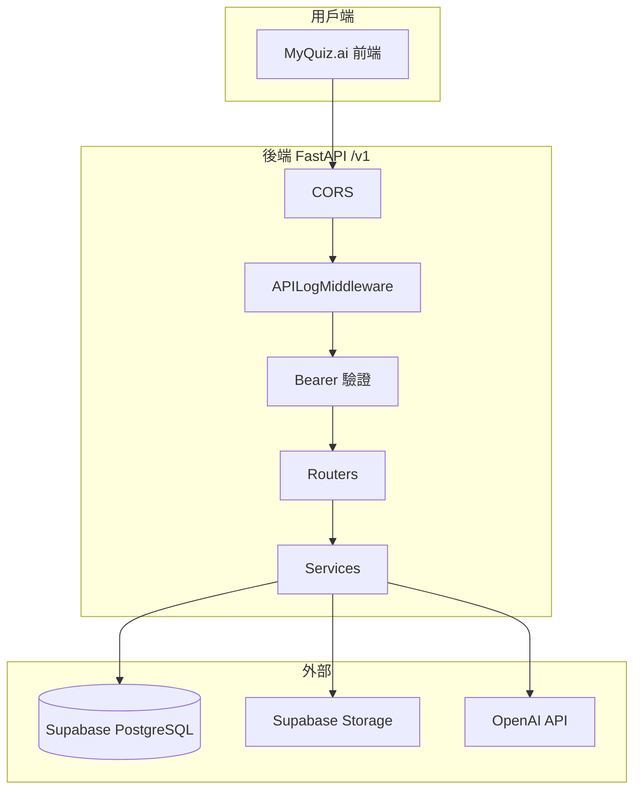
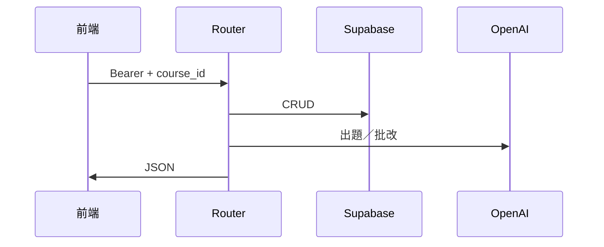
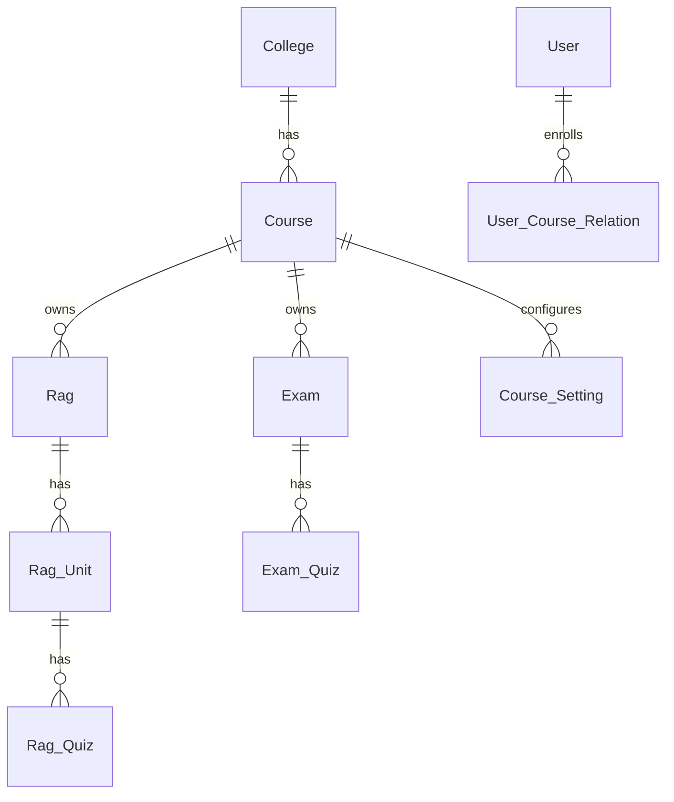
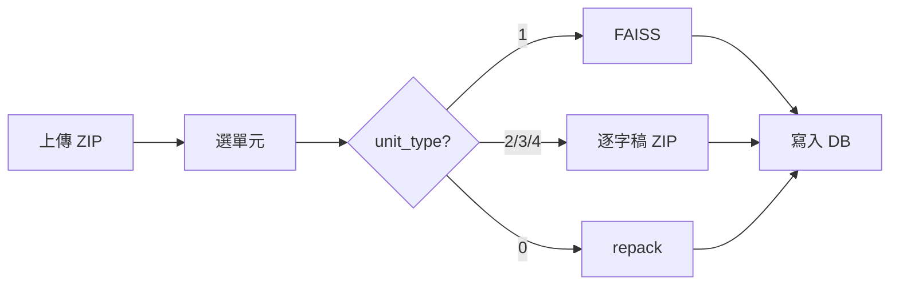
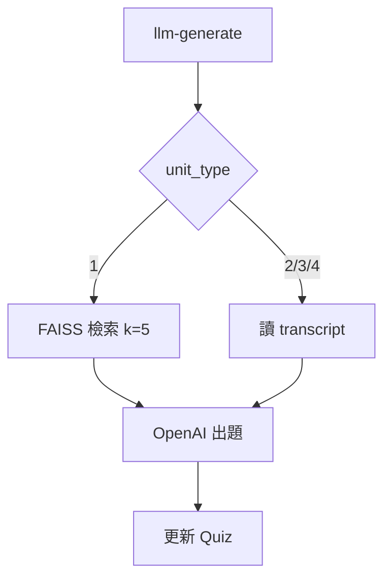
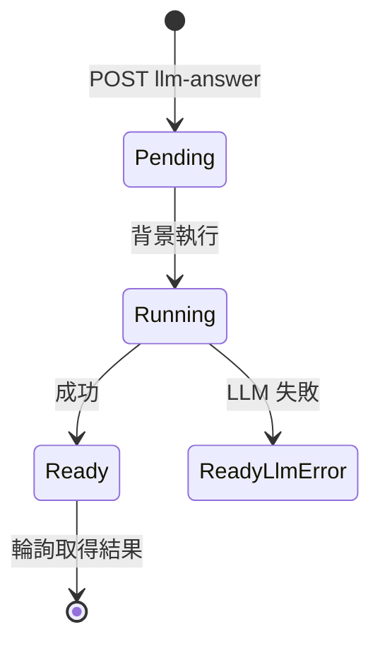

# MyQuiz.ai 後端教學手冊

[MyQuiz.ai](https://myquiz-ai.vercel.app) 的 **FastAPI 後端**教學文件。

這份文件教你：**系統在做什麼 → 怎麼跑起來 → 四大流程怎麼串 → 每支 API 怎麼呼叫**。

---

## 怎麼讀

| 你是… | 建議路線 |
|-------|----------|
| 第一次接觸 | 依序讀第 1～7 章 |
| 前端／整合工程師 | 第 3 章（認證）→ 第 5 章（流程）→ 第 9 章（API 手冊） |
| 維運／部署 | 第 2 章 → 第 8 章 |
| 查欄位格式 | 直接翻第 9 章 API 詳細文件 |

**圖片**：請把 JPG 放到 `docs/images/`，檔名 `img-01.jpg`～`img-20.jpg`，對應下方【圖 XX】編號。

### 圖片索引（待補 JPG）

| 編號 | 檔名 | 章節 | 建議內容 |
|------|------|------|----------|
| 01 | `img-01.jpg` | 1.1 | 前端、後端、Supabase、OpenAI 四方總覽 |
| 02 | `img-02.jpg` | 1.2 | RAG／Exam／分析／管理四大模組 |
| 03 | `img-03.jpg` | 2.2 | 請求處理流程（Middleware → Router） |
| 04 | `img-04.jpg` | 2.3 | 程式分層（routers / services / utils） |
| 05 | `img-05.jpg` | 3.1 | 登入取得 token 流程 |
| 06 | `img-06.jpg` | 3.2 | Bearer 驗證解析 |
| 07 | `img-07.jpg` | 3.4 | user_type 權限對照 |
| 08 | `img-08.jpg` | 4.1 | 資料表 ER 關係 |
| 09 | `img-09.jpg` | 4.3 | unit_type 五種類型 |
| 10 | `img-10.jpg` | 2.4 | Storage 三層路徑 |
| 11 | `img-11.jpg` | 5.1 | RAG 建置全流程 |
| 12 | `img-12.jpg` | 5.1 | build-zip NDJSON 串流 |
| 13 | `img-13.jpg` | 5.2 | LLM 出題流程 |
| 14 | `img-14.jpg` | 5.3 | LLM 批改非同步輪詢 |
| 15 | `img-15.jpg` | 5.4 | 弱點分析流程 |
| 16 | `img-16.jpg` | 5.5 | Exam 測驗流程 |
| 17 | `img-17.jpg` | 6.2 | llm_error vs 一般錯誤 |
| 18 | `img-18.jpg` | 8.1 | 本機 uvicorn + Swagger |
| 19 | `img-19.jpg` | 8.4 | Render 部署設定 |
| 20 | `img-20.jpg` | 8.1 | Swagger 端點分組 |

---

## 目錄

**入門**
- [第 1 章 系統在做什麼](#第-1-章-系統在做什麼)
- [第 2 章 架構一覽](#第-2-章-架構一覽)
- [第 3 章 認證與權限](#第-3-章-認證與權限)
- [第 4 章 資料怎麼存](#第-4-章-資料怎麼存)
- [第 5 章 四大核心流程](#第-5-章-四大核心流程)
- [第 6 章 設計慣例與錯誤處理](#第-6-章-設計慣例與錯誤處理)
- [第 7 章 目錄結構與技術棧](#第-7-章-目錄結構與技術棧)

**實作**
- [第 8 章 本機開發與部署](#第-8-章-本機開發與部署)

**參考**
- [第 9 章 API 手冊](#第-9-章-api-手冊)

---

## 第 1 章 系統在做什麼

### 1.1 一句話

MyQuiz.ai 讓老師**上傳教材 → AI 自動出題批改 → 學生做測驗 → 產生弱點報告**。

後端負責：存資料、管權限、叫 OpenAI、建向量庫。


<br/>

**【圖 01】系統全貌**


| 項目 | 說明 |
|------|------|
| 檔名 | `docs/images/img-01.jpg` |
| 建議內容 | 前端、後端、Supabase、OpenAI 四方關係總覽圖 |

<br/>


### 1.2 後端負責什麼

| 模組 | 路由前綴 | 白話說明 |
|------|---------|----------|
| 認證 | `/v1/auth` | 登入拿 token、換發 token |
| 使用者 | `/v1/users` | 查使用者、改自己密碼 |
| 學院／課程 | `/v1/colleges`、`/v1/courses` | 列出學院與課程 |
| 課程成員 | `/v1/rag/course-members` | 加人、改身份、移出課程 |
| RAG 教材 | `/v1/rag/pages`、`/v1/rag/units` | 上傳 ZIP、建庫、預覽媒體 |
| RAG 題目 | `/v1/rag/quizzes` | 練習題 CRUD、AI 出題／批改 |
| 課程設定 | `/v1/rag/*`、`/v1/exam/llm-api-key` | API Key、模型、分析指令 |
| 測驗 | `/v1/exam` | 正式測驗卷、出題、評分 |
| 弱點分析 | `/v1/person-analyses`、`/v1/course-analyses` | 個人／全班弱點報告 |
| Prompt 模板 | `/v1/prompt-templates` | 查內建 LLM 模板 |
| Log | `/v1/logs` | API 呼叫稽核紀錄 |


<br/>

**【圖 02】四大業務模組**


| 項目 | 說明 |
|------|------|
| 檔名 | `docs/images/img-02.jpg` |
| 建議內容 | RAG 練習、Exam 測驗、弱點分析、課程管理四塊與路由對應 |

<br/>


### 1.3 三個一定要記的規則

**規則 1：所有 API 都在 `/v1` 底下**

未來 breaking change 走 `/v2`，現行一律 `/v1/...`。

**規則 2：除登入外，都要帶 Bearer token**

```
Authorization: Bearer <access_token>
```

token 從 `POST /v1/auth/login` 取得。query 帶 `person_id` 的舊做法已移除（2026-06-07），沒 token 就 **401**。

**規則 3：RAG／Exam／分析／Log 都要帶 `course_id`**

放在 query，例如 `?course_id=1`。沒帶回 **400**。

### 1.4 欄位命名（前後端對接用）

| 情境 | 用這個欄位 |
|------|-----------|
| 學生作答（request body） | `quiz_answer`（相容 `answer`） |
| 學生作答（DB） | `answer_content` |
| AI 評語（DB） | `answer_critique`（純文字 Markdown） |

### 1.5 API Key 放哪

**不放在 `.env`**，而是依課程存在 `Course_Setting` 表：

| key | 用途 | 管理端點 |
|-----|------|----------|
| `rag-api-key` | RAG 出題／批改、FAISS 建庫、課程弱點分析 | `/v1/rag/llm-api-key` |
| `exam-api-key` | Exam 出題／批改、個人弱點分析 | `/v1/exam/llm-api-key` |
| `llm-model` | 出題／批改／分析共用模型（預設 `gpt-5.4`） | `/v1/rag/llm-model` |

前端可先查 `/exists` 端點，確認老師是否已設定 Key。

---

## 第 2 章 架構一覽

### 2.1 整體架構

前端（Vercel）透過 HTTPS 呼叫後端。後端再連 Supabase（資料庫＋檔案）與 OpenAI（LLM＋embedding）。




<br/>

**【圖 03】請求處理流程**


| 項目 | 說明 |
|------|------|
| 檔名 | `docs/images/img-03.jpg` |
| 建議內容 | 從前端發請求到 Middleware、Router、Service、回應的逐步示意 |

<br/>


### 2.2 一筆請求怎麼走

1. 前端帶 `Bearer` + `course_id` 發請求
2. `APILogMiddleware` 記錄（失敗不影響回應）
3. Router 驗證 token → 得到 `person_id`
4. 需要時讀寫 DB、下載 Storage ZIP、呼叫 LLM
5. 回 JSON；Middleware 非同步寫 Log



### 2.3 程式分層

| 層 | 目錄 | 做什麼 |
|----|------|--------|
| 入口 | `main.py` | 掛路由、CORS、Middleware |
| 路由 | `routers/` | HTTP 端點、權限檢查 |
| 服務 | `services/` | LLM 出題／批改／弱點報告 |
| 工具 | `utils/` | DB、Storage、FAISS、token |
| 依賴 | `dependencies/` | 注入 person_id、course_id |
| 中介 | `middleware/` | API 紀錄、遮罩敏感欄位 |


<br/>

**【圖 04】程式分層**


| 項目 | 說明 |
|------|------|
| 檔名 | `docs/images/img-04.jpg` |
| 建議內容 | main → routers → services → utils 資料夾對應圖 |

<br/>


### 2.4 Storage 檔案放哪

Bucket 名稱：`SUPABASE_RAG_BUCKET`（預設 `MyQuiz-ai`）

```
{person_id}/{rag_page_id}/upload/{rag_page_id}.zip   ← 原始上傳
{person_id}/{rag_page_id}/repack/{stem}.zip          ← 單元 repack
{person_id}/{rag_page_id}/rag/{stem}_rag.zip         ← FAISS 或逐字稿
```


<br/>

**【圖 10】Storage 路徑結構**


| 項目 | 說明 |
|------|------|
| 檔名 | `docs/images/img-10.jpg` |
| 建議內容 | person_id / rag_page_id / upload|repack|rag 三層資料夾示意 |

<br/>


---

## 第 3 章 認證與權限

### 3.1 登入拿 token（教學步驟）

**步驟 1** — 呼叫登入（不需 Bearer）

```bash
curl -X POST http://127.0.0.1:8000/v1/auth/login \
  -H 'Content-Type: application/json' \
  -d '{"person_id": "你的帳號", "password": "你的密碼"}'
```

**步驟 2** — 從回應取出 `access_token`

**步驟 3** — 之後每個請求帶標頭

```
Authorization: Bearer <access_token>
```

**步驟 4** — token 快到期可換發

`POST /v1/auth/refresh`（帶舊 token，無 body）


<br/>

**【圖 05】登入與 Token**


| 項目 | 說明 |
|------|------|
| 檔名 | `docs/images/img-05.jpg` |
| 建議內容 | 登入畫面 → 取得 access_token → 後續請求帶 Bearer 的流程 |

<br/>


### 3.2 Token 怎麼做的

自簽 HMAC-SHA256（`utils/auth.py`），不依賴外部 JWT 套件：

```
token = base64url(payload) + "." + base64url(簽章)
payload = {"sub": person_id, "iat": 簽發時間, "exp": 到期時間}
```

| 項目 | 值 |
|------|-----|
| 效期 | 預設 30 天（`AUTH_TOKEN_TTL_SECONDS` 可調） |
| 密鑰 | `AUTH_TOKEN_SECRET`（正式環境必設） |


<br/>

**【圖 06】Bearer 驗證**


| 項目 | 說明 |
|------|------|
| 檔名 | `docs/images/img-06.jpg` |
| 建議內容 | 每筆請求如何解析 Authorization 標頭得到 person_id |

<br/>


### 3.3 三層檢查

| 檢查 | 說明 |
|------|------|
| Bearer token | 除登入與 RAG 單元媒體端點外，全部必帶 |
| course_id | RAG／Exam／分析／Log 必填 query |
| user_type | 依課程決定身份（見下表） |

**例外**：`GET /v1/rag/units/{id}/text|mp3-file|youtube-url` **不驗 Bearer**，給 `<audio src>` 直接用。建置前預覽 `unit-preview/*` 則要 Bearer。

### 3.4 身份與權限（user_type）

同一人在不同課程可有不同身份：

| user_type | 身份 | 能做什麼 |
|-----------|------|----------|
| 1 | 開發者 | 全部；可建 FAISS |
| 2 | 管理者 | 設 API Key、模型、成員管理 |
| 3 | 學生 | 作答、查詢；不能改設定 |

需 **1 或 2** 才能：讀寫 API Key、模型、分析指令、課程成員管理。


<br/>

**【圖 07】權限模型**


| 項目 | 說明 |
|------|------|
| 檔名 | `docs/images/img-07.jpg` |
| 建議內容 | 開發者／管理者／學生三種身份與可操作功能對照 |

<br/>


---

## 第 4 章 資料怎麼存

### 4.1 核心表關係




<br/>

**【圖 08】資料表關係**


| 項目 | 說明 |
|------|------|
| 檔名 | `docs/images/img-08.jpg` |
| 建議內容 | College → Course → Rag/Exam → Quiz 簡化 ER 圖 |

<br/>


### 4.2 主要資料表

| 表 | 存什麼 |
|----|--------|
| `User` | 帳號（`person_id` 登入用） |
| `User_Course_Relation` | 選課 + `user_type` |
| `Rag` / `Rag_Unit` / `Rag_Quiz` | 教材分頁、單元、練習題 |
| `Exam` / `Exam_Quiz` | 測驗卷、測驗題 |
| `Course_Setting` | API Key、模型、分析指令 |
| `Person_Analysis` / `Course_Analysis` | 弱點分析結果 |
| `Log` | API 呼叫紀錄 |

> 刪除都是**軟刪除**（`deleted=true`）。時間戳為台北時區 `+08:00`。

### 4.3 單元類型 unit_type

教材 ZIP 建庫時，每個資料夾是一個「單元」：

| 值 | 名稱 | 建庫結果 | 出題時用什麼 |
|----|------|----------|-------------|
| 0 | 未指定 | repack 複製 | 依 ZIP 推斷 |
| 1 | Office/PDF/MD | **FAISS 向量庫** | 向量檢索 top-5 |
| 2 | 純文字 | 逐字稿 ZIP | 全文 transcript |
| 3 | MP3 音訊 | 逐字稿 ZIP | 音訊旁文字檔 |
| 4 | YouTube | 逐字稿 ZIP | URL + 逐字稿 |


<br/>

**【圖 09】unit_type 五種類型**


| 項目 | 說明 |
|------|------|
| 檔名 | `docs/images/img-09.jpg` |
| 建議內容 | 五種教材類型與建庫／出題差異對照圖 |

<br/>


**自動推斷**：一音訊＋一文字 → 3；僅文字 → 2；YouTube 須手動指定 4。

**FAISS 條件**：`unit_type=1` 且 `allow_faiss=true`（由 user_type、`build_faiss`、`repack_only` 決定）。

### 4.4 Course_Setting 常用 key

| key | 用途 |
|-----|------|
| `rag-api-key` | RAG + 課程分析 |
| `exam-api-key` | Exam + 個人分析 |
| `llm-model` | 共用模型名 |
| `person_analysis_user_prompt_text` | 個人分析規則 |
| `course_analysis_user_prompt_text` | 課程分析規則 |

---

## 第 5 章 四大核心流程

### 5.1 流程 A：RAG 建置（build-zip）

**目的**：把上傳的 ZIP 轉成 AI 能讀的格式。

**步驟**

1. `POST /v1/rag/pages/upload-zip` — 上傳 ZIP
2. 前端選資料夾、指定 unit_type
3. `POST /v1/rag/pages/{rag_page_id}/build-zip` — 建庫
4. 成功後才有 `Rag_Unit` 列




<br/>

**【圖 11】RAG 建置全流程**


| 項目 | 說明 |
|------|------|
| 檔名 | `docs/images/img-11.jpg` |
| 建議內容 | upload-zip → 選單元 → build-zip → Rag_Unit 建立的完整流程 |

<br/>


**回應格式**：`application/x-ndjson` 串流（逐行 JSON）

- 前端用 `fetch` 讀 `response.body`，**不要用** `response.json()`
- HTTP 永遠 200，看最後一行 `type:"complete"` 的 `success`


<br/>

**【圖 12】build-zip 串流**


| 項目 | 說明 |
|------|------|
| 檔名 | `docs/images/img-12.jpg` |
| 建議內容 | NDJSON 各行 type: start / building / unit / complete 示意 |

<br/>


**注意**

- 建 FAISS 前須設定 `rag-api-key`
- 建置前預覽用 `unit-preview/*`（此時還沒有 `rag_unit_id`）

---

### 5.2 流程 B：LLM 出題

**目的**：依教材內容，AI 產生題幹、提示、參考答案。

**步驟**

1. 確認 API Key 已設定
2. `POST /v1/rag/quizzes/llm-generate`（或 Exam 版）
3. 後端依 unit_type 取 context → 呼叫 LLM
4. 寫入 `quiz_content` 等欄位；清空舊作答




<br/>

**【圖 13】LLM 出題流程**


| 項目 | 說明 |
|------|------|
| 檔名 | `docs/images/img-13.jpg` |
| 建議內容 | 依 unit_type 取教材 → LLM 產題 → 寫入 DB |

<br/>


**變體速查**

| 後綴 | 意思 |
|------|------|
| `-db` | 沿用 DB 既有 prompt，body 不帶 prompt |
| `-followup` | 依前次作答／評語追問 |
| `create-`（Exam） | 先建題目列再出題 |

**失敗時**：HTTP 200 + `llm_error`（不是 5xx）

---

### 5.3 流程 C：LLM 批改（非同步）

**目的**：學生作答後，AI 產生評語。因為較慢，採**非同步 + 輪詢**。

**步驟**

1. `POST .../llm-answer` → 立刻回 **202** + `job_id`
2. 背景跑 LLM 批改
3. 前端輪詢 `GET .../answer-result/{job_id}`
4. `status=ready` 時讀 `answer_critique`




<br/>

**【圖 14】LLM 批改非同步**


| 項目 | 說明 |
|------|------|
| 檔名 | `docs/images/img-14.jpg` |
| 建議內容 | 202 job_id → 輪詢 → ready 取得評語的時序圖 |

<br/>


**注意**

- Job 存在**記憶體**，服務重啟後 `job_id` 失效（404）→ 要重新送出
- LLM 失敗：`status=ready` 但頂層有 `llm_error`

---

### 5.4 流程 D：弱點分析

**目的**：彙整已作答題目，AI 產生 Markdown 弱點報告。

**個人 vs 課程**

| | 個人 | 課程 |
|---|------|------|
| 表 | `Person_Analysis` | `Course_Analysis` |
| API Key | `exam-api-key` | `rag-api-key` |
| 範圍 | 該生已作答 | 全班已作答 |

**步驟（兩者相同模式）**

1. `POST /v1/person-analyses?course_id=…` — 建空白列
2. `POST /v1/person-analyses/{id}/llm-analysis` — 產生報告寫入該列
3. `PATCH` 改名、`DELETE` 軟刪


<br/>

**【圖 15】弱點分析流程**


| 項目 | 說明 |
|------|------|
| 檔名 | `docs/images/img-15.jpg` |
| 建議內容 | 建空白列 → llm-analysis 產報告 → 顯示 Markdown |

<br/>


---

### 5.5 流程 E：Exam 測驗

**目的**：把 RAG 練習題匯入正式測驗，學生作答並取得 AI 評語。

**步驟**

1. RAG 題目設 `for_exam=true`
2. `GET /v1/exam/rag-for-exams` — 查可匯入題目
3. `POST /v1/exam/pages` — 建測驗卷
4. `POST /v1/exam/quizzes/llm-generate` — 出題
5. `POST /v1/exam/quizzes/llm-answer` — 批改（非同步）
6. 可 `llm-generate-followup` 追問


<br/>

**【圖 16】Exam 測驗流程**


| 項目 | 說明 |
|------|------|
| 檔名 | `docs/images/img-16.jpg` |
| 建議內容 | for_exam 標記 → 匯入 → 出題 → 作答 → 批改 → 追問 |

<br/>


---

## 第 6 章 設計慣例與錯誤處理

### 6.1 REST 慣例（2026-06-06 起）

| 慣例 | 範例 |
|------|------|
| 複數集合名 | `/v1/rag/pages` |
| 新增 POST → 201 | `POST /v1/rag/quizzes` |
| 刪除 DELETE（軟刪） | `DELETE /v1/rag/pages/{id}` |
| 部分更新 PATCH | `PATCH /v1/exam/pages/{id}` |
| kebab-case | `/v1/rag/llm-api-key` |
| LLM 動作用 `llm-` 前綴 | `llm-generate`、`llm-answer` |

### 6.2 一般錯誤 vs LLM 錯誤

**一般錯誤**（驗證、權限、找不到資源）→ HTTP 4xx/5xx

```json
{ "detail": "錯誤說明" }
```

**LLM 錯誤**（Key 錯、額度不足、逾時）→ **HTTP 200 + `llm_error`**

讓前端能把原因顯示給使用者，而不是只看到 500。

| 情境 | 行為 |
|------|------|
| 出題失敗 | 200 + `llm_error`，題目欄位空字串 |
| 批改失敗 | `status=ready` + `llm_error` |
| 分析失敗 | 200 + `weakness_report=null` + `llm_error` |


<br/>

**【圖 17】LLM 錯誤處理**


| 項目 | 說明 |
|------|------|
| 檔名 | `docs/images/img-17.jpg` |
| 建議內容 | 一般 4xx 與 llm_error 200 兩種錯誤回應對照 |

<br/>


### 6.3 常見 HTTP 狀態碼

| 碼 | 意思 |
|----|------|
| 400 | 缺參數、person_id 不一致 |
| 401 | 沒 token 或過期 |
| 403 | 權限不足、非資源擁有者 |
| 404 | 資源不存在、job 查無 |
| 409 | 成員重複、跨學院衝突 |
| 413 | ZIP 太大 |
| 202 | 批改已接受（非同步） |

---

## 第 7 章 目錄結構與技術棧

### 7.1 技術棧

| 類別 | 技術 |
|------|------|
| 語言 | Python 3.10.12 |
| 框架 | FastAPI + Uvicorn |
| 認證 | 自簽 HMAC Bearer token |
| 資料庫 | Supabase PostgreSQL |
| 檔案 | Supabase Storage |
| 向量 | LangChain + FAISS + `text-embedding-3-small` |
| LLM | OpenAI gpt-5.4（可 per-course 覆寫） |
| 部署 | Render |

### 7.2 目錄結構

```
MyQuiz-ai-backend/
├── main.py              # 入口
├── routers/             # HTTP 端點
│   ├── zip/             # RAG 教材
│   ├── answer/          # RAG 出題批改
│   ├── exam/            # 測驗
│   └── …
├── services/            # LLM 業務邏輯
├── utils/               # DB、Storage、FAISS、auth
├── dependencies/        # person_id、course_id 注入
└── middleware/        # API Log
```

---

## 第 8 章 本機開發與部署

### 8.1 本機啟動（四步）

**步驟 1** — 複製環境變數

```bash
cp .env.example .env
# 填入 SUPABASE_URL、SUPABASE_SERVICE_ROLE_KEY 等
```

**步驟 2** — 安裝依賴

```bash
pip install -r requirements.txt
```

**步驟 3** — 啟動

```bash
uvicorn main:app --reload
```

**步驟 4** — 開 Swagger 確認

瀏覽 `http://127.0.0.1:8000/docs`


<br/>

**【圖 18】本機開發環境**


| 項目 | 說明 |
|------|------|
| 檔名 | `docs/images/img-18.jpg` |
| 建議內容 | 終端機啟動 uvicorn + 瀏覽器開 Swagger 截圖 |

<br/>


<br/>

**【圖 20】Swagger API 文件**


| 項目 | 說明 |
|------|------|
| 檔名 | `docs/images/img-20.jpg` |
| 建議內容 | /docs 頁面與端點分組截圖 |

<br/>


### 8.2 環境變數

| 變數 | 必填 | 說明 |
|------|------|------|
| `SUPABASE_URL` | ✅ | Supabase 專案 URL |
| `SUPABASE_SERVICE_ROLE_KEY` | ✅* | 後端用（略過 RLS） |
| `SUPABASE_ANON_KEY` | ✅* | 至少需其一 |
| `SUPABASE_RAG_BUCKET` | 選 | 預設 `MyQuiz-ai` |
| `AUTH_TOKEN_SECRET` | 建議 | token 簽章密鑰 |
| `AUTH_TOKEN_TTL_SECONDS` | 選 | 預設 30 天 |
| `CORS_EXTRA_ORIGINS` | 選 | 額外 CORS 網域 |

### 8.3 macOS 注意

`main.py` 設 `KMP_DUPLICATE_LIB_OK=TRUE`，避免 FAISS/NumPy OpenMP 衝突。

### 8.4 部署到 Render

1. Build：`pip install -r requirements.txt`
2. Start：`uvicorn main:app --host 0.0.0.0 --port $PORT`
3. 環境變數同 `.env`
4. Python 版本看 `runtime.txt`


<br/>

**【圖 19】Render 部署**


| 項目 | 說明 |
|------|------|
| 檔名 | `docs/images/img-19.jpg` |
| 建議內容 | Render Dashboard 設定 Build/Start Command 與環境變數 |

<br/>


**Render 注意**

- 同步 LLM 超過 ~30 秒可能 502 → 批改已改非同步
- 重啟後評分 job 失效 → 前端要重新送
- 改 `AUTH_TOKEN_SECRET` → 所有人要重新登入

---

## 第 9 章 API 手冊

> 以下保留完整 API 參考。每個端點含 request／response 範例。
> 教學重點請回第 3～5 章；這裡適合當字典查。

### 9.1 回傳格式速查

除登入與 RAG 單元媒體外，皆需 `Authorization: Bearer <token>`。
RAG／Exam／分析／Log 另需 query `course_id`。

**錯誤**

```json
{ "detail": "錯誤說明文字" }
```

**LLM 錯誤**：HTTP 200 + `llm_error`（見第 6 章）

---

### 9.2 API 目錄

RAG 與 Exam 採相同層級：**分頁（pages）→ 單元（units，僅 RAG）→ 題目（quizzes）→ 設定**。Swagger（`/docs`）路徑順序由 `utils/openapi_order.py` 統一排序。

| 方法 | 路徑 | 說明 |
|------|------|------|
| **認證** | | |
| POST | `/v1/auth/login` | 登入，簽發 access_token |
| POST | `/v1/auth/refresh` | 以有效 token 換發新 token |
| **使用者** | | |
| GET | `/v1/users` | 列出指定學院使用者（必填 query `college_id`，含選課） |
| PUT | `/v1/users/me/password` | 更新自己的密碼 |
| **學院／課程** | | |
| GET | `/v1/colleges` | 列出學院（含 courses、user_count） |
| GET | `/v1/courses` | 列出課程（含 college_name） |
| **課程成員** | | |
| GET | `/v1/rag/course-members` | 列出課程成員 |
| POST | `/v1/rag/course-members` | 新增成員（201） |
| POST | `/v1/rag/course-members/batch` | 批次新增成員（學生）（201） |
| PATCH | `/v1/rag/course-members/{member_person_id}` | 編輯成員 |
| DELETE | `/v1/rag/course-members/{member_person_id}` | 移出課程（軟刪除） |
| **RAG 教材管理** | | |
| GET | `/v1/rag/pages` | 列出 Rag（含 units→quizzes） |
| POST | `/v1/rag/pages/upload-zip` | 建立 Rag 並上傳 ZIP（201） |
| PATCH | `/v1/rag/pages/{rag_page_id}` | 更新 Rag tab_name |
| DELETE | `/v1/rag/pages/{rag_page_id}` | 軟刪除 Rag + 刪 Storage 資料夾 |
| GET | `/v1/rag/pages/{rag_page_id}/units` | 列出 Rag_Unit（含 quizzes） |
| POST | `/v1/rag/pages/{rag_page_id}/build-zip` | 建置 RAG ZIP（NDJSON 串流） |
| GET | `/v1/rag/pages/{rag_page_id}/unit-preview/text` | 建置前預覽文字單元（Bearer + owner） |
| GET | `/v1/rag/pages/{rag_page_id}/unit-preview/mp3-file` | 建置前預覽音訊單元 |
| GET | `/v1/rag/pages/{rag_page_id}/unit-preview/youtube-url` | 建置前預覽 YouTube 單元 |
| **RAG 單元媒體（不驗 Bearer）** | | |
| GET | `/v1/rag/units/{rag_unit_id}/text` | 取得文字單元逐字稿 |
| GET | `/v1/rag/units/{rag_unit_id}/mp3-file` | 取得音訊與逐字稿 |
| GET | `/v1/rag/units/{rag_unit_id}/youtube-url` | 解析 YouTube URL 與逐字稿 |
| **RAG 題目管理** | | |
| POST | `/v1/rag/quizzes` | 新增空白 Rag_Quiz（201，不呼叫 LLM） |
| PATCH | `/v1/rag/quizzes/{rag_quiz_id}` | 更新 quiz_name |
| DELETE | `/v1/rag/quizzes/{rag_quiz_id}` | 軟刪除 Rag_Quiz |
| PUT | `/v1/rag/quizzes/{rag_quiz_id}/followup` | 更新 follow_up 旗標 |
| PUT | `/v1/rag/quizzes/{rag_quiz_id}/for-exam` | 更新 for_exam 旗標 |
| **RAG 出題與評分** | | |
| POST | `/v1/rag/quizzes/llm-generate` | LLM 出題 |
| POST | `/v1/rag/quizzes/llm-generate-db` | LLM 出題（沿用 DB prompt） |
| POST | `/v1/rag/quizzes/llm-generate-followup` | LLM 追問出題 |
| POST | `/v1/rag/quizzes/llm-generate-followup-db` | LLM 追問出題（沿用 DB prompt） |
| POST | `/v1/rag/quizzes/llm-answer` | 非同步評分（202 + job_id） |
| POST | `/v1/rag/quizzes/llm-answer-db` | 非同步評分（沿用 DB prompt） |
| GET | `/v1/rag/quizzes/answer-result/{job_id}` | 輪詢評分結果 |
| **RAG 課程設定** | | |
| GET | `/v1/rag/llm-api-key` | 讀取 rag-api-key（user_type 1/2） |
| PUT | `/v1/rag/llm-api-key` | 寫入 rag-api-key（user_type 1/2） |
| GET | `/v1/rag/llm-api-key/exists` | rag-api-key 是否已設定（一般使用者可查） |
| GET | `/v1/rag/llm-model` | 讀取 llm-model（user_type 1/2） |
| PUT | `/v1/rag/llm-model` | 寫入 llm-model（user_type 1/2） |
| GET | `/v1/rag/person-analysis-user-prompt-text` | 取得個人分析指令 |
| PUT | `/v1/rag/person-analysis-user-prompt-text` | 寫入個人分析指令（user_type 1/2） |
| GET | `/v1/rag/course-analysis-user-prompt-text` | 取得課程分析指令 |
| PUT | `/v1/rag/course-analysis-user-prompt-text` | 寫入課程分析指令（user_type 1/2） |
| **測驗** | | |
| GET | `/v1/exam/pages` | 列出 Exam（含 quizzes、follow_up_quiz 巢狀） |
| POST | `/v1/exam/pages` | 建立 Exam（201） |
| GET | `/v1/exam/rag-for-exams` | 列出 for_exam RAG 單元與題目 |
| PATCH | `/v1/exam/pages/{exam_page_id}` | 更新 Exam tab_name |
| DELETE | `/v1/exam/pages/{exam_page_id}` | 軟刪除 Exam |
| DELETE | `/v1/exam/quizzes/{exam_quiz_id}` | 軟刪除 Exam_Quiz（含追問鏈） |
| PUT | `/v1/exam/quizzes/{exam_quiz_id}/quiz-rate` | 更新 quiz_rate（-1/0/1） |
| PUT | `/v1/exam/quizzes/{exam_quiz_id}/answer-rate` | 更新 answer_rate（-1/0/1） |
| POST | `/v1/exam/quizzes/llm-generate` | LLM 出題 |
| POST | `/v1/exam/quizzes/llm-generate-followup` | LLM 追問出題 |
| POST | `/v1/exam/quizzes/create-llm-generate` | 建立並 LLM 出題 |
| POST | `/v1/exam/quizzes/create-llm-generate-followup` | 建立並 LLM 追問出題 |
| POST | `/v1/exam/quizzes/llm-answer` | 非同步評分（202 + job_id） |
| GET | `/v1/exam/quizzes/answer-result/{job_id}` | 輪詢評分結果 |
| **Exam 課程設定** | | |
| GET | `/v1/exam/llm-api-key` | 讀取 exam-api-key（user_type 1/2） |
| PUT | `/v1/exam/llm-api-key` | 寫入 exam-api-key（user_type 1/2） |
| GET | `/v1/exam/llm-api-key/exists` | exam-api-key 是否已設定（一般使用者可查） |
| **個人弱點分析** | | |
| GET | `/v1/person-analyses` | 列出自己所有結果列（跨課程；analysis_text 非 null） |
| POST | `/v1/person-analyses` | 新增空白分析列（201；query 可帶 analysis_name） |
| POST | `/v1/person-analyses/{person_analysis_id}/llm-analysis` | 產生個人弱點報告並寫入該列 |
| PATCH | `/v1/person-analyses/{person_analysis_id}` | 更新分析名稱 |
| DELETE | `/v1/person-analyses/{person_analysis_id}` | 軟刪除分析列 |
| **課程弱點分析** | | |
| GET | `/v1/course-analyses` | 列出課程所有結果列（analysis_text 非 null） |
| POST | `/v1/course-analyses` | 新增空白分析列（201；query 可帶 analysis_name） |
| POST | `/v1/course-analyses/{course_analysis_id}/llm-analysis` | 產生課程弱點報告並寫入該列 |
| PATCH | `/v1/course-analyses/{course_analysis_id}` | 更新分析名稱 |
| DELETE | `/v1/course-analyses/{course_analysis_id}` | 軟刪除分析列 |
| **Prompt 模板** | | |
| GET | `/v1/prompt-templates` | 內建 LLM prompt 模板全文 |
| **Log** | | |
| GET | `/v1/logs` | 列出 API 呼叫紀錄 |

---

### 9.3 API 詳細文件

> 以下所有時間戳皆為 ISO 8601 台北時區字串（範例以 `"2026-01-01T00:00:00+08:00"` 表示）。除特別註明外，端點皆需 `Authorization: Bearer <token>`。

### 認證 `/v1/auth`

#### `POST /v1/auth/login`

**不需 Bearer**。以 `person_id` + `password` 登入，簽發 access_token。Body：

```json
{ "person_id": "string", "password": "string" }
```

成功時回傳使用者資訊（**不含 password**）、選課列表與 token：

```json
{
  "user": {
    "user_id": 1,
    "person_id": "string",
    "college_id": "string",
    "college_name": "string",
    "name": "string",
    "courses": [ /* 同頂層 courses */ ],
    "user_metadata": null,
    "updated_at": "2026-01-01T00:00:00+08:00",
    "created_at": "2026-01-01T00:00:00+08:00"
  },
  "courses": [
    {
      "course_user_id": 1,
      "course_id": 1,
      "college_id": 1,
      "course_name": "string",
      "semester": "113-1",
      "user_type": 3
    }
  ],
  "access_token": "eyJ…（base64url payload）.（base64url 簽章）",
  "token_type": "bearer",
  "expires_in": 2592000
}
```

- 帳號或密碼錯誤回 **401**。
- `expires_in` 為秒數（預設 30 天，env `AUTH_TOKEN_TTL_SECONDS` 可調）。
- 前端應保存 `access_token`，後續所有請求帶 `Authorization: Bearer <access_token>`。

---

#### `POST /v1/auth/refresh`

持**仍有效**的 token 換發新 token（延長效期）。無 body。

```json
{
  "access_token": "新 token",
  "token_type": "bearer",
  "expires_in": 2592000
}
```

> token 已過期則回 401，須重新登入。

---

### 使用者 `/v1/users`

> 使用者的新增／編輯／刪除已改由 [`/v1/rag/course-members`](#課程成員-v1ragcourse-members) 管理；此處僅保留列表與改自己密碼。

#### `GET /v1/users`

列出**指定學院**（必填 query `college_id`，對應 `User.college_id`）的未刪除使用者，含各使用者選課 `courses` 列表（`user_type` 依課程，見 courses 各項）。**含 `password` 欄位**（僅此端點回傳）。缺 `college_id` 回 422。

```json
{
  "users": [
    {
      "user_id": 1,
      "person_id": "string",
      "college_id": "string",
      "college_name": "string",
      "name": "string",
      "password": "string",
      "courses": [
        {
          "course_user_id": 1,
          "course_id": 1,
          "college_id": 1,
          "course_name": "string",
          "semester": "113-1",
          "user_type": 3
        }
      ],
      "user_metadata": null,
      "updated_at": "2026-01-01T00:00:00+08:00",
      "created_at": "2026-01-01T00:00:00+08:00"
    }
  ],
  "count": 1
}
```

---

#### `PUT /v1/users/me/password`

更新**自己**（token 呼叫者）的密碼。Body 只有一個欄位：

```json
{ "password": "新密碼" }
```

```json
{
  "message": "密碼已更新",
  "person_id": "string",
  "updated_at": "2026-01-01T00:00:00+08:00"
}
```

---

### 學院／課程 `/v1/colleges`、`/v1/courses`

#### `GET /v1/colleges`

列出所有未刪除學院，含所屬課程列表與該學院 User 數（`user_count`，未刪除）。

```json
{
  "colleges": [
    {
      "college_id": 1,
      "college_name": "string",
      "user_count": 3,
      "courses": [
        {
          "course_id": 1,
          "college_id": 1,
          "semester": "113-1",
          "course_name": "string"
        }
      ],
      "updated_at": "2026-01-01T00:00:00+08:00",
      "created_at": "2026-01-01T00:00:00+08:00"
    }
  ],
  "count": 1
}
```

---

#### `GET /v1/courses`

列出所有未刪除課程，含 `college_id`、`college_name`。

```json
{
  "courses": [
    {
      "course_id": 1,
      "college_id": 1,
      "college_name": "string",
      "semester": "113-1",
      "course_name": "string",
      "updated_at": "2026-01-01T00:00:00+08:00",
      "created_at": "2026-01-01T00:00:00+08:00"
    }
  ],
  "count": 1
}
```

---

### 課程成員 `/v1/rag/course-members`

課程成員管理（操作者須為該課程 user_type 1／2，否則 403）。所有端點必填 query `course_id`。

成員單筆結構（`CourseMemberItem`）：

```json
{
  "course_user_id": 1,
  "user_id": 1,
  "person_id": "string",
  "name": "string",
  "password": "string",
  "user_type": 3,
  "college_id": 1
}
```

#### `GET /v1/rag/course-members`

列出課程所有成員（`User_Course_Relation` ⋈ `User`，僅未刪除列）。

```json
{
  "course_id": 1,
  "members": [ /* CourseMemberItem[] */ ],
  "count": 1
}
```

---

#### `POST /v1/rag/course-members`

新增單一成員至課程，回 **201**。若 `User` 不存在則一併建立（**預設密碼 `0000`**）。Body：

```json
{
  "person_id": "string",
  "name": "string",
  "user_type": 3
}
```

> `user_type`：1 開發者、2 管理者、3 學生。回傳新增之 `CourseMemberItem`。
> 409：成員已在課程、或 `person_id` 已屬其他學院。

---

#### `POST /v1/rag/course-members/batch`

批次新增成員，回 **201**；每筆僅 `person_id`、`name`，**`user_type` 固定 3（學生）**。Body 為**陣列**：

```json
[
  { "person_id": "student01", "name": "王小明" },
  { "person_id": "student02", "name": "李小華" }
]
```

回應（單筆失敗不影響其他筆）：

```json
{
  "created": [ /* CourseMemberItem[] */ ],
  "failed": [
    { "person_id": "string", "detail": "失敗原因" }
  ],
  "created_count": 1,
  "failed_count": 1
}
```

---

#### `PATCH /v1/rag/course-members/{member_person_id}`

更新成員 `name`、`user_type`（path `member_person_id` 為要編輯的成員）。Body：

```json
{ "name": "string", "user_type": 3 }
```

回傳更新後 `CourseMemberItem`。

---

#### `DELETE /v1/rag/course-members/{member_person_id}`

自課程移出成員（`User_Course_Relation.deleted=true`，**不刪 `User` 表**）。回傳被移出成員之 `CourseMemberItem`。

---

### RAG 教材管理 `/v1/rag/pages`

所有端點需 Bearer + query `course_id`。

#### `GET /v1/rag/pages`

列出**呼叫者擁有**的 Rag（含 units→quizzes）。query `local`（選填 bool）過濾 `Rag.local`，未帶時依連線自動判斷（localhost → true）。

音訊單元（unit_type=3 且 mp3_file_name 非空）附 `mp3_audio_url`（指向 `GET /v1/rag/units/{id}/mp3-file`，不驗 Bearer，可直接作 `<audio src>`）；YouTube 單元（unit_type=4 且 youtube_url 非空）附 `youtube_url_api`（指向 `GET /v1/rag/units/{id}/youtube-url`）。

```json
{
  "rags": [
    {
      "rag_id": 1,
      "rag_page_id": "string",
      "tab_name": "string",
      "person_id": "string",
      "course_id": 1,
      "local": false,
      "deleted": false,
      "file_metadata": { "filename": "...", "second_folders": [], "file_size": 1.23 },
      "updated_at": "2026-01-01T00:00:00+08:00",
      "created_at": "2026-01-01T00:00:00+08:00",
      "units": [
        {
          "rag_unit_id": 1,
          "rag_page_id": "string",
          "person_id": "string",
          "course_id": 1,
          "unit_name": "string",
          "folder_combination": "string",
          "unit_type": 1,
          "repack_file_name": "string",
          "rag_file_name": "string",
          "rag_file_size": 1.23,
          "rag_chunk_size": 1000,
          "rag_chunk_overlap": 200,
          "transcript": "string",
          "text_file_name": "string",
          "mp3_file_name": "string",
          "youtube_url": "string",
          "deleted": false,
          "updated_at": "2026-01-01T00:00:00+08:00",
          "created_at": "2026-01-01T00:00:00+08:00",
          "mp3_audio_url": "/v1/rag/units/1/mp3-file?rag_page_id=...&course_id=...",
          "youtube_url_api": "/v1/rag/units/1/youtube-url?rag_page_id=...&course_id=...",
          "quizzes": [
            {
              "rag_quiz_id": 1,
              "rag_page_id": "string",
              "rag_unit_id": 1,
              "person_id": "string",
              "quiz_name": "string",
              "quiz_user_prompt_text": "string",
              "quiz_content": "string",
              "quiz_hint": "string",
              "quiz_answer_reference": "string",
              "answer_user_prompt_text": "string",
              "quiz_answer": "string",
              "answer_content": "string",
              "answer_critique": "string | null",
              "for_exam": false,
              "follow_up": false,
              "deleted": false,
              "updated_at": "2026-01-01T00:00:00+08:00",
              "created_at": "2026-01-01T00:00:00+08:00"
            }
          ]
        }
      ]
    }
  ],
  "count": 1
}
```

---

#### `POST /v1/rag/pages/upload-zip`

建立 Rag 並上傳 ZIP，回 **201**（multipart/form-data）。

| form 欄位 | 必填 | 說明 |
|-----------|------|------|
| `file` | ✅ | ZIP 檔（副檔名須為 `.zip`） |
| `rag_page_id` | ✅ | 分頁識別字串（不可含 `/`、`\`） |
| `tab_name` | ✅ | 顯示名稱 |
| `person_id` | 選 | 預設 token 呼叫者；有傳須一致 |
| `local` | 選 | 預設 false |

```json
{
  "rag_id": 1,
  "rag_page_id": "string",
  "tab_name": "string",
  "person_id": "string",
  "course_id": 1,
  "local": false,
  "created_at": "2026-01-01T00:00:00+08:00",
  "file_metadata": {
    "rag_id": 1,
    "rag_page_id": "string",
    "created_at": "2026-01-01T00:00:00+08:00",
    "filename": "upload.zip",
    "second_folders": ["folder1", "folder2"],
    "file_size": 1.23
  }
}
```

> 413：ZIP 超過 Storage 大小限制；502：Storage 上傳失敗。`second_folders` 為 ZIP 內第二層資料夾清單（即可建置的單元）。

---

#### `PATCH /v1/rag/pages/{rag_page_id}`

更新 Rag 的 tab_name（owner 限定）。Body：`{ "tab_name": "新名稱" }`。

```json
{
  "rag_id": 1,
  "rag_page_id": "string",
  "person_id": "string",
  "tab_name": "新名稱",
  "updated_at": "2026-01-01T00:00:00+08:00"
}
```

---

#### `DELETE /v1/rag/pages/{rag_page_id}`

軟刪除 Rag 及其 Rag_Unit，並刪除 Storage 資料夾。

```json
{
  "message": "已將 RAG 資料標記為刪除並刪除儲存資料夾",
  "rag_page_id": "string",
  "person_id": "string",
  "rag_updated": true,
  "folder_deleted": true
}
```

---

#### `GET /v1/rag/pages/{rag_page_id}/units`

列出該分頁所有 Rag_Unit（含 quizzes），單元結構同 `GET /v1/rag/pages` 之 `units[]`。

```json
{
  "units": [ /* Rag_Unit[]（含 quizzes） */ ],
  "count": 1
}
```

---

#### `POST /v1/rag/pages/{rag_page_id}/build-zip`

依 `unit_list` 建置各單元 RAG ZIP（owner 限定）。query `repack_only`（選填 bool，預設 false）強制不建 FAISS。

**Body（`PackRequest`）**：

| 欄位 | 必填 | 預設 | 說明 |
|------|------|------|------|
| `unit_list` | ✅ | | 資料夾清單，`+` 或 `,` 分隔（如 `folder1+folder2`） |
| `unit_names` | 選 | | 顯示名稱覆寫（逗號分隔字串或 JSON 陣列） |
| `unit_types` | 選 | 自動推斷 | 各單元 unit_type（逗號分隔 0–4） |
| `transcripts` | 選 | | 逐字稿覆寫（字串陣列） |
| `rag_chunk_size` | 選 | 1000 | FAISS chunk 大小（夾限 64–32000） |
| `rag_chunk_overlap` | 選 | 200 | chunk 重疊（夾限 0–size-1） |
| `rag_chunk_sizes` / `rag_chunk_overlaps` | 選 | | 逐單元覆寫（逗號分隔或 JSON 陣列） |
| `build_faiss` | 選 | null | null=依 user_type 自動、true=強制建、false=等同 repack_only |
| `person_id` | 選 | token 呼叫者 | 有傳須一致 |

**回應**：`application/x-ndjson` 串流，逐行 JSON。請以 `fetch` 讀取 `response.body` 逐行解析，**勿**使用 `response.json()`。HTTP 狀態碼恆為 200，以最後一行 `type === "complete"` 的 `success` 判斷成敗。

**第 1 行 — start**
```json
{
  "type": "start",
  "total": 2,
  "source_rag_page_id": "string",
  "unit_list": "folder1+folder2",
  "user_type": 1,
  "build_faiss_request": null,
  "repack_only": false,
  "allow_faiss": true
}
```

**每單元前一行 — building**
```json
{
  "type": "building",
  "index": 1,
  "total": 2,
  "completed_before": 0,
  "filename": "folder1.zip"
}
```

**每單元結果 — unit**
```json
{
  "type": "unit",
  "index": 1,
  "total": 2,
  "output": {
    "filename": "folder1.zip",
    "folder_combination": "folder1",
    "unit_name": "folder1",
    "repack_filename": "abc123.zip",
    "rag_filename": "abc123_rag.zip",
    "unit_type": 1,
    "rag_mode": "faiss",
    "transcript_plain": "string",
    "text_file_name": "string",
    "mp3_file_name": "string",
    "youtube_url": "string",
    "rag_chunk_size": 1000,
    "rag_chunk_overlap": 200,
    "file_size": 0.45,
    "rag_error": "string（僅失敗時出現）"
  }
}
```

**最後一行 — complete**
```json
{
  "type": "complete",
  "success": true,
  "source_rag_page_id": "string",
  "unit_list": "folder1+folder2",
  "outputs": [ /* 同 unit.output */ ],
  "total": 2,
  "built_ok": 2,
  "built_failed": 0,
  "message": "RAG ZIP 建立失敗（請修正後重試）（僅失敗時出現）"
}
```

> - `rag_mode`：`"faiss"`（向量庫）、`"transcript_md"`（逐字稿 md ZIP）、`"repack_copy"`（與 repack 同內容）。
> - `rag_chunk_size`／`rag_chunk_overlap` 於 unit_type≠1 時回傳 0；自動推斷 unit_type 與宣告不同時另附 `unit_type_declared`。
> - 全部成功後才寫入 `Rag_Unit` 列並更新 `Rag.rag_metadata`。
> - `allow_faiss=true` 時須已設定 `rag-api-key`（embedding 用），否則開始前即回 400。

---

#### `GET /v1/rag/pages/{rag_page_id}/unit-preview/{text,mp3-file,youtube-url}`

**建置前**（upload-zip 後、build-zip 前，`Rag_Unit` 尚無列）預覽單元內容；直接讀 upload ZIP。須 Bearer + owner 檢查；query `folder_name`（必填）、`course_id`。

**`/unit-preview/text`**（unit_type=2 預覽）
```json
{
  "rag_page_id": "string",
  "folder_name": "string",
  "text_file_name": "content.md",
  "transcript": "全文 Markdown 內容"
}
```

**`/unit-preview/mp3-file`**（unit_type=3 預覽；音訊 + 同資料夾至多一個文字檔）
```json
{
  "rag_page_id": "string",
  "folder_name": "string",
  "audio_base64": "base64 encoded audio string",
  "media_type": "audio/mpeg",
  "filename": "audio.mp3",
  "text_file_name": "transcript.md",
  "transcript": "文字檔全文"
}
```

**`/unit-preview/youtube-url`**（unit_type=4 預覽；文字檔第一行 URL、第二行起逐字稿）
```json
{
  "rag_page_id": "string",
  "folder_name": "string",
  "youtube_url": "https://www.youtube.com/watch?v=VIDEO_ID",
  "text_file_name": "unit.md",
  "transcript": "第二行起的逐字稿"
}
```

---

### RAG 單元媒體 `/v1/rag/units`

**已建置單元**（`Rag_Unit` 已有列）的媒體端點。**不驗 Bearer**（owner 由 `rag_page_id` 解析）；query 必填 `rag_page_id`、`course_id`。資料以 `Rag_Unit` 欄位為準，缺值時讀 upload ZIP 備援。

#### `GET /v1/rag/units/{rag_unit_id}/text`

僅 unit_type=2。

```json
{
  "rag_unit_id": 1,
  "rag_page_id": "string",
  "folder_name": "string",
  "text_file_name": "content.md",
  "transcript": "全文 Markdown 內容"
}
```

---

#### `GET /v1/rag/units/{rag_unit_id}/mp3-file`

僅 unit_type=3。音訊優先讀 repack ZIP（`repack_file_name`），備援 upload ZIP；逐字稿讀 `Rag_Unit.transcript`。可直接作 `<audio src>` 來源（回傳 JSON 內含 base64）。

```json
{
  "rag_unit_id": 1,
  "rag_page_id": "string",
  "audio_base64": "base64 encoded audio string",
  "media_type": "audio/mpeg",
  "filename": "audio.mp3",
  "transcript": "string"
}
```

---

#### `GET /v1/rag/units/{rag_unit_id}/youtube-url`

僅 unit_type=4。

```json
{
  "rag_unit_id": 1,
  "rag_page_id": "string",
  "folder_name": "string",
  "youtube_url": "https://www.youtube.com/watch?v=VIDEO_ID",
  "text_file_name": "unit.md",
  "transcript": "第二行起的逐字稿"
}
```

> 三端點共通錯誤：`rag_page_id` 與單元不符、unit_type 不符 → 400；單元不存在／已刪除、無內容 → 404。

---

### RAG 題目管理 `/v1/rag/quizzes`

所有端點需 Bearer + `course_id`；寫入操作驗證 owner。

#### `POST /v1/rag/quizzes`

新增空白 Rag_Quiz（不呼叫 LLM），回 **201**。Body：

```json
{ "rag_page_id": "string", "rag_unit_id": 1 }
```

> 兩欄擇一即可：`rag_unit_id > 0` 優先以主鍵查；否則以 `rag_page_id` 查（該分頁須恰有一個單元，否則 400）。

```json
{
  "rag_quiz_id": 1,
  "rag_page_id": "string",
  "rag_unit_id": 1,
  "person_id": "string",
  "quiz_name": "（取自 Rag_Unit.unit_name）",
  "quiz_user_prompt_text": "",
  "quiz_content": "",
  "quiz_hint": "",
  "quiz_answer_reference": "",
  "answer_user_prompt_text": "",
  "quiz_answer": "",
  "answer_content": "",
  "answer_critique": null,
  "for_exam": false,
  "follow_up": false,
  "deleted": false,
  "updated_at": "2026-01-01T00:00:00+08:00",
  "created_at": "2026-01-01T00:00:00+08:00"
}
```

---

#### `PATCH /v1/rag/quizzes/{rag_quiz_id}`

更新 quiz_name。Body：`{ "quiz_name": "新名稱" }`。

```json
{
  "rag_quiz_id": 1,
  "rag_page_id": "string",
  "rag_unit_id": 1,
  "person_id": "string",
  "quiz_name": "新名稱",
  "updated_at": "2026-01-01T00:00:00+08:00"
}
```

---

#### `DELETE /v1/rag/quizzes/{rag_quiz_id}`

軟刪除 Rag_Quiz。

```json
{
  "message": "已將 Rag_Quiz 標記為刪除",
  "rag_quiz_id": 1,
  "rag_page_id": "string",
  "rag_unit_id": 1,
  "person_id": "string",
  "rag_quiz_updated": true,
  "updated_at": "2026-01-01T00:00:00+08:00"
}
```

---

#### `PUT /v1/rag/quizzes/{rag_quiz_id}/followup`

更新 Rag_Quiz.follow_up 旗標。Body：`{ "followup": true }`（相容別名 `follow_up`、`followUp`；預設 false）。回傳 Rag_Quiz 整列（結構同 `GET /v1/rag/pages` 之 `quizzes[]`）。

---

#### `PUT /v1/rag/quizzes/{rag_quiz_id}/for-exam`

更新 Rag_Quiz.for_exam 旗標（標記可供測驗匯入）。Body：`{ "for_exam": true }`（預設 true）。回傳 Rag_Quiz 整列。

---

### RAG 出題與評分

#### `POST /v1/rag/quizzes/llm-generate`

四個變體（皆 Bearer + `course_id` + owner 檢查）：

| 端點 | Body 差異 | 說明 |
|------|----------|------|
| `llm-generate` | 含 `quiz_user_prompt_text` | body 帶出題 prompt（空字串時沿用 DB 值） |
| `llm-generate-db` | 無 prompt 欄位 | 沿用 DB 既存 `quiz_user_prompt_text` |
| `llm-generate-followup` | 含 prompt + followup 歷史 | 依前次作答／評語追問出題 |
| `llm-generate-followup-db` | followup 歷史 | 追問出題，沿用 DB prompt |

**Body（`GenerateQuizRequest`）**：

```json
{
  "rag_quiz_id": 1,
  "quiz_name": "",
  "quiz_user_prompt_text": "",
  "quiz_history_list": [
    {
      "rag_unit_id": 1,
      "quiz_name": "string",
      "follow_up": false,
      "quiz_content": "string",
      "quiz_hint": "",
      "answer_content": "",
      "quiz_answer_reference": "",
      "answer_critique": ""
    }
  ],
  "quiz_history_list_prompt_text": [
    { "quiz_content": "前次題幹" }
  ]
}
```

> - `quiz_history_list`：8 欄歷史問答，**僅寫入 DB**。
> - `quiz_history_list_prompt_text`：注入 LLM prompt。一般出題為 1 欄（`quiz_content`）；followup 變體為 4 欄（`quiz_content`、`quiz_answer_reference`、`answer_content`、`answer_critique`）。
> - unit_type=1 → 下載 rag ZIP + FAISS 檢索（k=5，query 固定「課程重點概念」）；unit_type=2/3/4 → 用 `Rag_Unit.transcript`。

**回應（HTTP 200）**：LLM 出題後更新 Rag_Quiz（並清空 `answer_content`／`answer_critique`）。

```json
{
  "rag_quiz_id": 1,
  "quiz_name": "string",
  "quiz_content": "題幹",
  "quiz_hint": "提示",
  "quiz_answer_reference": "參考答案",
  "quiz_user_prompt_text": "出題 prompt",
  "answer_user_prompt_text": "批改 prompt",
  "transcript": "逐字稿（unit_type=1 時為空字串）",
  "rag_output": {
    "rag_page_id": "stem string",
    "unit_name": "stem string",
    "filename": "stem.zip"
  },
  "follow_up": false,
  "quiz_history_list": [ /* echo */ ],
  "quiz_history_list_prompt_text": [ /* echo */ ],
  "quiz_llm_model": "gpt-5.4"
}
```

`quiz_llm_model` 為本次出題實際使用的模型（`Course_Setting` key=`llm-model`；未設定時為程式預設 `gpt-5.4`）。followup 變體的 `follow_up` 為 true。

**LLM 呼叫失敗時**（HTTP 200）：

```json
{
  "llm_error": "錯誤原因",
  "rag_quiz_id": 1,
  "quiz_content": "",
  "quiz_hint": "",
  "quiz_answer_reference": "",
  "follow_up": false,
  "quiz_llm_model": "gpt-5.4"
}
```

> 未設定 `rag-api-key` 時回 400（`請設定 RAG API Key`）。

---

#### `POST /v1/rag/quizzes/llm-answer`

兩個變體：`llm-answer`（body 帶批改 prompt）、`llm-answer-db`（沿用 DB `answer_user_prompt_text`）。

**Body（`QuizAnswerRequest`）**：

```json
{
  "rag_id": "1",
  "rag_page_id": "string",
  "rag_quiz_id": "1",
  "quiz_content": "",
  "answer_user_prompt_text": "",
  "quiz_answer": "學生作答文字"
}
```

> `rag_id`、`rag_quiz_id` 為**數字字串**；`quiz_answer` 必填（相容別名 `answer`）；`quiz_content` 空字串時沿用 DB 值。

非同步評分，回 **HTTP 202**：

```json
{
  "job_id": "uuid-string",
  "answer_llm_model": "gpt-5.4"
}
```

---

#### `GET /v1/rag/quizzes/answer-result/{job_id}`

輪詢評分結果。`status` 為 `"pending"` | `"ready"` | `"error"`。

**pending 時**
```json
{
  "status": "pending",
  "result": null,
  "error": null,
  "llm_error": null
}
```

**ready 時**（另附 rag_quiz 整列）
```json
{
  "status": "ready",
  "result": {
    "quiz_comments": ["評語 Markdown 段落 1", "評語 Markdown 段落 2"],
    "rag_quiz_id": 1,
    "rag_answer_id": 1
  },
  "error": null,
  "llm_error": null,
  "rag_quiz": {
    "rag_quiz_id": 1,
    "rag_page_id": "string",
    "rag_unit_id": 1,
    "person_id": "string",
    "quiz_name": "string",
    "quiz_content": "string",
    "quiz_hint": "string",
    "quiz_answer_reference": "string",
    "answer_content": "學生作答",
    "answer_critique": "批改評語純文字（非 JSON 物件）",
    "for_exam": false,
    "follow_up": false,
    "deleted": false,
    "updated_at": "2026-01-01T00:00:00+08:00",
    "created_at": "2026-01-01T00:00:00+08:00"
  }
}
```

**LLM 呼叫失敗時**：`status="ready"`、頂層 `llm_error` 為錯誤原因、`result.quiz_comments` 為空陣列。

**其他錯誤（DB 寫入失敗等）**：`status="error"`、`error` 為錯誤原因。

> `result.quiz_comments`：字串陣列（Markdown）。DB 的 `Rag_Quiz.answer_critique` 寫入以 `\n\n` 合併後的純文字。`rag_answer_id` 為 `rag_quiz_id` 的向下相容別名。
> 查無 `job_id`（服務重啟／冷啟動）回 **404**（`job not found（可能為服務重啟或冷啟動，請重新送出評分）`），前端應重新送出評分。

---

### RAG 課程設定

皆掛在 `/v1/rag`，依 query `course_id` 讀寫 `Course_Setting` 或分析指令表。

#### `GET /v1/rag/llm-api-key`

讀取 `Course_Setting` key=`rag-api-key`。僅該課程 user_type 1／2 可讀。

```json
{
  "course_setting_id": 1,
  "course_id": 1,
  "api_key": "sk-…（無設定時為 null）"
}
```

#### `PUT /v1/rag/llm-api-key`

寫入 `rag-api-key`（user_type 1／2）。Body：`{ "api_key": "sk-…" }`。回應同 GET。

#### `GET /v1/rag/llm-api-key/exists`

查詢 `rag-api-key` 是否已設定（value 非空）。**不回傳 key 內容**，一般使用者即可查詢——供前端在出題前提示「請先請老師設定 API Key」。

```json
{ "course_id": 1, "exists": true }
```

---

#### `GET /v1/rag/llm-model`

讀取 `Course_Setting` key=`llm-model`（user_type 1／2）。無設定時 `llm_model` 為 null（執行時 fallback 至程式預設 `gpt-5.4`）。

```json
{
  "course_setting_id": 1,
  "course_id": 1,
  "llm_model": "gpt-5.4（無設定時為 null）"
}
```

#### `PUT /v1/rag/llm-model`

寫入 `llm-model`（user_type 1／2）。Body：`{ "llm_model": "gpt-5.4" }`。

適用範圍：RAG／Exam **出題**、RAG／Exam **批改**、**個人／課程弱點分析**（三者共用）。

---

#### `GET /v1/rag/person-analysis-user-prompt-text`

取得個人分析指令（`Course_Setting` key=`person_analysis_user_prompt_text`，依 `course_id`）。

```json
{
  "course_id": 2,
  "person_analysis_user_prompt_text": "string（無設定時為 null）"
}
```

#### `PUT /v1/rag/person-analysis-user-prompt-text`

寫入個人分析指令至 `Course_Setting`（依 `course_id` upsert；user_type 1／2；傳空字串可清除）。Body：`{ "person_analysis_user_prompt_text": "string" }`。回應同 GET。

#### `GET /v1/rag/course-analysis-user-prompt-text`

取得課程分析指令（`Course_Setting` key=`course_analysis_user_prompt_text`，依 `course_id`）。

```json
{
  "course_id": 2,
  "course_analysis_user_prompt_text": "string（無設定時為 null）"
}
```

#### `PUT /v1/rag/course-analysis-user-prompt-text`

寫入課程分析指令至 `Course_Setting`（依 `course_id` upsert；user_type 1／2；傳空字串可清除）。Body：`{ "course_analysis_user_prompt_text": "string" }`。回應同 GET。

---

### 測驗 `/v1/exam`

所有端點需 Bearer + query `course_id`。

#### `GET /v1/exam/pages`

列出**呼叫者擁有**的 Exam（含 quizzes）。query `local`（選填 bool）同 `GET /v1/rag/pages` 規則。追問題以 `follow_up_quiz` 巢狀附在母題之下（可遞迴；`services/exam_queries.nest_follow_up_quizzes`）。

```json
{
  "exams": [
    {
      "exam_id": 1,
      "exam_page_id": "string",
      "tab_name": "string",
      "person_id": "string",
      "course_id": 1,
      "local": false,
      "deleted": false,
      "updated_at": "2026-01-01T00:00:00+08:00",
      "created_at": "2026-01-01T00:00:00+08:00",
      "quizzes": [
        {
          "exam_quiz_id": 1,
          "exam_page_id": "string",
          "rag_page_id": "string",
          "rag_unit_id": 1,
          "rag_quiz_id": 1,
          "person_id": "string",
          "course_id": 1,
          "unit_name": "string",
          "quiz_name": "string",
          "quiz_user_prompt_text": "string",
          "quiz_content": "string",
          "quiz_hint": "string",
          "quiz_answer_reference": "string",
          "quiz_rate": 0,
          "answer_user_prompt_text": "string",
          "answer_content": "string | null",
          "answer_critique": "string | null",
          "answer_rate": 0,
          "follow_up": false,
          "follow_up_exam_quiz_id": 0,
          "updated_at": "2026-01-01T00:00:00+08:00",
          "created_at": "2026-01-01T00:00:00+08:00",
          "follow_up_quiz": { /* 下一筆 follow_up Exam_Quiz，結構相同，可遞迴 */ }
        }
      ]
    }
  ],
  "count": 1
}
```

---

#### `GET /v1/exam/rag-for-exams`

列出 for_exam=true 的 RAG 單元與題目（供測驗匯入；**不限擁有者**）。query `local` 同上。

```json
{
  "units": [
    {
      "rag_unit_id": 1,
      "rag_page_id": "string",
      "unit_name": "string",
      "unit_type": 1,
      "for_exam": true,
      "deleted": false,
      "updated_at": "2026-01-01T00:00:00+08:00",
      "created_at": "2026-01-01T00:00:00+08:00",
      "quizzes": [
        {
          "rag_quiz_id": 1,
          "rag_page_id": "string",
          "rag_unit_id": 1,
          "person_id": "string",
          "course_id": 1,
          "follow_up": false,
          "quiz_name": "string",
          "quiz_user_prompt_text": "string",
          "quiz_content": "string",
          "quiz_hint": "string",
          "quiz_answer_reference": "string",
          "answer_user_prompt_text": "string"
        }
      ]
    }
  ],
  "count": 1
}
```

---

#### `POST /v1/exam/pages`

建立一筆 Exam，回 **201**。Body（`CreateExamRequest`）：

```json
{
  "exam_page_id": "string（選填；空字串時自動產生）",
  "person_id": "string（選填；預設 token 呼叫者）",
  "tab_name": "string",
  "local": false
}
```

```json
{
  "exam_id": 1,
  "exam_page_id": "string",
  "tab_name": "string",
  "person_id": "string",
  "course_id": 1,
  "local": false,
  "deleted": false,
  "updated_at": "2026-01-01T00:00:00+08:00",
  "created_at": "2026-01-01T00:00:00+08:00"
}
```

---

#### `PATCH /v1/exam/pages/{exam_page_id}`

更新 Exam 的 tab_name（owner 限定）。Body：`{ "tab_name": "新名稱" }`。

```json
{
  "exam_id": 1,
  "exam_page_id": "string",
  "tab_name": "新名稱",
  "person_id": "string",
  "updated_at": "2026-01-01T00:00:00+08:00"
}
```

---

#### `DELETE /v1/exam/pages/{exam_page_id}`

軟刪除 Exam（owner 限定）。

```json
{
  "message": "已將 Exam 標記為刪除",
  "exam_page_id": "string",
  "person_id": "string"
}
```

---

#### `DELETE /v1/exam/quizzes/{exam_quiz_id}`

軟刪除 Exam_Quiz（`deleted=true`）；並一併軟刪除 `follow_up_exam_quiz_id` 指向該題的追問子題鏈（遞迴）。

```json
{
  "message": "已將 Exam_Quiz 標記為刪除",
  "exam_quiz_id": 1,
  "exam_page_id": "string",
  "person_id": "string",
  "exam_quiz_updated": true,
  "updated_at": "2026-01-01T00:00:00+08:00"
}
```

---

#### `POST /v1/exam/quizzes/llm-generate`

兩個變體：`llm-generate`（對既有 Exam_Quiz 出題）、`create-llm-generate`（先建立 Exam_Quiz 列再出題，一次完成）。**API Key 為 `exam-api-key`**；prompt 模板讀自連結的 `Rag_Quiz` 並快照寫回 `Exam_Quiz`。

**Body（`ExamLlmGenerateQuizRequest`）**：

```json
{
  "exam_quiz_id": 1,
  "rag_page_id": "string",
  "rag_unit_id": 1,
  "rag_quiz_id": 1,
  "quiz_history_list": [ /* 8 欄歷史問答，僅寫 DB */ ],
  "quiz_history_list_prompt_text": [ { "quiz_content": "前次題幹" } ]
}
```

> `create-llm-generate` 變體以 `exam_page_id`（取代 `exam_quiz_id`）定位父 Exam。
> 若 Exam_Quiz 列已綁 `rag_unit_id`／`rag_quiz_id`（皆 >0），request 值必須一致，否則 400。

**回應（HTTP 200）**：

```json
{
  "exam_quiz_id": 1,
  "quiz_name": "string",
  "quiz_content": "題幹",
  "quiz_hint": "提示",
  "quiz_answer_reference": "參考答案",
  "quiz_user_prompt_text": "出題 prompt（快照）",
  "answer_user_prompt_text": "批改 prompt（快照）",
  "unit_name": "string",
  "rag_page_id": "string",
  "rag_unit_id": 1,
  "rag_quiz_id": 1,
  "transcript": "逐字稿（unit_type=1 時為空字串）",
  "rag_output": {
    "rag_page_id": "stem string",
    "unit_name": "stem string",
    "filename": "stem.zip"
  },
  "created_at": "2026-01-01T00:00:00+08:00",
  "quiz_llm_model": "gpt-5.4"
}
```

**LLM 呼叫失敗時**（HTTP 200）：

```json
{
  "llm_error": "錯誤原因",
  "exam_quiz_id": 1,
  "quiz_content": "",
  "quiz_hint": "",
  "quiz_answer_reference": "",
  "rag_page_id": "string",
  "rag_unit_id": 1,
  "rag_quiz_id": 1,
  "quiz_llm_model": "gpt-5.4"
}
```

---

#### `POST /v1/exam/quizzes/llm-generate-followup`

兩個變體：`llm-generate-followup`、`create-llm-generate-followup`。接續追問出題；Body 較一般出題多 `follow_up_exam_quiz_id`（前一題 PK，≥0），且 `quiz_history_list_prompt_text` 為 4 欄（`quiz_content`、`quiz_answer_reference`、`answer_content`、`answer_critique`）。

`follow_up_exam_quiz_id > 0` 且有傳入歷史問答時，回應另帶 follow_up 欄位：

```json
{
  "exam_quiz_id": 2,
  "quiz_name": "string",
  "quiz_content": "追問題幹",
  "quiz_hint": "提示",
  "quiz_answer_reference": "參考答案",
  "quiz_user_prompt_text": "出題 prompt",
  "answer_user_prompt_text": "批改 prompt",
  "unit_name": "string",
  "rag_page_id": "string",
  "rag_unit_id": 1,
  "rag_quiz_id": 1,
  "transcript": "string",
  "rag_output": { "rag_page_id": "…", "unit_name": "…", "filename": "….zip" },
  "follow_up": true,
  "follow_up_exam_quiz_id": 1,
  "quiz_history_list": [
    {
      "quiz_content": "string",
      "answer_content": "string",
      "quiz_answer_reference": "string",
      "answer_critique": "string"
    }
  ],
  "created_at": "2026-01-01T00:00:00+08:00",
  "quiz_llm_model": "gpt-5.4"
}
```

> `create-llm-generate-followup` 成功後**一律**標記 `follow_up=true`。LLM 失敗時同樣回 HTTP 200 + `llm_error`。

---

#### `POST /v1/exam/quizzes/llm-answer`

非同步評分，回 **HTTP 202**。Body（`ExamQuizAnswerRequest`）：

```json
{
  "exam_quiz_id": 1,
  "quiz_content": "題幹（選填；空字串時用 DB 值）",
  "quiz_answer": "學生作答"
}
```

```json
{
  "job_id": "uuid-string",
  "answer_llm_model": "gpt-5.4"
}
```

> 批改 prompt 優先用 `Exam_Quiz` 快照（`answer_user_prompt_text`），無則回退連結之 `Rag_Quiz`。

---

#### `GET /v1/exam/quizzes/answer-result/{job_id}`

輪詢評分結果。`status` 語意與 [RAG answer-result](#get-v1ragquizzesanswer-resultjob_id) 相同（LLM 失敗 → `status="ready"` + `llm_error`；查無 job_id → 404）。

**ready 時**（另附 exam_quiz 整列）
```json
{
  "status": "ready",
  "result": {
    "quiz_comments": ["評語 Markdown 段落 1", "評語 Markdown 段落 2"],
    "exam_quiz_id": 1
  },
  "error": null,
  "llm_error": null,
  "exam_quiz": {
    "exam_quiz_id": 1,
    "exam_page_id": "string",
    "rag_page_id": "string",
    "rag_unit_id": 1,
    "rag_quiz_id": 1,
    "person_id": "string",
    "course_id": 1,
    "unit_name": "string",
    "quiz_name": "string",
    "quiz_content": "string",
    "quiz_hint": "string",
    "quiz_answer_reference": "string",
    "quiz_rate": 0,
    "answer_content": "學生作答",
    "answer_critique": "批改評語純文字（非 JSON 物件）",
    "answer_rate": 0,
    "follow_up": false,
    "follow_up_exam_quiz_id": 0,
    "updated_at": "2026-01-01T00:00:00+08:00",
    "created_at": "2026-01-01T00:00:00+08:00"
  }
}
```

---

#### `PUT /v1/exam/quizzes/{exam_quiz_id}/quiz-rate`

更新 Exam_Quiz.quiz_rate（**題目**評價，僅 -1、0、1）。Body：`{ "quiz_rate": 1 }`。

```json
{
  "exam_quiz_id": 1,
  "quiz_rate": 1,
  "updated_at": "2026-01-01T00:00:00+08:00",
  "created_at": "2026-01-01T00:00:00+08:00",
  "message": "已更新 quiz_rate"
}
```

---

#### `PUT /v1/exam/quizzes/{exam_quiz_id}/answer-rate`

更新 Exam_Quiz.answer_rate（**評語**評價，僅 -1、0、1）。Body：`{ "answer_rate": 1 }`。

```json
{
  "exam_quiz_id": 1,
  "answer_rate": 1,
  "updated_at": "2026-01-01T00:00:00+08:00",
  "created_at": "2026-01-01T00:00:00+08:00",
  "message": "已更新 answer_rate"
}
```

---

#### `GET /v1/exam/llm-api-key`／`PUT /v1/exam/llm-api-key`／`GET /v1/exam/llm-api-key/exists`

讀寫 `Course_Setting` key=`exam-api-key`，行為與 [RAG 課程設定](#rag-課程設定) 之 `llm-api-key` 三端點完全相同（GET/PUT 限 user_type 1／2；`/exists` 一般使用者可查，不回傳 key 內容）。

```json
{ "course_setting_id": 1, "course_id": 1, "api_key": "sk-…（無設定時為 null）" }
```

```json
{ "course_id": 1, "exists": true }
```

---

### 個人弱點分析 `/v1/person-analyses`

對齊測驗頁「一列一 page、按 id 操作」：一列＝一筆分析紀錄（結果列），改名／刪除／寫入報告一律按主鍵；分析規則存 `Course_Setting`（見 `/v1/rag/person-analysis-user-prompt-text`）。

分析列結構（`Person_Analysis` 結果列）：

```json
{
  "person_analysis_id": 1,
  "person_id": "student01",
  "course_id": 2,
  "analysis_name": "string | null",
  "analysis_user_prompt_text": "產生報告當下的規則快照",
  "analysis_prompt_text": "產生報告當下的規則快照（同源）",
  "analysis_text": "Markdown 弱點報告全文（POST /add 新增之空白列為 ''）",
  "exams": [ /* 該課程目前已作答題目（GET 時即時自資料庫彙整），結構同 POST /{id}/llm-analysis 回應的 exams */ ],
  "created_at": "2026-01-01T00:00:00+08:00",
  "updated_at": "2026-01-01T00:00:00+08:00"
}
```

#### `GET /v1/person-analyses`

列出**呼叫者自己**所有未刪除結果列（**跨課程**，不需 `course_id`；`analysis_text` 非 null），依 `person_analysis_id` 升冪。每列附 `exams`：該列課程目前已作答題目，抓法與 `POST /{id}/llm-analysis` 相同。

```json
{
  "person_id": "string",
  "analyses": [ /* 分析列[] */ ],
  "count": 1
}
```

---

#### `POST /v1/person-analyses`

新增一筆空白結果列（`analysis_text=""`），回 **201**。query：`course_id`（必填）、`analysis_name`（選填，命名用）。無 body。以回傳的 `person_analysis_id` 呼叫 `POST /{id}/llm-analysis` 將報告寫入此列。

```json
{
  "message": "已新增 Person_Analysis 列",
  "person_analysis_id": 1,
  "person_id": "string",
  "course_id": 2,
  "analysis_name": "string | null",
  "created_at": "2026-01-01T00:00:00+08:00",
  "updated_at": "2026-01-01T00:00:00+08:00"
}
```

---

#### `POST /v1/person-analyses/{person_analysis_id}/llm-analysis`

依呼叫者與 `course_id` 彙整已作答 Exam_Quiz，呼叫 LLM 產生個人弱點報告並**按主鍵寫入指定列**的 `analysis_text`（同時寫入當次規則快照 `analysis_prompt_text`）。驗證：該列須存在（404）、屬於呼叫者（403）、`course_id` 相符（400）。**API Key 為 `exam-api-key`**。指令來源：`Course_Setting` key=`person_analysis_user_prompt_text`。

```json
{
  "person_analysis_id": 1,
  "exams": [
    {
      "exam_id": 1,
      "exam_page_id": "string",
      "tab_name": "string",
      "person_id": "string",
      "quizzes": [ /* 已作答 Exam_Quiz[]，結構同 GET /v1/exam/pages */ ]
    }
  ],
  "count": 1,
  "weakness_report": "Markdown 弱點報告全文（成功時非 null）",
  "llm_error": "失敗原因（成功時為 null）",
  "analysis_llm_model": "gpt-5.4"
}
```

> `weakness_report` 為 LLM `message.content` 原文 Markdown。未設定 API Key、無已作答題目或 LLM 呼叫失敗時 `weakness_report=null` 且 `llm_error` 說明原因（HTTP 仍為 200）。

---

#### `PATCH /v1/person-analyses/{person_analysis_id}`

更新分析名稱。Body：`{ "analysis_name": "string" }`（傳空字串可清除）。

```json
{
  "message": "已更新 Person_Analysis 分析名稱",
  "person_analysis_id": 1,
  "person_id": "string",
  "course_id": 2,
  "analysis_name": "string | null",
  "updated_at": "2026-01-01T00:00:00+08:00"
}
```

---

#### `DELETE /v1/person-analyses/{person_analysis_id}`

軟刪除分析列。

```json
{
  "message": "已將 Person_Analysis 標記為刪除",
  "person_analysis_id": 1,
  "person_id": "string",
  "course_id": 2,
  "updated_at": "2026-01-01T00:00:00+08:00"
}
```

---

### 課程弱點分析 `/v1/course-analyses`

端點與行為對應 `/v1/person-analyses`，差異：

- 資料表為 `Course_Analysis`（欄位 `course_analysis_id`，其餘結構相同）。
- `GET /v1/course-analyses` 依 **`course_id`** 列出**全課程**結果列（必填 query `course_id`；`analysis_text` 非 null），依 `course_analysis_id` 升冪。每列附 `exams`：**全課程**目前已作答題目（各列內容相同），抓法與 `POST /{id}/llm-analysis` 相同。
- `POST /v1/course-analyses/{id}/llm-analysis` 彙整**全課程**已作答題目；**API Key 為 `rag-api-key`**；指令來源 `Course_Setting` key=`course_analysis_user_prompt_text`。

| 方法 | 路徑 | 對應個人分析端點 |
|------|------|----------------|
| GET | `/v1/course-analyses` | GET `/v1/person-analyses`（但依課程列出） |
| POST | `/v1/course-analyses` | POST `/v1/person-analyses` |
| POST | `/v1/course-analyses/{course_analysis_id}/llm-analysis` | POST `/v1/person-analyses/{id}/llm-analysis` |
| PATCH | `/v1/course-analyses/{course_analysis_id}` | PATCH `/v1/person-analyses/{id}` |
| DELETE | `/v1/course-analyses/{course_analysis_id}` | DELETE `/v1/person-analyses/{id}` |

`llm-analysis` 回應結構同個人分析（`course_analysis_id`、`exams`、`count`、`weakness_report`、`llm_error`、`analysis_llm_model`）。

---

### Prompt 模板 `/v1/prompt-templates`

#### `GET /v1/prompt-templates`

回傳程式內建 LLM prompt 模板全文（**非** DB 動態值）。含占位符說明、RAG 檢索參數、出題／批改／弱點分析模板。

```json
{
  "placeholders": { "{placeholder}": { "source": "…", "description": "…" } },
  "rag": {
    "llm_generate": { "retrieval_query": "課程重點概念", "retrieval_k": 5 },
    "llm_answer": { "retrieval_k": 5 },
    "build_defaults": { "embedding_model": "text-embedding-3-small", "chunk_size": 1000, "chunk_overlap": 200 }
  },
  "llm_generate": { "system": "…", "user": "…", "system_followup": "…", "user_followup": "…" },
  "llm_answer": { "system": "…", "user_transcript_course": "…", "user_faiss_course": "…" },
  "person_analysis": { "system": "…", "user": "…" },
  "course_analysis": { "system": "…", "user": "…" }
}
```

---

### Log `/v1/logs`

#### `GET /v1/logs`

依 `course_id` 列出 API 呼叫紀錄，依 log_id 降冪（分頁抓取，每批最多 1000 筆）。

```json
{
  "logs": [
    {
      "log_id": 1,
      "person_id": "string",
      "course_id": 1,
      "api": "POST /v1/rag/quizzes/llm-generate",
      "api_metadata": {
        "api": "string（path + query，最長 255 字）",
        "method": "post",
        "parameters": { "key": "value 或 ***" }
      },
      "updated_at": "2026-01-01T00:00:00+08:00",
      "created_at": "2026-01-01T00:00:00+08:00"
    }
  ],
  "count": 1
}
```

**APILogMiddleware 行為**：

- 記錄所有業務請求；略過 `OPTIONS`／`HEAD`、`/docs`、`/redoc`、`/openapi.json`、`/favicon.ico`，以及 `GET /v1/logs` 本身（避免遞迴）。
- `person_id` 從 Bearer token 解出寫入 Log；`course_id` 取 query，否則取 JSON body 之 `course_id`，再無則記 0。
- 敏感欄位遮罩為 `***`：`password` 及含 `secret`、`token`、`api_key`、`apikey`、`authorization` 等關鍵字的欄位。
- multipart body 僅記 `{"_body": "multipart/form-data"}`；寫 Log 失敗不影響 API 回應。

---

### 9.4 開發備註

| 主題 | 說明 |
|------|------|
| OpenAPI | `http://127.0.0.1:8000/docs`；隱藏端點 `include_in_schema=False`（見 [API 設計慣例](#api-設計慣例)）；路徑順序由 `utils/openapi_order.py` 排序 |
| 時區 | 時間戳記以台北時區（`utils/taipei_time.py`）格式化 |
| 軟刪除 | `deleted=true` 標記；查詢 filter `deleted.eq.false,deleted.is.null` |
| 評分 Job | 記憶體 dict（`routers/answer/helpers.py`）；單 process 有效；Render 重啟或 scale-out 後 job_id 失效（answer-result 回 404） |
| LLM 參數 | 出題 temperature 0.7、批改 0.3；FAISS 檢索 k=5（出題 query 固定「課程重點概念」、批改以題幹為 query） |
| Schema 演進 | 寫入遇 PGRST204（欄位不存在）時自動降級重試（如 `quiz_history_list`、`answer_critique`） |
| Token 失效 | 變更 `AUTH_TOKEN_SECRET` 或 `SUPABASE_SERVICE_ROLE_KEY`（未設前者時）會使所有 token 失效 |
| 測試 | 無自動化測試；重構驗證以 OpenAPI snapshot diff + `ruff --select F821` + AST 比對為主 |
